## 一 寻找垃圾对象的算法

### 1.1 引用对象计数法
1. [ ] 每一个对象维护了一个计数器
2. [ ] 当对象被引用时，计数器递增；引用被释放的时候，计数器递减
3. [ ] 当计数器为0，表示没有对象引用，即为垃圾

### 1.2 可达性分析法
1. [ ] 确定哪些对象是GC Roots对象
2. [ ] 根据这些GC Roots对象往下遍历整个对象图
3. [ ] 不在引用链上的对象则是垃圾

**确定哪些对象是GC Roots对象？**  
1. [ ] 虚拟机栈引用的对象
2. [ ] 本地方法栈引用的对象
3. [ ] 静态变量引用
4. [ ] 常量池中引用

## 二 垃圾回收算法

### 2.1 标记清除算法
* 标记需要被回收的对象
* 启动一个GC线程清理这些需要回收的对象  
* 缺点: 清理对象后的内存有很多内存碎片，很多时候无法有效利用，造成内存资源利用率低  

### 2.2 复制算法
* 将内存划分2分，一部分使用，另外一部分空闲
* 标记需要被回收的对象
* 然后启动一个GC线程，将存活对象拷贝到另外一部分未使用或者已经是清理干净的内存区域,最后将有垃圾那部分内存区域回收掉
* 如果存活对象较多，那么需要复制的存活对象就多；如果垃圾对象多，那么需要复制的存活对象就少。所以比较适合新生代。
* 优点: 可以降低内存碎片问题
* 缺点: 降低了空间利用率

### 2.3 标记压缩算法
* 标记需要被回收的对象
* GC线程将存活的对象压缩到或者尽量移到内存的另一端
* 清理存活对象边界之外的对象
* 优点: 可以降低内存碎片问题，还能比复制算法的内存利用率更高

### 2.4 分代算法
* 根据对象的不同特点，划分为不同的代: 新生代(年轻代)、老年代、永久代
* 然后根据不的代，使用不同的垃圾回收算法
* 比如年轻代的对象一般存活时间较短，GC频繁，适合复制算法；但是老年代的对象存活时间很长，如果使用复制算法，就有可能会复制大量的对象，这时候可以对老年代使用标记压缩算法

## 三 传统垃圾回收器

### 3.1 串行垃圾回收器
#### 3.1.1 Serial GC
* 暂停用户线程
* 启动一个单线程对年轻代进行垃圾回收
* 使用复制算法进行垃圾回收
* 通过-XX:+UseSerialGC开启，则年轻代使用Serial GC,老年代使用Serial Old GC

#### 3.1.2 Serial Old GC
* 暂停用户线程
* 启动一个单线程对老年代进行垃圾回收
* 使用标记压缩算法进行垃圾回收
* 通过-XX:+UseSerialGC开启老年代使用Serial Old GC

### 3.2 多线程
#### 3.2.1 ParNew GC
* 暂停用户线程
* 启动多个GC线程开始进行垃圾回收
* 使用复制算法进行年轻代垃圾回收
* 通过-XX:+UseParNewGC或者-XX:+UseConcMarkSweepGC年轻代启用ParNew GC
* -XX:ParallelGCThreads指定线程数,一般最好与CPU数量相当,默认情况下，当CPU 个数小于8的时候，线程数为CPU个数；如果大于8，则(5 *CPU个数)/8+3,比如 8核就是8,16核就是13

#### 3.2.2 Parallel Old GC
* 暂停用户线程
* 启动多个GC线程开始进行垃圾回收
* 使用标记压缩算法进行老年代垃圾回收
* 通过参数-XX:MaxGCPauseMills，设置GC最大暂停时间，如果垃圾比较多，在暂停时间内没有回收完，那么有可能触发多次GC,所以这个参数最要不谨慎使用，最好不用。
* 通过-XX:+UseParallelGC或者-XX:+UseParallelOldGC参数启用Parallel GC: 年轻代都是ParNew GC,但是老年代前者是Serial Old GC；后者是Parallel Old GC

## 四 CMS垃圾回收器

### 4.1 什么是CMS垃圾回收器
* CMS是一个基于标记清除算法实现的一个适用于老年代进行垃圾回收的并发垃圾回收器
* 主要目的是解决老年代对象回收，暂停时间太长带来的性能问题  
* 因为它是基于标记清除算法实现的。因此不可避免的还是有内存碎片的问题

### 4.2 CMS底层使用的数据结构和技术
#### 4.2.1 Card & Card Table
* 整个内存被划分为多个大小相等的Card的内存块，默认每一个内存块大小是512KB，分配的对象将会分配到这些Card上
* CMS全局维护了一个Card Table数组数据结构，用于存储每一个Card状态是否发生变化。当每一个Card中对象有引用关系发生变化，则会从Card Table找到Card所在的位置，将其置为1，代表dirty card

#### 4.2.2 写屏障
* 当引用关系发生变化的时候，会触发写屏障。写屏障会更新Card Table中的Card所在的位置，更新状态

### 4.3 CMS垃圾回收器的详细流程

#### 4.3.1 初始标记阶段
* 暂停所有应用线程，即stop-the-word
* 寻找GC Roots对象，并对GC Roots对象进行标记

#### 4.3.2 并发标记阶段
* 启动多个GC线程和应用线程并发执行
* GC 线程根据开始根据GC Roots遍历整个对象图，对存活对象进行标记
* 应用线程也会并发运行，如果修改对象引用的时候，触发写屏障，会把这个对象所在Card在Card Table中进行状态修改

#### 4.3.3 重新标记阶段
* 暂停所用应用线程，启动多个GC线程
* 补充并发标记阶段因引用关系变动而遗漏的标记对象。在并发标阶段，可能有些Card中有对象引用发生变化，因此此时需要跟踪Card Table状态值为1的Card中的对象，是否有垃圾对象，进行标记

#### 4.3.4 并发清理阶段
* 启动多个GC线程和应用线程并发执行
* GC线程根据重新标记阶段的结果，对未标记的对象进行垃圾回收

#### 4.4 参数配置和优化
* -XX:+UseConcMarkSweepGC参数启用，年轻代使用ParNew GC回收垃圾, 老年代使用CMS GC回收垃圾
* -XX:CMSInitiatingOccupancyFraction：确定什么时候开始进行CMS垃圾回收，其默认值是-1，就是按照堆内存占用92%开始垃圾回收。如果老年代对象增长太快，这个值可以适当调低，比如68% 或者 80%等
* -XX:UseCMSCompactAtFullCollection：通过这个参数指示在Full GC垃圾收集完后进行一次内存碎片整理，这个过程会暂停应用线程
* -XX:CMSFullGCsBeforeCompaction：通过这个参数设定在多少次CMS Full GC之后才进行压缩，默认为0，表示每一次Full GC结束后都会进行压缩

* 设置STW的并发线程数量: -XX:ParallelGCThreads: 设置STW阶段并发线程数量。-XX:ParallelGCThreads = (cpu cores <= 8) ? cpu cores : (5 * cpu cores) / 8 + 3
* 设置并发标记时候并发线程数量: -XX: ConcGCThreads:指的是在并发标记阶段，并发执行标记的线程数，一般设置为-XX: ConcGCThreads = (-XX:ParallelGCThreads + 3) / 4，几乎等于-XX:ParallelGCThreads的1/4。而且注意，最多不允许超过-XX:ParallelGCThreads指定的线程数量。

## 五 G1垃圾回收器

### 5.1 为什么需要G1
* CMS处理大堆内存不理想
* CMS依然存在内存碎片化问题
* CMS回收时候可能带来不可预测的长时间停顿

### 5.2 什么是G1垃圾回收器
* G1是一款针对大堆内存的、以控制目标暂停时间为目的的并发垃圾回收器
* 允许用户通过设置目标暂停时间，来控制垃圾回收的停顿时间
* 在回收的时候优先回收垃圾对象最多的那些Region

### 5.3 数据结构
#### 5.3.1 Region 、Card & Card Table
* G1将内存划分为多个大小相等Region, 每一个Region默认是2M大小
* 每一个Region又划分为多个Card, 每一个Card默认是512KB
* G1也维护了一个Card Table来记录发生dirty的Card

#### 5.3.2 RSet
* RSet是一个哈希表的数据结构，key 是 引用当前Region的其他Region的内存起始地址, value 是一个Card列表，存储的是引用当前Region的其他Region中Card在Card Table中的索引
* 其实就是记录哪些Region的什么Card引用了我，这样很方便定位到引用当前Region中对象位于什么Region中。如果没有RSet，需要遍历整个堆才可以知道有哪些Region引用了当前Region，否则无法知道有哪些Region引用了当前Region。所以，为了避免对整个堆内存扫描，跟踪引用当前Region中的对象，从而引入了RSet
* RSet用于帮助G1追踪跨Region的引用
* 垃圾回收时，G1只需要处理RSet中的记录，而无需遍历整个堆来寻找跨代引用

#### 5.3.3 CSet
* CSet是一个在本次回收过程选择的待回收的Region的集合
* CSet中的Region并不意味着一定会被回收，有可能会，也可能不会，取决于多种因素，比如目标暂停时间
* G1会将 CSet 中 Region 的存活对象通过“对象拷贝”的方式复制到新的 Region, 比如Survivor Region
* CSet中本次垃圾回收没有回收的的Region，不会回收，CSet也会被清空

### 5.4 垃圾回收流程

#### 5.4.1 YGC
**触发时机:**  
当年轻代的Region区(也就是E、S区)分配对象内存占用达到阈值，则会开始触发YGC  

**详细过程:**  
1. 暂停所有应用线程，开启多个GC线程
2. 清理 Card Table 和 Dirty Card Queue（DCQ）,把未处理的 Dirty Card 写入到对应 Region 的 Remembered Set（RSet）
3. 确定GC Roots对象，从 GC Roots 遍历对象图，对存活对象进行标记
4. 对存活对象年龄进行判定，如果不需要晋升到来年代则复制存活对象到其他Survivor区；否则复制到老年代Old区
5. 对象发生了移动，那么对应的Card地址发生了变化，因此需要更新Card Table和RSet, 需要对RSet重新进行映射
6. 清空 Eden 和 From Survivor 区
7. 判断是否需要启动 Mixed GC : 若老年代使用率超过 -XX:InitiatingHeapOccupancyPercent(默认 45%)，则设置 mixed GC 标志，等待触发

#### 5.4.2 Mixed GC
**触发时机:**  
Minor GC结束的时候，会检查老年代堆的占用比例，超过设置的阈值，默认45%，就会触发混合回收

**详细过程:**  
**初始标记:**  
1. 暂停所有应用线程
2. 标记GC Roots根对象(根据YGC扫描的GC Roots, 不需要自己在扫描一次)

**并发标记:**  
1. 应用线程和并发线程同时执行
2. 根据GC Roots根对象往下遍历，对存活对象进行标记
3. 会记录对象引用变动，触发写屏障更新 DCQ/RSet

**重新标记:**  
1. 补充并发标记阶段因引用关系变动而遗漏的标记对象。在并发标阶段，可能有些Card中有对象引用发生变化，因此此时需要跟踪Card Table状态值为1的Card中的对象，是否有垃圾对象，进行标记

**混合回收:**  
1. 对每一个Region中存活对象数量进行统计,对这些Region按照回收效益进行排名
2. 会将回收效益较高的Region放入到CSet中进行回收
3. 选定CSet后，GC线程将CSet中存活的对象复制到新的Region，释放旧的Region，并且更新RSet
4. 默认情况下，老年代会计划分为8次回收完本次需要回收region,可以通过-XX:G1MixedGCCountTarget参数设置最多回收次数（只是计划8次，可能少于或者多余8次）还需要根据GC暂停时间-XX:MaxGCPauseMillis来确定需要回收多少，如果有1000个可以回收，但是规定的暂停时间是200毫秒，但是200毫秒只能回收800个，则只能回收800个

#### 5.4.3 Full GC
**触发时机:**  
1. [ ] 元数据空间不足
2. [ ] Mixed GC无法回收足够的老年代空间，导致堆内存趋于耗尽
3. [ ] GC过程中出现“晋升失败”（Promotion Failure），即无法将年轻代存活对象晋升到老年代
4. [ ] System.gc()直接调用

**详细过程:**  
1. 暂停所有应用线程
2. 找到GC Roots根对象，遍历对象图，标记存活对象
3. 在标记完成后，统计Region信息，G1GC会根据对象的存活情况选择需要回收的Region，并将其加入CSet
4. Full GC在CSet的Region中开始执行对象的复制与压缩操作，将存活的对象移动到新的位置，释放出连续的内存空间
5. 更新RSet
6. Full GC完成后，GC线程释放堆控制权，重新启动应用线程，使其恢复正常运行
**备注:** 由于是全堆回收，Full GC不会使用Remembered Set（RSet）和Dirty Card Queue（DCQ），直接从根对象出发遍历所有对象

## 六 ZGC垃圾回收器
### 6.1 什么是ZGC? 主要目标是什么？为什么需要ZGC?

#### 6.1.1 什么是ZGC？主要目标是什么？
ZGC是一款针对大堆内存的，高吞吐量、超低延迟的并发垃圾回收器，它的主要目标是:  
1. [ ] GC 停顿时间不超过 1ms(低延迟)
2. [ ] 适用于大堆内存(数十 GB ~ TB)(大堆内存)
3. [ ] 高吞吐量

#### 6.1.2 为什么需要ZGC?
* G1、CMS这些垃圾回收器，虽然说性能也很高了，延迟也比较低，但是依然存在些问题，比如CMS内存碎片问题，G1延迟仍然只能控制到100-200ms左右
* 在一些行业或者特殊的场景中，使用的堆内存比较大，CMS和G1无法完全满足需求，比如金融系统交易链路时间可能需要控制在几毫秒或者几十毫秒

### 6.2 ZGC核心概念

#### 6.2.1 Region
* ZGC中将堆内存分为大小不同的内存块，叫做Region或者ZPages
* 这些内存块并不是一开始就分配好了，而是在分配内存的时候申请
* 根据待分配的对象大小不同，会分配到不同大小的内存块。ZGC中内存块主要分为2MB、32M和大于32M的内存块

#### 6.2.2 颜色指针(Colored Pointer)
* 在64位系统中，对象地址经常高位用不到
* ZGC将第44或者46位作为对象实际地址，接下来4位用来表示当前对象在GC过程中的状态
* ZGC一共有4中状态: M0 、M1、 Remapped、 Finalizable   
* M0和M1: 在并发标记中用于标记存活对象，每次只会用一个标记，上次用MO标记，这次用M1,下一次又用M0
* Remapped: 已经经过重映射处理
* Finalizable一般也用不到，这里忽略  
  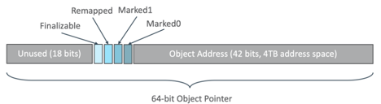
#### 6.2.3 加载屏障/读屏障(Load Barrier)
* 当我们要从堆中读取一个对象引用的时候，指针指向的对象可能已经发生转移，但是引用地址却是引用转移之前的地址
* 那么就需要一种机制，当我们读取引用的时候，去判断这个对象是不是已经转移了，如果转移了则更新当前引用位转移后的新地址  
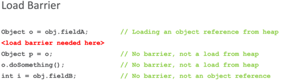

#### 6.2.4 Reallocate Set(转移集合或者重新分配集合)
* 当垃圾回收的时候，也就是存在垃圾的Region，ZGC会根据每个 Region 的存活率和碎片程度判断是否将其加入 Reallocate Set
* 这个集合中的存活对象在重新分配的阶段，会被转移到其他新的Region中
* 指向这个集合中存活对象的引用会在读的时候被修正，然后回收集合中垃圾对象，最后这个处于Reallocate Set中的Region会被释放和清理  
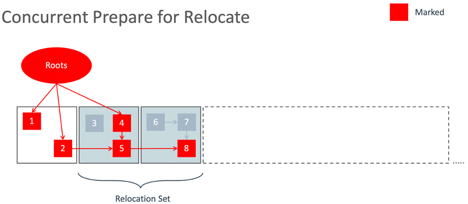

#### 6.2.5 转发表(Forward Table)
* 在重分配准备阶段，会对每一个Reallocate Set中的Region初始化一个Forwarding Table转移表
* 这个表主要用于对象转移之前的地址和转移之后的地址之间的映射，方便后续的引用修正  
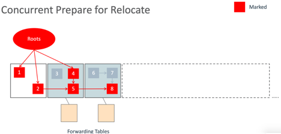

#### 6.2.6 重分配(Reallocate)
* RSet中的Region的对象迁移到另外新的Region中，因为是重新再新的Region开辟的内存地址，然后将原对象拷贝过来，所以叫做重分配

#### 6.2.7 重映射(Remapping)
* 因为重分配后对象的地址可能发生了变化，那么对于这些对象的引用就需要发生变化，所以需要重映射

### 6.3 ZGC垃圾回收流程

#### 6.3.1 并发标记阶段
**初始标记:**  
* 暂停所有应用线程，找到GC Roots对象  
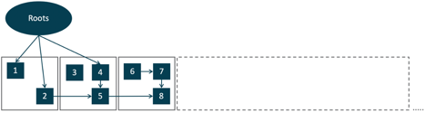  
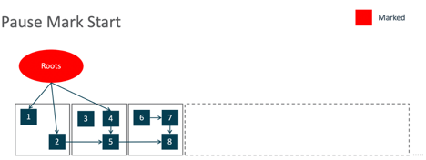  
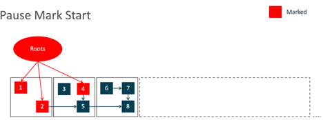  

**并发标记:** 
恢复应用线程和GC线程并发执行
GC线程根据GC Roots开始遍历对象图，对存活对象进行标记M0或者M1  
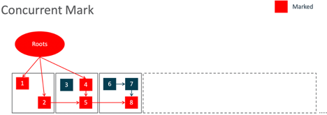
注意，在这个阶段，并发重映射阶段也会在此时发生，新对象或者已经修正引用的对象映射为Remapped,  然后会立刻更新为M0或者M1  
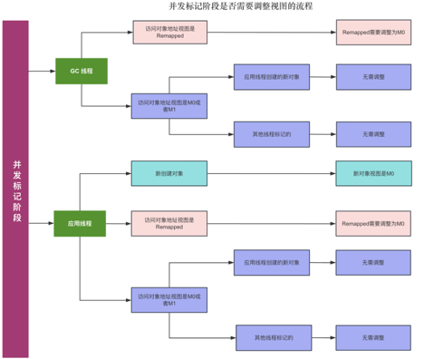

#### 6.3.2 并发准备重分配阶段(Concurrent Prepare for Relocate)
* 启动多个GC线程和应用线程并发执行
* 将存在垃圾对象的Region，判断是否加入到Reallocate Set(重分配集合)
* 为每一个在Relocate Set中的Region初始化一个转发表(Forwarding Table)  
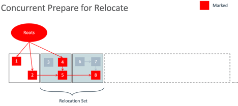  
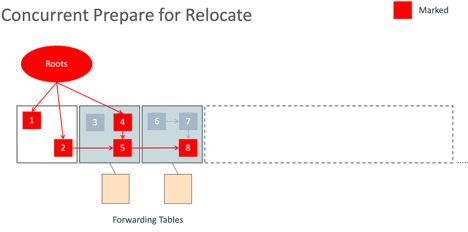

#### 6.3.3 并发重分配阶段
* 暂停所有应用线程
* GC Roots根节点对象往下遍历，如果对象所在的Region没有在Reallocate Set(重分配集合)中，则标记位Remapped
* 如果在，则判断是不是存活对象(M0或者M1), 如果是存活对象，则需要拷贝到其他的Region中
* 转发表(Forwarding Table)记录该对象拷贝之前的地址和拷贝之后的新地址  
* 多个GC线程和应用线程并发执行，通过应用程序访问对象，如果访问的对象已经转移了，但是引用还没变化，修正引用    
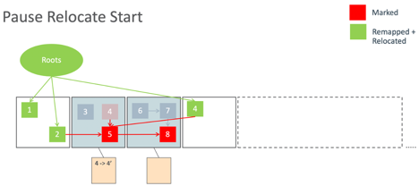  
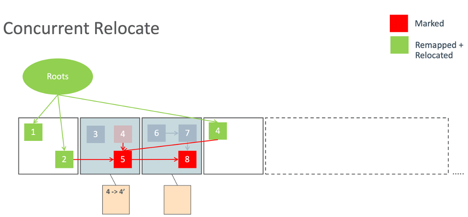  
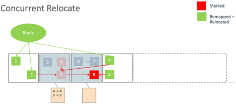  
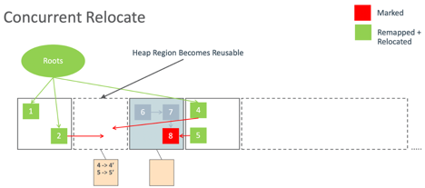  
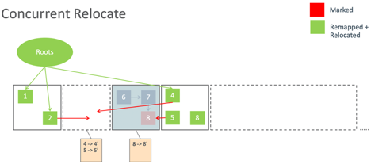  
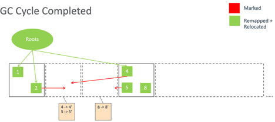  

#### 6.3.4 并发重映射阶段(Concurrent Remap)
* GC线程和应用线程是并发执行
* 并发重映射阶段，迁移后的对象引用关系有的可能因为应用线程访问，已经修正了， 有的没有被访问还没有被修正，因此这个阶段需要修正这些对象的引用
* GC线程开始从GC root开始遍历对象图，对于没有在Relocate Set中的Region中的对象直接标记为Remapped；对于已经在Relocate Set中的对象，标记为Remapped, 并且修正对象引用
* 因此在并发标记阶段，可能会遇到对象状态是Remapped。 但是，如果对象是存活状态，Remapped状态会被GC线程重置为M0或者M1
* 当对象迁移完成之后，解除转发表的依赖，清空转发表
* 在这一阶段可能和下一轮的并发标记阶段重合

