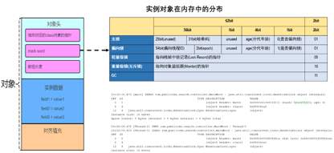
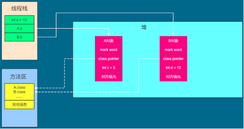
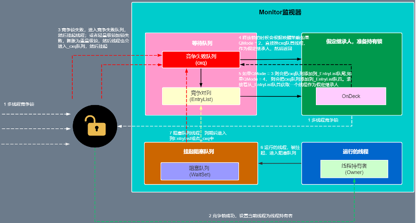

## 一  Java 中有哪些并发控制机制
1. [ ] 内置锁：synchronized
2. [ ] 显式锁：ReentrantLock、ReadWriteLock、StampedLock
3. [ ] 原子变量（无锁）：AtomicInteger 等基于 CAS 的类
4. [ ] 线程同步器：Semaphore、CountDownLatch、CyclicBarrier


## 二 synchronized底层原理

**synchronized在使用的过程中会经历锁升级和膨胀的一个过程。大致分为偏向锁、轻量级锁和重量级锁三个阶段**


### 2.1 对象和对象头
❗️我们知道一个对象主要包含三部分: 对象头，实例数据和对齐填充三部分  
❗️对象头主要包括mark word(8)、class pointer 和 array length(非必选)，只有数组对象在对象头才会有数组长度  
❗️mark word 主要是存储在运行时候对象的一些元信息，比如哈希码、GC年龄、锁状态, 8字节  
❗️class pointer就是指指向一个class对象的指针。默认情况下，在32G以下内存，类型指针是4字节，因为默认启用了类型指针压缩。 如果32位以上内存或者没有启用类型指针压缩，那么类型指针就是8字节。为什么32位以上内存就是8字节，因为受到总线宽度的影响  
❗️array length是数组对象才会有的信息，4字节  
  


### 2.2 重量级锁

#### 2.2.1 ObjectMonitor监视器对象
synchronized底层是基于Monitor监视器实现，Monitor监视器又是基于操作系统的互斥锁原语实现  
Monitor监视器对象主要包含以下字段:  
1. [ ] _object: 监视器锁寄生在哪个对象
2. [ ] _owner: 哪个线程对象当前持有这个锁
3. [ ] _EntryList: 准备获取锁的等待队列
4. [ ] _WaitSet: 调用等待方法的线程，进入到阻塞队列，这里面的线程都是等待被唤醒的
5. [ ] _cxq: 竞争失败队列，当线程竞争失败就会进入到该队列，然后线程被挂起
6. [ ] _recursion: 重入次数
7. [ ] _header: 运行过程中的锁对象的头信息，理解为mark word其实也差不多，包括哈希值、GC年龄、锁状态等

#### 2.2.2 工作原理
  
✅ 线程参与竞争  
✅ 竞争成功，修改监视器对象中的_owner为当前线程  
✅ 竞争失败，加入到竞争失败队列_cxq  
✅ 当持有锁的线程执行完之后，需要重新获取下一个线程持有锁，这个时候根据不同的模式有不同的处理方式:  
* QMode = 2: 直接从竞争失败队列_cxq队首获线程，作为假定继承人，准备持有锁  
* QMode = 3: 将竞争失败队列_cxq放入到_EntryList准备获取锁的等待队列的末尾，然后从_EntryList队唤醒队首线程，作为假定继承人，准备持有锁  
* QMode = 4: 将竞争失败队列_cxq放入到_EntryList准备获取锁的等待队列的队首，然后从_EntryList队唤醒队首线程，作为假定继承人，准备持有锁  

✅ 假定继承人一定会获取到锁吗？这是不一定的，假定继承人将会和新进入的线程一起竞争锁，依然存在竞争失败的问题  
✅ 如果调用wait方法，线程处于阻塞状态，那么线程将会被挂起，放入到一个_WaitSet阻塞等待队列  
✅ 当_WaitSet阻塞等待队列中某一个线程被唤醒，不是直接参与竞争锁，而是放入到_EntryList中  

#### 2.2.3 重量级锁特点
因为底层依赖的是操作系统的互斥锁，那么就需要调用操作系统内核的库函数，比如等待和唤醒线程等，这就需要在CPU在用户态和内核态之间来回切换，比较耗费资源和性能。也正是因为如此，所以才有偏向锁和轻量级锁优化的出现

### 2.3 轻量级锁
#### 2.3.1 什么是轻量级锁
✅ 根据上面重量级锁的工作流程，我们知道，这个是一个比较重的操作，JDK1.5之后后续进行了一些优化    
✅ 因此当只有较少线程竞争的情况下，允许线程通过自旋的方式等待获取锁，而不是直接就获取监视器这个重量级锁，从而提升系统的性能  
✅ 如果超过一定次数或者说阈值，还是不能获取到轻量级锁，此时会升级到重量级锁。因为超过一定时间或者次数没有获取到锁说明锁竞争激烈，那么就会导致多个线程自旋，如果线程越拉越多，自旋是消耗CPU的资源的，少量的话没问题，太多了就会有性能问题了  

#### 2.3.2 偏向锁升级为轻量级锁的流程
✅ 每一个线程在竞争锁的时候，会再买线程栈中创建一个LockRecord锁对象  
✅ 当该线程持发现锁对象没有被其他线程持有，就会通过CAS将自己的LockRecord指针设置为锁对象的Lock Record指针  
✅ 当该线程竞争失败或者发现锁对象已经被别人持有，则开始自旋  
✅ 当自旋到一定程度，还是无法获取到锁则会尝试升级到重量级锁  


### 2.4 偏向锁
#### 2.4.1 无竞争时的优化
✅ 当一个线程首次获取锁时，JVM 会通过 CAS 操作 将线程 ID 写入对象头的 Mark Word 中，标记为偏向锁  
✅ 后续同一线程再次进入同步块时，只需检查 Mark Word 中的线程 ID 是否与当前线程一致：  
1. [ ] 一致 ：无需任何同步操作（如 CAS 或重量级锁），直接执行同步代码
2. [ ] 不一致 ：触发偏向锁的撤销或升级


#### 2.4.2 其他线程竞争时的处理
当另一个线程尝试获取锁时，会触发以下流程：  
🎯 原线程已释放锁 ：
撤销偏向锁，将 Mark Word 恢复为无锁状态（或直接升级为轻量级锁），然后新线程尝试通过 CAS 竞争轻量级锁。

🎯 原线程仍持有锁 ：
偏向锁会直接升级为轻量级锁（通过 CAS 自旋 ），新线程进入自旋等待。


## 三 AQS框架运行机制
### 3.1 AQS是什么
✅ AQS是抽象队列同步器的缩写，是Java并发包下的核心组件，它是通过队列实现了一套同步状态管理机制  
✅ Seamaphore、CarrierBarrier、线程池 、ReentrantLock等都是基于AQS实现的  
✅ 支持独占模式和共享模式的同步操作    
1. [ ] 独占模式: 一次只有一个线程能获取资源，比如ReentrantLock  
2. [ ] 共享模式: 允许多个线程同时获取资源（如Semaphore、CountDownLatch）  

### 3.2 AQS组成
✅ AQS包含一个状态字段，是volatile类型，表示锁。有线程持有锁，state > 1; 没有线程持有锁 ，state = 0  
✅ AQS包含一个双向链表实现的FIFO同步队列  
✅ AQS还提供了公平锁和非公平锁的实现  
1. [ ] 公平锁: 新线程都加入到队尾；每次从队首唤醒线程竞争锁  
2. [ ] 非公平锁: 唤醒队首线程，并尝试和新线程竞争锁。如果新线程竞争成功，则先获取锁；否则加入到同步队列末尾  

✅ AQS还提供了一个内部的ConditionObject，实现等待和唤醒的操作，可以进行线程之间的通信  


### 3.3 AQS同步队列和条件队列原理
#### 3.3.1 AQS同步队列原理
##### 3.3.1.1 公平锁
📦 **同步队列为空**  
🚪**锁未被占用**  
新线程直接通过CAS更新锁状态为1，获取到锁

🚪**锁被占用**  
新线程发现锁被占用，则加入到同步队列队尾


📦 **同步队列非空**  
🚪**锁未被占用**  
唤醒同步队列队首线程，队首线程去获取锁，新线程加入到同步队列末尾

🚪**锁被占用**  
新线程直接加入到同步队列末尾

##### 3.3.1.2 非公平锁
📦 **同步队列为空**  
🚪**锁未被占用**  
新线程直接通过CAS更新锁状态为1，获取到锁

🚪**锁被占用**  
新线程发现锁被占用，则加入到同步队列队尾


📦 **同步队列非空**   
🚪**锁未被占用**  
唤醒同步队列队首线程，队首线程和新线程也会竞争锁，如果新线程竞争成功获取锁，竞争失败加入到队尾

🚪**锁被占用**  
新线程直接加入到同步队列末尾

#### 3.3.2 AQS条件队列原理
✅ 条件队列是一个单向链表实现的队列  
✅ 线程需要等待满足条件，线程调用Condition.await()  
✅ 该线程首先会释放锁，然后通过LockSupport.park()方法进入等待状态，创建一个新的节点，放到条件队列队尾  
✅ 当条件满足的时候，需要唤醒线程，调用Condition.signal()唤醒条件队列队首的线程或者Condition.signalAll()会唤醒条件队列所有线程  
✅ 然后将该队首的线程对象放入到同步队列末尾，从条件队列移除  

📌 **总结:**  
1. [ ] Condition.await() 会将当前线程加入条件队列并释放锁、挂起线程
2. [ ] Condition.signal() 则会将条件队列中的节点转移回同步队列中等待重新竞争锁
3. [ ] 整个过程由 ConditionObject 协助管理，并严格依赖 AQS 的同步状态机制

### 3.4 AQS为什么采用双向链表
* 支持双向遍历，针对某些操作，可以从队尾开始遍历，减少和队首的竞争
* 高效的节点插入和删除

## 四 CAS机制
### 4.1 什么是CAS？
✅ CAS是一种无锁并发机制  
✅ 期望在不加锁的前提下，实现对共享变量的原子更新  
✅ 通过硬件指令(总线锁lock + 硬件指令cmpxchg)的支持，在无需加锁的情况下，确保多个线程对共享数据进行安全的修改

### 4.2 CAS工作机制
1. CAS由三个参数: 内存地址、预期值和新值
2. CAS会检查内存中当前存储的值是否与预期值（E）相同
3. 如果相同:说明在此期间没有其他线程修改过该变量，于是CAS将内存中的值更新为新值（N），并返回成功
4. 如果不同: 说明有其他线程在这段时间内修改过该变量，CAS操作失败，不会修改内存中的值。
5. CAS通常和自旋搭配使用，如果CAS修改失败，则进行重试，自旋不会进入操作系统内核，不会挂起线程，开销小； 适合锁冲突轻微，线程等待时间短的场景
```java
public final int incrementAndGet() {
    int prev, next;
    do {
        prev = get();
        next = prev + 1;
    } while (!compareAndSet(prev, next));
    return next;
```

### 4.3 CAS和传统锁机制比较
#### 4.3.1 相同点
✅ 都属于并发控制机制  
✅ 都是为了解决多线程并发访问共享资源时的数据一致性问题  
✅ 都需要保证原子性  

#### 4.3.2 不同点
✅ **是否加锁**    
CAS：无锁  
传统锁: 需要加锁  

✅ **底层机制不一样**  
CAS: 基于总线锁+cmpxchg(比较交换指令)  
传统锁: 基于操作系统的互斥锁  

✅ **是否会阻塞线程**  
CAS: CAS一般会重试，不会阻塞  
传统锁: 阻塞（线程挂起与唤醒）  

✅ **公平性**  
CAS: 非公平（线程可能“饿死”）  
传统锁: 可配置为公平或非公平  

✅ **可重入性**  
CAS: 不支持  
传统锁: 支持  

✅ **粒度控制**  
CAS: 只能修改一个变量  
传统锁: 可以同时修改多个  

### 4.4 CAS优缺点
#### 4.4.1 优点
✅ **无锁化**  
CAS技术避免了传统锁的上下文切换、线程阻塞和唤醒的开销，尤其在轻度竞争的情况下，性能非常好  

✅ **性能较好**  
因为不涉及线程阻塞，减少了操作系统调度带来的开销  

#### 4.4.2 缺点
✅ **无法避免饥饿问题**  
* 在多线程竞争激烈的场景中，有可能出现某些线程始终无法成功执行CAS操作，而其他线程频繁成功，这就导致了饥饿问题
* CAS操作本身无法保证公平性，因此不能避免某些线程一直无法获得资源

✅ **只能保证单个变量的原子操作**  
* CAS只能保证单个变量的原子操作，无法同时进行多个变量原子操作

✅ **ABA问题**  
* CAS只检查当前值与预期值是否相同，但并不关心该值在检查前是否经历了其他变化

### 4.5 如何解决CAS的ABA问题
* 引入版本号（或时间戳）
* 使用带有标记位的引用
