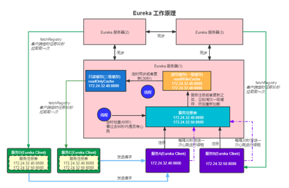

## 一 服务注册中心
### 1.1 为什么需要服务注册中心
✅ 屏蔽服务调用细节  
✅ 方便服务集中管理和监控  

### 1.2 服务注册与发现需要哪些角色
#### 1.2.1 服务提供者
✅ 服务注册  
✅ 发送心跳进行续租  
✅ 服务下线发送通知  

#### 1.2.2 服务消费者
✅ 从服务注册中心拉取服务，比如定时拉取服务，根据服务状态检测和更新本地服务列表  
✅ 本地维护一个服务缓存，防止服务注册中心不可用，无法拉取到服务  

#### 1.2.3 服务注册中心 
✅ 维护服务注册表，进行服务注册  
✅ 判断服务提供者是否及时续租，将不可用的服务实例剔除；更新服务注册列表  
✅ 对外提供服务注册和获取的接口  
✅ 服务监视  

## 二 Eureka概述
✅ Eureka是一个Netflix开源的服务注册与发现的服务治理框架  
✅ Eureka提供了服务注册与发现、心跳与故障检测、服务监控等功能  
✅ Eureka属于CAP模型中的AP模型，首要是保证服务可用性  
✅ Eureka可以按照P2P方式进行集群部署，保证每一个节点都是对等的，每一个节点都可以处理读写请求， 但是写请求需要同步给其他节点  
✅ Eureka底层是通过Jersy框架通信，也就是通过HTTP协议进行通信  

## 三 Eureka工作原理

### 3.1 Eureka服务端工作原理
#### 3.1.1 服务注册流程
1. 接收服务提供者注册请求
2. 更新本地服务注册表
3. 将注册请求同步给其他Eureka节点
4. 将最新更新的服务放入到最近修改队列recentlyChangedQueue中，服务消费者可以从这里拉取增量数据，避免每次需要拉取全量数
5. 将注册的服务更新到二级缓存readWriteCacheMap中
6. 定时任务默认每隔30秒会将二级缓存数据同步到一级缓存readOnlyCache中

#### 3.1.2 服务续租流程
1. 服务端接收服务提供者发送的续租请求，即心跳请求
2. 更新服务注册表中服务的时间戳
3. 同步这个续租请求到其他Eureka节点
4. 定时任务默认每隔60秒会检查服务列表中超过90秒时间戳没有发生修改的服务实例，Eureka认为这个服务不可用，会从服务注册列表中剔除掉

### 3.2 服务提供者流程
1. Eureka客户端服务提供者启动的时候，DiscoveryClient会自动向Eureka服务器发起注册
2. DiscoveryClient还会启动一个线程，定时向Eureka 服务器发送心跳或者续租请求，默认是每间隔30秒钟就会发送一次心跳请求到服务器

### 3.3 服务消费者流程
1. Eureka客户端服务消费者，启动的时候通过DiscoveryClient向Eureka服务器发起全量同步，将所有的服务信息都拉到本地缓存起来
2. DiscoveryClient会启动一个线程定时从Eureka服务器增量拉取数据，默认是间隔30秒从服务器进行一次增量同步，然后更新本地缓存
3. DiscoveryClient启动一个定时任务，检查本地服务缓存列表中的服务的状态是不是UP，不是UP需要剔除。比如Ribbon默认10秒检查一次

### 3.4 Eureka的自我保护机制
1. 注册中心定时任务60秒检查服务注册表最近90秒钟有没有发送心跳。如果没有则认为，该服务实例已经下线，需要将服务实例标记位下线，从服务注册表中剔除掉  
2. 但是有可能因为网络或者其他原因，导致短时间内大面积心跳故障，这时候超过阈值的服务就会被剔除  
3. 因此。为了避免这种情况，Eureka设计了一种自我保护机制，当在一个时间段内，有大量服务实例短时间不可用， 心跳故障(续租)的比例触发阈值，则会触发这个保护机制  
4. 这个自我保护机制可以防止 Eureka 误将大量正常的服务实例剔除，从而导致服务雪崩或系统瘫痪  
5. 这个自我保护机制默认是打开的，可以关闭掉。另外阈值也时刻可以配置的，默认是85%，表示最近15分钟内续约成功的比例低于85%，就会触发自我保护机制 

## 四 服务注册中心选型
### CAP模型和一致性
✅ eureka: AP模型, 弱一致性，服务注册可能有延迟或丢失    
✅ nacos: CP + AP 模型，满足最终一致性  
✅ zookeeper: CP模型，强一致性  
✅ etcd: CP模型，强一致性  
✅ consul: CP模型，强一致性

### 社区与维护状态
✅ eureka: Netflix已停止更新  
✅ nacos: 阿里开源，持续维护，尤其在国内  
✅ zookeeper: 成熟但较老，复杂度高  
✅ etcd: K8s 核心，仍在维护  
✅ consul: 活跃，由 HashiCorp 维护

### 语言
✅ eureka: Java语言  
✅ nacos: Java语言  
✅ zookeeper: Java语言  
✅ consul: Go语言  
✅ etcd: Go语言

### 部署复杂度
✅ eureka: 简单，单节点即可部署  
✅ nacos: 中等，支持单机和集群部署  
✅ consul: 中等，支持集群部署  
✅ zookeeper: 高（依赖 Java 环境+选主机制）  
✅ etcd: 高(需部署集群，网络要求高)

### 支持配置中心
✅ eureka: 不支持  
✅ nacos: 支持  
✅ consul: 不支持   
✅ zookeeper: 不支持   
✅ etcd: 不支持

### 多注册中心
✅ eureka: 不支持
✅ nacos: 命名空间隔离  
✅ consul: 多数据中心  
✅ zookeeper: 不支持  
✅ etcd: 支持

### 性能 & 成熟度
✅ eureka: 较旧，Netflix 已弃用  
✅ nacos: 高, 阿里已验证  
✅ consul: 高，可用于跨数据中心  
✅ zookeeper: 一般    
✅ etcd: 高，k8s底座

### 适用技术栈
✅ eureka: Java 微服务、轻量级系统
✅ nacos: Java服务，国内企业应用，服务注册 + 配置中心，特别适合Spring Cloud Alibaba技术栈
✅ consul: 语言服务注册、K8s 辅助组件、服务网格场景
✅ zookeeper: 配置协调、任务调度、分布式锁等   
✅ etcd: 云原生服务发现、K8s、存储配置型数据