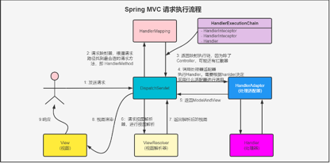

## 一 谈谈你对Spring的理解

### 1.1 总论
**Spring是一个生态体系，它包含了Spring Framework、Spring Boot、Spring Cloud、Spring Data、Spring Integration、Spring Security等**  

### 1.2 Spring Framework
其中Spring Framework是整个Spring生态体系的基石，Spring Framework是一个容器框架，它主要包括以下模块:  
1. [ ] Spring Core: 核心模块，主要提供IoC功能
2. [ ] Spring AOP: 提供AOP功能
3. [ ] Spring Context: 为Spring Framework提供上下文
4. [ ] Spring ORM: 集成看ORM框架的模块
5. [ ] Spring DAO: 操作数据库的模块
6. [ ] Spring Web: Web模块

### 1.2 Spring Boot
Spring Boot 是一个基于 Spring 框架的脚手架，提供开箱即用的配置和自动化功能， 主要用于简化 Java 后端应用的开发与部署, 它主要提供以下一些功能:  
1. [ ] 自动配置：根据项目依赖自动配置 Spring 组件，减少手动配置
2. [ ] 内嵌服务器：支持嵌入式 Tomcat、Jetty，无需部署到外部服务器
3. [ ] 快速启动器（Starter）依赖：一行依赖引入整套功能（如spring-boot-starter-web）
4. [ ] 独立运行：打包为可执行 JAR，java -jar 即可运行
5. [ ] Actuator 监控：提供系统健康检查、指标监控等管理功能

### 1.3 Spring Cloud
Spring Cloud 是一套基于SpringBoot的工具集，帮助开发者快速构建和部署微服务架构下的分布式系统，它主要提供以下一些功能:  
1. [ ] 服务注册与发现（如 Eureka、Consul）
2. [ ] 负载均衡（如 Ribbon、Spring Cloud LoadBalancer）
3. [ ] 配置中心（如 Spring Cloud Config）
4. [ ] 断路器与容错（如 Resilience4j、Hystrix）
5. [ ] 网关服务（如 Spring Cloud Gateway）

## 二 Spring Bean的生命周期
**Spring Bean 的生命周期是指一个 Bean 从创建到销毁的全过程:**  
✅ Bean的实例化, 产生Bean对象  
✅ 注入Bean属性，即给Bean对象注入属性值   
✅ 如果注册了一系列Aware接口，比如BeanNameAware, BeanFactoryAware或者ApplicationContextAware此时会被调用  
✅ 如果注册了BeanPostProcessor, 则调用BeanPostProcessor的postProcessBeforeInitialization方法，在初始化之前做一些预处理  
✅ 初始化Bean  
1. [ ] 实现了调用InitializingBean接口， 则会调用的afterPropertiesSet方法  
2. [ ] 添加了@PostConstruct, 也在初始化时候调用  

✅ 如果注册了BeanPostProcessor, 则调用BeanPostProcessor的postProcessAfterInitialization方法，在初始化后做一些预处理  
✅ Bean已经准备就绪，可以被应用程序使用了  
✅ Bean销毁，如果 Bean 实现 DisposableBean 则会执行 destroy方法  

## 三 Spring 提供了哪些扩展机制
### 3.1 ApplicationContextInitializer
✅ 在整个容器还没有刷新之前或者说初始化之前，做一些操作  
✅ 在启动时进行环境检测，根据不同的环境（如开发、测试、生产）进行一些初始化操作  
✅ 可以在 ApplicationContext 初始化阶段为应用添加ApplicationListener  

### 3.2 BeanDefinitionRegistryPostProcessor
✅ 有些BeanDefinition,可能应用中没有，或者需要修改应用中的BeanDefinition等等  
✅ 和BeanFactoryPostProcessor比较, 可以添加和删除BeanDefinition  

### 3.3 BeanFactoryPostProcessor
✅ 只能针对系统存在的BeanDefinition进行修改，无法添加和删除BeanDefinition  

### 3.4 ApplicationContextAware
✅ 使得该Bean可以获取ApplicationContext  

### 3.5 BeanNameAware
✅ 可以获取BeanName  

### 3.6 BeanPostProcessor#before
✅ 可以在初始化之前做一些操作  

### 3.7 InitializingBean
✅ 可以调用InitializingBean的afterPropertiesSet方法  

### 3.8 @PostConstruct
✅ 可以执行@PostConstruct定义的逻辑，比如缓存预热等  

### 3.9 BeanPostProcessor#after
✅ 可以在初始化之后做一些操作  

### 3.10 CommandLineRunner/ApplicationRunner
✅ 在容器启动后，执行一些自定义逻辑   
✅ 都在 ApplicationContext 启动完成后自动调用   
✅ 都适合做：初始化数据、校验参数、启动任务等操作  
✅ 方法签名和参数类型有点区别   

### 3.11 DisposableBean
✅ 实现了这个接口的Bean, 在对象被销毁的时候，会执行这个扩展  

### 3.12 @PreDestroy
✅ 销毁之前执行一些预定义的操作  

### 3.13 ApplicationListener
✅ 监听 Spring 生命周期事件（如 ContextRefreshedEvent），容器刷新完成就可以干的一些事情  

### 3.14 ApplicationEventPublisher
✅ 容器中发布一些事件，配合@EventListener和@Event实现  

### 3.15 HandlerInterceptor
✅ 拦截 HTTP 请求  

### 3.16 AOP 扩展  
✅ 自定义切面，方法增强  


## 四 BeanFactory和ApplicationContext比较
### 4.1 相同点
✅ 都是 Spring 的 IoC 容器  
✅ 都支持依赖注入  


### 4.2 不同点
#### 4.2.1 是否提供高级功能
✅ BeanFactory是低级容器，不能提供高级功能  
✅ ApplicationContext是高级容器，提供了发布订阅、国际化、AOP等高级功能  

#### 4.2.2 加载机制不一样
✅ BeanFactory默认是懒加载，即在获取Bean的时候才会被加载  
✅ ApplicationContext是立即加载，除非添加了@Lazy注解,也会是懒加载  

#### 4.2.3 Web容器支持
✅ BeanFactory不支持Web容器  
✅ ApplicationContext是支持Web容器，提供如 WebApplicationContext 等子接口  

## 五 BeanFactory和FactoryBean比较
1. [ ] BeanFactory是Spring IoC容器，负责创建、管理和提供Bean实例
2. [ ] FactoryBean是一个特殊的Bean, 通过这个Bean可以创建其他Bean, 他可以创建Bean实例，但是不能对外提供Bean实例， 一般用于创建复杂对象
3. [ ] 比如BeanFactory就可以通过FactoryBean创建实例，然后对外提供Bean实例

## 六 属性注入 vs 自动装配
### 6.1 什么是属性注入？什么是自动装配？
✅ 属性注入: 就是为字段赋值或者注入依赖，可以通过手动注入和自动装配两种方式  
✅ 自动装配: 需要根据byName或者byType方式自动从容器查找相关名字或者类型的Bean实例，然后注入给属性    

**区别:**  
✅ 属性注入可能需要依赖自动装配完成依赖注入 ，自动装配是属性注入的一种方式而已

### 6.2 Spring Bean的属性注入有哪些方式？ 
#### 6.2.1 构造器注入
```java
@Component
public class UserService {
    private final UserDao userDao;
    // 自动装配置
    @Autowired
    public UserService(UserDao userDao) {
        this.userDao = userDao;
    }
}
```

```java
@Component
public class OrderService {
    // 自动装配
    @Autowired
    private UserRepository userRepository;
}


@Bean
public OrderService orderService() {
    // 手动注入
    return new OrderService(userRepository());
}
```


### 6.2.2 Setter注入
```java
@Component
public class UserService {
    private final UserDao userDao;

    @Autowired
    public void setUserDao(UserDao userDao) {
        this.userDao = userDao;
    }
}
```

### 6.2.3 字段注入
```java
@Component
public class OrderService {
    // 自动装配
    @Autowired
    private UserRepository userRepository;
}


@Bean
public OrderService orderService() {
    OrderService orderService = new OrderService();
    // 手动注入
    orderService.setUserRepository(userRepository()); 
    return orderService;
}
```

### 6.3 Spring Bean的自动装配方式有哪些
#### 6.3.1 注入方式
✅ byName: 根据Bean名字注入  
✅ byType: 根据Bean类型注入  

#### 6.3.2 Autowired注入
**@Autowired 默认是根据byType进行注入的**  
```java
@Component
public class OrderService {
    @Autowired
    private UserRepository userRepository;
}
```

**如果存在多个类型相同的Bean实例，可以通过@Qualifier 通过不同名字，即通过byName方式注入**  
```java
@Autowired
@Qualifier("mysqlUserRepository")
private UserRepository userRepository;

```

**@Primary可以用于存在多个类型相同的Bean实例，默认选择哪一个Bean实例注入**  
```java
@Primary
@Component
public class MysqlUserRepository implements UserRepository {
    // ...
}

```

#### 6.3.3 @Resource
Resource默认是根据byName注入的,不支持按照byType，也不支持@Qualifier和@Primary搭配使用   
```java
@Resource(name = "userRepository")
private UserRepository userRepository;
```

#### 6.3.4 @Inject
功能几乎等同于 @Autowired，但不支持 required=false，配合 @Named 指定名称  
```java
@Inject
private UserRepository userRepository;

```


## 七 Spring 循环依赖问题

### 7.1 什么是循环依赖
✅ Spring中，多个Bean在创建的过程中需要互相依赖对方，导致Bean的创建无法完成  
✅ A 依赖 B，B 又依赖 C,  C 又依赖 A => 形成依赖闭环  

### 7.2 Spring 是如何解决循环依赖的?
🎯 **@Lazy构造器注入可以在一定程度上解决循环依赖，前提是Bean之间立即需要互相调用，那么就不可以**
🎯 **Spring通过3级缓存方式可以解决循环依赖问题，那首先3级缓存是什么？**    
#### 7.2.1 三级缓存
✅ singletonObjects(1级缓存): 缓存的是已经完全实例化完成的Bean实例，这个缓存的bean实例可以正常被使用  
✅ earlySingletonObjects(2级缓存): 缓存的是还未创建完成的Bean实例，相当于一个半成品，无法正常对外提供使用，主要用来解决循环依赖  
✅ singletonFactories(3级缓存):  缓存的是可以创建对象或者代理对象的工厂  

#### 7.2.2 工作机制
前提: 假设两个 Bean A 和 B 互相依赖

🧩 **步骤 1：准备创建 A**  
✅ 实例化A，发现A 依赖 B, 准备去创建 B  
✅ 在实例化B之前，为防止循环依赖问题，Spring会创建一个ObjectFactory对象工厂，这个ObjectFactory接口是一个功能型接口:  
```java
@FunctionalInterface
public interface ObjectFactory<T> {
    T getObject();
}
```

✅ 创建这个对象目的，就是把A的引用提前准备好，类似于这样:  
```java
ObjectFactory<Object> factory = () -> {
    return getEarlyBeanReference(beanName, mbd, bean);
};
```
✅ 你以后如果想要这个 A这个Bean 的早期引用，就调用这个工厂（factory）的 getObject() 方法，它会帮你返回A的实例    

**🧩 步骤 2：创建 B 的时候注入 A**  
✅ B 依赖 A，于是尝试从缓存里取 A
1. [ ] 一级缓存：还没有 A
2. [ ] 二级缓存：也没有
3. [ ] 三级缓存：有 ObjectFactory，可以调用创建 A 的“早期引用”

✅ Spring 调用 singletonFactories 中的工厂，获取一个早期 A 的实例，并放入二级缓存


🧩 **步骤 3：B 得到 A 的早期引用后完成创建**  
✅ 创建好 B，把 B 放入一级缓存

🧩 **步骤 4：回到 A 的创建流程，继续初始化属性注入 B**  
✅ 注入 B 后，A 的实例完成，也被放入一级缓存  
✅ 从三级缓存、二级缓存中清除 A 的临时引用  

#### 7.2.3 为什么二级缓存无法解决，必须三级缓存
✅ 对于普通的Bean，二级缓存确实足够解决循环依赖的问题  
✅ 但是如果Bean是需要被AOP代理的，比如@Transactional等他们必须要走SmartInstantiationAwareBeanPostProcessor 的 getEarlyBeanReference这个函数  
✅ 否则无法根据之前引用创建代理对象，这就是必须使用三级缓存的原因所在  


## 八 Spring事务传播行为和实现原理
✅ REQUIRED: 当前有事务，则加入当前事务; 没有事务，则新建事务  
✅ REQUIRED_NEW: 无论当前有没有事务，都需要新建事务  
✅ MANDATORY: 当前有事务则加入，没事务则抛出异常  
✅ SUPPORTS: 当前有事务则加入到事务中，没事务则以非事务方式运行  
✅ NOT_SUPPORTS: 该方法不支持事务，如果当前存在事务，Spring会将其挂起，然后以非事务方式执行当前方法。事务执行完成后，恢复挂起的事务  
✅ NEVER: 该方法不应该运行在事务中，如果当前存在事务，Spring将抛出异常  
✅ NESTED: 如果当前存在事务，方法将在该事务的嵌套事务中运行；如果没有事务，则会创建一个新的事务   


## 九 Spring多线程事务，是否保证事务一致性
我们知道事务信息是保存在ThreadLocal中的，线程不一样，那其他线程ThreadLocal就没有事务信息，所以最终的结果就是不能保证事务一致性


## 十 Spring事务失效的原因
✅ @Transaction注解添加到非public方法，不是public 不能被代理  
✅ @Transaction注解添加的方法包含final或者static关键字   
✅ 吃掉了异常，没有抛出来  
✅ 同一个类中调用包含了@Transaction的方法，因为只有通过代理对象调用@Transactional的方法才会生效  
✅ 错误使用事务传播机制  
✅ 当前类没有被没有被Spring管理  
✅ 多线程环境下，每一个线程事务都是存储ThreadLocal中的，因此多线程环境下，事务也无效  

## 十二 Spring事件监听的核心机制是什么
### 12.1 核心流程
✅ 发布者发出事件 → 容器通知监听器处理事件**  

### 12.2 Spring 框架中，事件监听机制组成部分
✅ ApplicationEvent: 事件对象（继承自该类）  
✅ ApplicationListener: 监听器接口，接收事件  
✅ ApplicationEventPublisher: 事件发布器（容器自动实现）  
✅ ContextRefreshedEvent等: 内置生命周期事件  


### 12.3 事件监听机制执行流程
✅ 事件对象创建：自定义事件类继承自 ApplicationEvent  
✅ 监听器定义：实现 ApplicationListener<T extends ApplicationEvent>  
✅ 注册监听器：Spring 自动识别为 Bean（或通过注解）  
✅ 事件发布：通过 ApplicationEventPublisher.publishEvent(event) 发布事件  
✅ 事件派发：Spring 通过 ApplicationEventMulticaster 派发事件给匹配的监听器  


## 十三 Spring源码用到了哪些设计模式
### 13.1 简单工厂模式
✅ BeanFactory、ObjectFactory、AopProxyFactory  
✅ 传入一个参数，比如beanName或者Bean的class然后获取Bean实例   

### 13.2 工厂方法
✅ FactoryBean  

### 13.3 适配器模式
✅ Spring MVC中HandlerAdapter  

### 13.4 代理模式
✅ AopPorxy、CGLibAopProxy、JDKDynamicAopProxy

### 13.5 模板方法 
✅ JdbcTemplate、AbstractApplicationContext

### 13.6 策略模式 
✅ BeanPostProcessor、NamesSpaceHandler、 HandlerMapping

### 13.7 责任链模式
✅ HandlerInterceptor  

## 十四 Spring MVC 控制器是不是单例的，如果是有什么问题，怎么解决
默认是单例的，如果声明了成员变量，那么会有线程安全问题  
需要程序员自己保证线程安全，比如看能不能放在方法内或者更新的时候使用同步方案  

## 十五 Spring MVC的工作流程？或者DispatcherServlet如何工作
  

✅ 用户发起HTTP请求  
✅ DispatcherServlet 接收请求  
✅ DispatcherServlet 调用 HandlerMapping: 查找能处理该请求的 Controller 和方法, 比如 UserController#getUserById(Long id)  
✅ DispatcherServlet 调用 HandlerAdapter: 根据方法签名，解析请求参数，调用对应的 Controller 方法  
✅ Controller 返回 ModelAndView 或 响应体  
✅ ViewResolver进行视图解析  
✅ 渲染响应，返回客户端  

## 十六 Spring拦截器和过滤器执行顺序
### 16.1 拦截器和过滤器区别
✅ 第一：过滤器依赖Servlet容器，而拦截器不依赖Servlet容器  
✅ 第二：过滤器可以过滤任何请求，包括静态资源请求；拦截器只能拦截Action请求或者Handler方法  
✅ 第三：过滤器不能访问Action或者Handler里的上下文；拦截器可以  

### 16.2 执行顺序
Filter -> Servet -> Inteceptor -> Controller

