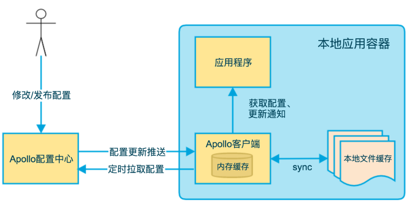

## 一 什么是Apollo? Apollo的核心概念有哪些？
### 1.1 什么是Apollo
✅ Apollo 是一个广泛使用的配置中心，是携程开源的一款配置管理平台，专门解决分布式系统中配置管理的问题  
✅ Apollo 能够集中管理配置，支持热更新，具有权限控制、灰度发布等功能  

### 1.2 核心概念 
#### 1.2.1 应用(Application) 
✅ 每个应用都拥有唯一的 AppId，用于在 Apollo 中隔离配置
✅ AppId 通常与项目名一致

#### 1.2.2 环境(Environment)
✅ 支持多环境管理，比如prod、sit、dev
✅ 每个环境独立部署一套 Config Service 和 Admin Service，Portal 跨环境管理

#### 1.2.3 命名空间(Namespace)
✅ 在Apollo中, 命名空间和Nacos中不太一样，Nacos的命名空间类似于Apollo的环境概念  
1. [ ] 私有类型：只可以被所属的应用获取，应用内唯一
2. [ ] 公有类型：部门级别共享配置、小组级别共享配置、中间件客户端的配置，必须全局唯一
3. [ ] 关联类型（继承类型）：私有继承公有，并覆盖；定制公共组件配置场景

✅ Apollo的命名空间就是多个不同模块的配置,常见的使用场景:  

💡 **公共配置**  
✅ 多个应用就可以与之关联，从而避免重复定义  

💡 **业务模块拆分配置**  
✅ 对于复杂服务，将配置分模块管理。比如订单服务可能有 3 个模块：支付、物流、风控，你可以为每个模块建一个 Namespace：  
1. [ ] order-payment.yaml
2. [ ] order-logistics.yaml
3. [ ] order-risk.yaml  
✅ 有利于责任分离、变更隔离、发布审计  

💡 **灰度实验配置**  
✅ 创建一个特定 Namespace，例如 gray-features.json，用于灰度功能开关   
✅ 只关联到特定的客户端或特定环境的集群上   

💡 多租户/多实例个性化配置
✅ 如果一个服务要为多个租户定制配置，可以为每个租户单独定义一个 Namespace：  
1. [ ] tenant-a-config.yaml
2. [ ] tenant-b-config.yaml

✅ 你可以根据集群（Cluster）来选择加载哪些 Namespace，做到按需加载  


#### 1.2.4 集群(Cluster)
✅ 集群是用于区分同一应用在 不同环境或物理区域(如不同机房)部署时的配置差异  
✅ 通过集群功能，Apollo 允许为同一应用的不同部署环境（如测试、预发、生产）或不同地理位置（如 A 机房、B 机房）设置独立的配置，从而实现配置的精细化管理  
✅ 比如order-service, 可以创建不同集群，每一个集群配置不一样的配置   

**场景：多机房部署的配置隔离**  
假设某应用同时部署在 A 机房 和 B 机房 ，且两个机房的 Elasticsearch（ES）服务器地址不同：  
🧾 A 机房的 ES 地址 ：es.a-cluster.example.com  
🧾 B 机房的 ES 地址 ：es.b-cluster.example.com  

**在 Apollo 中，可以通过以下步骤实现配置隔离：**

✍️ **创建集群：**  
在 Apollo 配置中心为该应用创建两个集群，分别命名为 A-CLUSTER 和 B-CLUSTER

✍️ **配置差异化参数 ：**  
在 A-CLUSTER 的配置中设置：  
elasticsearch.host = es.a-cluster.example.com  

在 B-CLUSTER 的配置中设置：  
elasticsearch.host = es.b-cluster.example.com  

✍️ **应用部署时指定集群 ：**   
应用启动时通过参数 -Dapollo.cluster=A-CLUSTER 或 -Dapollo.cluster=B-CLUSTER 指定所属集群，Apollo 会自动加载对应集群的配置   

## 二 Apollo的架构和工作流程
### 2.1 Apollo 的架构主要分为以下几个核心组件
#### 2.1.1 Config Service(配置服务)
✅ 为客户端提供配置读取和推送服务  

#### 2.1.2 Admin Service(管理服务)
✅ 为Portal(管理后台) 提供配置修改、发布等管理接口  

#### 2.1.3 Portal（管理界面）
✅ 提供一个 Web UI 界面，方便用户查看和修改配置  

#### 2.1.4 Client
✅ 接入方服务通过 SDK 与 Config Service 通信，读取配置  
✅ 支持缓存配置、本地 fallback、防止服务不可用时配置丢失  

#### 2.1.5 ConfigDB
✅ 保存配置的数据库，ConfigService可以查询ConfigDB，AdminService可以查询和写入配置  

#### 2.1.6 Eureka & MetaServer
✅ 为了保证高可用，ConfigService和AdminService都是无状态以集群方式部署的  
✅ 这个时候就存在一个服务发现问题：Client怎么找到ConfigService？Portal怎么找到AdminService？  
✅ 为了解决这个问题，Apollo在其架构中引入了Eureka服务注册中心组件，实现微服务间的服务注册和发现  

✅ Eureka的客户端只支持Java，如果客户端就是Java，那么服务发现之后就可以通过客户端的负载均衡，比如Ribbon路由到目标服务实例  
✅ 如果是其他语言的客户端，Eureka就无法实现, 因此设计了MetaServer  

✅ MetaServer可以动态获取ConfigService和AdminService地址信息，比如:  
1. [ ] 服务发现: 客户端SDK 启动时，通过访问MetaServer获取当前环境下可用的 Config Service 列表
2. [ ] 解耦: 客户端不需要硬编码 Config Service 地址，提升系统灵活性与可维护性

✅ 实际上，MetaServer 不是单独的模块，它是集成在 Config Service 和 Admin Service 中的，换句话说，每个 Config Service 实例，同时也充当对应环境的 MetaServer
✅ 当你启动 Config Service 实例时，通过配置 apollo.meta 来声明它是某环境的 MetaServer:   
```yaml
# application-github.properties（示例）
spring.profiles.active=github
apollo.config-service=http://config1.example.com:8080
apollo.admin-service=http://admin1.example.com:8090
apollo.meta=http://config1.example.com:8080
```
✅ **客户端访问时：**  
会先读取环境变量或配置中定义的 MetaServer 地址：
-Dapollo.meta=http://config1.example.com:8080
请求 MetaServer 的服务发现接口，如：
GET http://config1.example.com:8080/services/config
得到可用的 Config Service 列表

### 2.2 发布配置的流程
✅ Portal用户保存或者修改配置  
✅ Portal调用Admin Service的接口操作发布  
✅ Admin Service发布配置后，通过MQ发送消息给所有Config Service  
✅ Config Service收到消息后，会通知客户端拉取最新配置  

## 三 客户端工作流程
  
✅ 客户端本地会维护一个缓存  
✅ 客户端根据推拉结合获取配置信息   
1. [ ] 利用Spring长连接技术，配置实时推送
2. [ ] 也可以定期拉取配置

✅ 拉取的配置缓存在本地内存，会将配置写入本地磁盘，防止Apollo客户端不可用的情况下，还可以使用本地缓存的配置  
✅ 应用程序订阅Apollo客户端更新通知  


## 五 SpringCloud Config 、Apollo、Nacos配置中心选型
### 5.1 单机吞吐量(可选)
✅ SpringCloud Config: 几个每秒, 很差  
✅ Apollo: 高  
✅ Nacos: 高

### 5.2 版本管理
✅ SpringCloud Config: 支持(Git)  
✅ Apollo: 自动管理  
✅ Nacos: 自动管理

### 5.3 配置回滚
✅ SpringCloud Config: 支持(Git)  
✅ Apollo: 支持   
✅ Nacos: 支持

### 5.4 灰度发布
✅ SpringCloud Config: 支持  
✅ Apollo: 支持  
✅ Nacos: 支持

### 5.5 多环境支持
✅ SpringCloud Config: 支持  
✅ Apollo: 支持  
✅ Nacos: 支持

### 5.6 权限管理
✅ SpringCloud Config: 支持  
✅ Apollo: 支持  
✅ Nacos: 支持， Nacos 2.x 版本或开启鉴权机制时，它具备较完善的权限控制体系

### 5.7 多语言支持
✅ SpringCloud Config: 只支持Java   
✅ Apollo: 支持多种语言  
✅ Nacos: 支持多种语言

### 5.8 实时推送
✅ SpringCloud Config: 支持(spring cloud bus)  
✅ Apollo: 支持(http 长轮询)  
✅ Nacos: 支持(http 长轮询)

### 5.9 格式校验
✅ SpringCloud Config: 不支持  
✅ Apollo: 支持  
✅ Nacos: 支持


### 5.10  运维复杂度
✅ SpringCloud Config: ConfigServer (2) + Git + MQ (复杂度中等)
✅ Apollo: ConfigService(2) + AdminService(3) + Portal (2) + Eureka(3) + MySQL (复杂)
✅ Nacos: Nacos(3) + MySQL(简单)


### 5.11 通信协议
✅ SpringCloud Config: HTTP  
✅ Apollo: HTTP  
✅ Nacos: HTTP  


