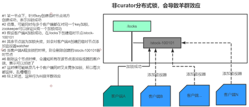
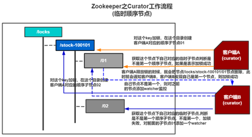

## 一 什么是分布式锁，分布式锁设计的时候需要考虑哪些问题
### 1.1 什么是分布式锁
✅ 为了防止多个进程修改某个共享变量，给该共享变量添加的锁就是分布式锁   

### 1.2 分布式锁设计的时候需要考虑哪些问题
#### 1.2.1 防止死锁，设置超时
✅ 当某一个进程获取到锁之后，可能该进程挂掉，但是锁没有释放，那么其他进程会一直等待锁的释放，产生死锁现象  
✅ 所以设置超时时间，即便死锁，超时之后也会释放锁  

#### 1.2.2 避免锁到期，业务没执行完，需要自动续租
✅ 当某进程获取到锁之后，可能业务稍微有点耗时，导致锁超时自动释放，但是业务没执行完，那这个时候别的线程持有锁，造成并发问题  
✅ 因此持有锁的线程需要进行对锁续租，然后手动释放锁  

#### 1.2.3 避免锁的单点问题
✅ 如果锁是单点的，那么锁挂了，获取不到锁，业务也就没法执行了  

#### 1.2.4 释放锁应该通知其他进程
✅ 首先，其他进程获取不到锁，应该是阻塞等待，而不是自旋重试，并发高的话，自旋从事很容易产生问题  
✅ 然后，你等待就需要被唤醒，所以释放锁的时候应该有机制通知其他处于等待状态的锁  

#### 1.2.5 锁的性能
✅ 加锁和释放锁，我们需要考虑性能，不能时间比较长  

## 二 分布式锁有哪些实现方案
✅ 数据库表的方案  
✅ Zookeeper方案  
✅ Redis方案  

## 三 数据库方案
✅ 创建一张资源表(resource_locks): lock_id, owner_id, resource, state, create_time, update_time等  
✅ 进程需要加锁的时候，会通过resource和state作为条件，比如update resource_locks set state = 1 where resource = 'xxx' and state = 0  
✅ 如果加锁失败，这时候会进行重试  

❗ **缺点:**  
🔵 多个服务并发写入或更新这条记录时，会产生大量行锁冲突、阻塞、事务回滚，而且还需要自己重试  
🔵 这个是进行磁盘I/O操作，和Redis等操作内存相比，性能低一些  
🔵 从并发程度来讲，Redis并发高，Zookeeper有排队机制，数据库会受到连接限制  
🔵 针对死锁、自动续租等问题，数据库方案都需要自己去实现，很麻烦  

## 四 Zookeeper方案
🔍 **结论:**
💡 **是否有死锁?**
持有锁的客户端进程挂了，那么会话到期，这个节点就会自动被删除，所以不存在死锁，所以不需要设置超时时间  

💡 **是否需要续租?**
因为没有锁超时问题，不存在业务没有执行完锁就释放的场景，所以也不需要续租  

💡 **否单点故障?**
Zookeeper一般集群部署，就不存在单点故障  

💡 **是否通知其他进程？**
锁删除的时候会通知其他进程  

### 4.1 无序临时节点
  

✅ 在某一个目录下，客户端进程需要创建一个临时节点，创建成功，表示获取到锁；创建失败，表示锁已存在  
✅ 失败的进程会注册一个Watcher去监听这个节点，如果别人释放锁的时候，就会被通知  
✅ 持有锁的线程删除这个锁，就是释放锁，别的客户端因为监听这个节点，所以会被通知  
✅ 被通知后，这些客户端进程又开始向这个目录下创建临时节点，去获取锁  

❗ **缺点:**  
🔵 **羊群效应**  
所有获取锁失败的客户端都会在父节点上创建对子节点的监听，当持有锁的客户端释放锁之后，所有等待的进程一起来创建节点，并发量很大，每次都这样，乱糟糟的，所以也叫羊群效应  

🔵 **锁不公平**  
可能后面的进程先于前面等待的进程先获取到锁，不是公平锁，所以可能造成饥饿现象  

### 4.2 有序临时节点
  

✅ 客户端在某路径下创建临时有序节点，会根据指定的锁的前缀 + 生成一个数字序号，这个数字序号是递增的  
✅ 每一个客户端创建后判断自己是不是第一个有序节点，如果是获取锁，且不需要注册监听器  
✅ 如果不是，则监听“前一个”节点添加Watcher监听器，监听删除事件  
✅ 当持有锁的客户端释放锁或者宕机的的时候，监听器就会被通知，判断自己是不是第一个有序节点，如果是获取锁  

❗**优点:** 解决了无需节点的羊群效应和不公平的问题  

## 五 Redis方案
🔍 **5.1 结论**  
💡 **是否有死锁?**  
持有锁的客户端进程挂了，锁无法释放，需要解决死锁问题  

💡 **是否需要续租?**  
因为有锁超时问题，存在业务没有执行完锁就释放的场景，所以需要自动续租  

💡 **是否单点故障?**  
Redis集群部署或者主从部署，就不存在单点故障  

💡 **是否通知其他进程？**  
Redis有发布订阅机制，可以通知其他客户端  

## 5.2 Redisson工作原理

**Redisson 提供了 tryLock(waitTime, leaseTime, unit) 方法实现分布式加锁机制:**
1. [ ] waitTime：获取锁的最大等待时间，超时仍未成功则返回失败
2. [ ] leaseTime：锁的自动过期时间，如果未设置（即为 -1），则会由 WatchDog 自动续期

🧠 ** 加锁步骤如下:**   
🎯 获取当前线程 ID  
✅ Redisson 为每个线程生成一个唯一标识，用于判断锁的归属和支持可重入  

🎯 执行 Lua 脚本（原子加锁）  
✅ 如果锁不存在: 设置锁标识（包括线程 ID）并设置默认过期时间（30 秒）  
✅ 如果锁已存在:如果是同一个线程加的锁，则认为是重入，重入次数 +1  
✅ 如果是其他线程，则表示加锁失败  

🎯 **加锁失败后的处理**    
✅ 如果设置了 waitTime，则 Redisson 会:    
1. [ ] 订阅锁释放事件（基于 Redis 的 Pub/Sub）  
2. [ ] 在 waitTime 时间内循环尝试获取锁  
   
✅️ 如果未设置 waitTime，则会一直阻塞等待，直到获取到锁   

🎯WatchDog自动续租(仅在未设置 leaseTime 时生效)  
✅ 加锁成功后，如果未设置 leaseTime，Redisson 会启动 WatchDog:  
1. [ ] 每隔 10 秒将锁的 TTL 重置为 30 秒  
2. [ ] 保证锁在任务未完成时不会因 TTL 到期而被误删  

🧠 **释放锁流程**  
🎯 执行 Lua 脚本释放锁（原子性）  
✅ 判断 Redis 中的锁是否为当前线程持有:    
1. [ ] 是当前线程：重入次数减 1； 如果重入次数为 0：彻底释放锁  
2. [ ] 不是当前线程：释放失败，抛出异常（非法释放）  

🎯 WatchDog 停止续租  
✅ 如果启用了 WatchDog，释放锁时会停止对应线程的续租调度任务，避免资源浪费  

🎯 触发锁释放事件通知  
✅ 通过 Redis 的发布订阅机制（unlock:xxx 频道），通知等待该锁的线程重试获取锁  

## 六 Redis和Zookeeper比较
### 6.1 性能
✅ Redis: 性能非常高，内存级别操作，毫秒级响应  
✅ Zookeeper: 性能相对低（磁盘+通信），但可接受  

### 6.2 一致性
✅ Redis: 弱一致性(默认不保证强一致)  
✅ Zookeeper: 强一致性  

### 6.3 可靠性
✅ Redis: 本身存在死锁风险、锁丢失风险，可以通过RedissonLock解决  
✅ Zookeeper: 极高可靠性，临时节点+Watcher机制防死锁  

### 6.4 部署复杂度	
✅ Redis: 简单(Redis 单机或主从即可), 但是无法解决单点问题，所以最好是集群或者Sentinel模式，最低也需要主从  
✅ Zookeeper: 较复杂(至少3个节点组成集群)    

🎯 **总结:**
1. [ ] Zookeeper适合的是中等并发，不允许锁出现丢失的情况
2. [ ] Redis: 适合极高并发，偶尔允许出现锁丢失
但是在真正的高并发场景下，一般都会使用Redis, 同时也不允许锁丢失
