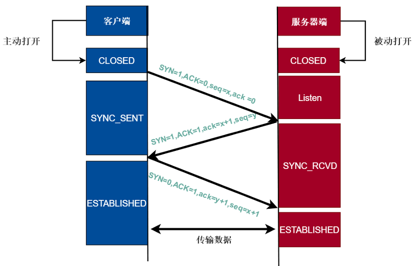
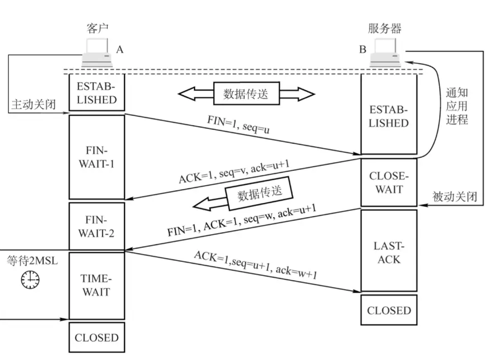
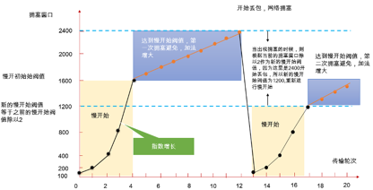
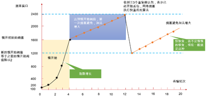

## 一 什么是tcp协议，有什么特点?
**TCP协议是一个面向字节流的、可靠的传输协议**。包括以下特点:  
✅ TCP协议面向连接的、可靠的传输层协议  
✅ TCP是全双工传输协议  
✅ TCP协议是一种面向字节流，而不是数据包的协议
✅ UDP首部开销大  
✅ UDP有网络拥塞控制  

## 二 tcp协议三次握手流程
  
### 2.1 第一次握手: 客户端向服务端发起连接请求
✅ 客户端请求建立连接，初始化序列号seq=X  
✅ 报文段标志位是SYN=1表示这是一个连接请求，ACK=0表示这不是确认
✅ 此时，客户端进入 SYN-SENT 状态，等待服务器的响应

### 2.2 第二次握手: 服务端对客户端连接进行确认
✅ 服务器收到连接请求，回应客户端并同步自己的序列号
✅ 报文段标志位是SYN=1表示这是一个连接请求，ACK=1表示这是一个确认报文
✅ 指定序列号seq=Y, ack=X+1(表示收到了客户端的 seq=X)
✅ 服务器进入 SYN-RCVD 状态，等待客户端的确认

### 2.3 第三次握手: 客户端对服务端的确认进行确认
✅ 客户端收到服务端确认，对这个确认进行确认
✅ 报文段标志位是SYN=0表示这不是一个连接请求，ACK=1表示这是一个确认报文
✅ 客户端ack=Y+1(客户端收到服务端的序列号)， seq=X+1(在自己初始化的序列号基础上加1)
✅ 客户端进入ESTABLISHED状态

## 三 tcp四次挥手流程
  
### 3.1 第一次挥手: 客户端发送终止连接的报文
✅ 客户端详服务端发送终止连接的报文FIN = 1  
✅ 这不是一个确认报文ACK = 0  
✅ 客户端告诉服务端最后一个数据包序列号seq = u  
✅ 客户端进入FIN_WAIT_1状态  

### 3.2 第二次挥手: 服务端对客户端的终止连接的请求进行了确认
✅ 服务端收到客户端终止报文，然后进行确认ACK = 1  
✅ 但是服务器并没有终止连接，所以没有设置FIN字段，只是告诉客户端我知道了  
✅ 并且告知客户端我知道你发送的序列号: ack = u+1  
✅ 服务端进入CLOSE_WAIT即等待关闭状态  
✅ 客户端收到后，不会做任何处理，状态变为FIN_WAIT_2状态  

### 3.3 第三次挥手: 服务端也开始发送终止连接的报文
✅ 服务端处理完业务后，准备终止连接，向客户端发送终止连接报文FIN = 1  
✅ 这是一个确认报文ACK = 1  
✅ 告诉客户端服务器当前序列号是w  
✅ 告诉客户端我知道你上次告诉我的序列号ack = u+1  
✅ 服务器进入LAST_ACK最后确认阶段  

### 3.4 第四次挥手: 客户端对服务端的终止报文进行确认
✅ 客户端收到服务端的FIN报文后，进行确认ACK = 1  
✅ 但是现在已经不是终止报文了，所以FIN = 0  
✅ 告诉服务端已收到服务端的序列号ack = w+1  
✅ 客户端此时状态TIME_WAIT  
✅ 等待 2 倍最大段寿命（MSL）时间后，彻底关闭连接,状态变为CLOSED  
✅ 服务端收到之后状态变为CLOSED  

## 四 三次握手，为什么最后客户端要再次确认?
### 4.1 防止失效的连接请求报文
✅ 如果客户端发送的第一个 SYN 报文因网络延迟未及时到达服务端，客户端会超时重传新的 SYN 报文  
✅ 假设没有第三次握手，服务端收到旧的 SYN 报文时会误认为是新的连接请求，分配资源并回复 SYN+ACK，最终导致服务端维护一个无效的连接（客户端已放弃该请求）  

### 4.2 同步双方的初始序列号
✅ 第三次握手的 ACK 报文携带了客户端对服务端序列号的确认，确保双方初始序列号（ISN）同步  
✅ 若只有两次握手，服务端无法确认客户端是否成功接收自己的 ISN，可能导致后续数据传输的混乱  

## 五 四次挥手，TIME_WAIT为什么要等待2MSL那么长时间
### 5.1 MSL是什么
✅ Max Segment Lifetime: 最大报文段生存时间  
✅ TCP 协议规定，任何一个 TCP 报文段在网络中不应该存活超过 MSL  
✅ 在这个时间内，报文段要么成功传送到目的地，要么被网络丢弃  

## 5.2 为什么不直接关闭，而是进入TIME_WAIT状态
✅ 客户端给服务端发送了终止确认报文，但是服务器不一定收得到啊，有可能因为网络问题超时或者丢失等，导致服务器可能又会发送一次呢  
✅ 如果客户端现在已经关闭了，那么服务器重新发送到报文客户端收不到  

### 5.3 TIME_WAIT为什么要等待2MSL那么长时间
✅ 如果最后一个 ACK 丢了，服务器会重新发送 FIN  
✅ 客户端要确保自己在 MSL 时间内还能收到这个重传的 FIN，并再发一次 ACK  
✅ 为了保证这个 ACK 也不会丢在网络中，还要再多等一个 MSL  
✅ 因此，总共要等待2 × MSL 的时间  

## 六 为什么需要四次挥手
✅ TCP协议是全双工通信，客户端和服务器双方都可以同时发送和接收数据  
✅ 因此，在断开连接时，双方都需要各自发送 FIN 报文来表示不再发送数据，从而需要四次挥手  

## 七 什么是TCP粘包和拆包问题，如何解决？UDP是否存在粘包和拆包问题？
### 7.1 TCP粘包和拆包问题
🎯**拆包:**  
如果消息每次都很小，远小于MSS，为了提升性能，将多个小包合成一个大的包传输到接收端。比如Nagle算法。这就会导致粘包现象  

🎯**拆包：**  
我们知道，TCP是面向字节流的，每次传输需要收到MSS(最大段大小)控制，如果一个数据很大，超过MSS大小，就需要发送多次  

### 7.2 TCP半包读写解决方案
✅ 方案一： 发送端关闭Nagle算法  
✅ 方案二： 接收端TCP是无界的数据流，并没有处理粘包的机制，半包的读写的需要在应用层来处理  
🔧 设置定长消息(比如10字节或者5个字符) hello00000  
🔧 设置消息的边界(分隔符 ##)  
🔧 使用带消息头的协议(head+body), 带有消息长度的头部信息和body信息  

## 八 拥塞控制
### 8.1 什么是拥塞，拥塞控制
✅ 当网络中的数据流量超过了网络设备或者链路的处理能力，从而导致吞吐量下降、丢包率上升，延迟增加，就是拥塞
✅ 拥塞控制指在网络中防止过多的数据注入导致网络拥堵的一种机制

### 8.2 TCP怎么解决拥塞控制
TCP 主要通过拥塞窗口（cwnd）控制发送速率，并结合以下 四个机制 来动态调整：
### 8.2.1 慢开始阶段(Slow Start)
✅ 初始时，发送速率按照指数级增长  
✅ 呈指数级增长，直到达到一个阈值 ssthresh  

### 8.2.2 拥塞避免(Congestion Avoidance)
✅ 当慢开始算法发送端报文段超过这个阀值，就会进行线性递增(加法增大)报文段  
✅ 如果到达某个时候开始出现网络拥塞，出现丢包的情况，则重新从头开始递增报文段  

### 8.2.3 快速恢复(Fast Recovery)
  
改进前的拥塞避免: 又要从慢开始进行启动，但是慢开始的阈值就从之前出现拥塞时候量除以2  

  
改进后的拥塞避免: 从拥塞避免触发的阈值除以2，然后按照这个量线性增长，不再从慢开始启动  

## 九 流量控制
### 9.1 什么是流量控制
✅ 就是在接收端拥堵的时候，发送端应减少报文段的发送  
✅ 在接收端不拥堵的时候，可以恢复到正常的报文段的发送  
✅ 流量控制是通过滑动窗口实现的，通过窗口来控制流量  

### 9.2 怎么进行流量控制
✅ **通过接收端返回的window size 和 ack 序列号确定能否发送数据，以及最多能发多少数据**  
✅ 发送端向接收端发送连接请求，接收端对请求进行确认，确认包里会告诉发送端它的接受窗口window是多大  
✅ 当接收窗口来不及处理发送端报文段的时候，则会调整(缩小)window窗口  
✅ 如果接收窗口已经不能处理任何发送端的报文段，如果发送端继续发送，这些数据段会被丢弃的, 因此发送端收到确认后发现window size = 0， 会停止发送数据  
✅ **发送端会定时发送一个窗口探测包，如果接收端返回的window size > 0，表示有能力继续处理了，可以继续发送数据**

## 十 TCP协议和UDP协议比较
✅ TCP是面向连接，而UDP面向的是无连接  
✅ TCP面向的是字节流; 而UDP面向的是数据报文  
✅ TCP是可靠传输协议; UDP是不可靠传输协议  
✅ TCP会处理拥塞控制;UDP不会进行拥塞控制  
✅ TCP是点对点传输;UDP可以一对一, 一对多和多对多传输  
✅ TCP首部开销大;UDP首部开销小  