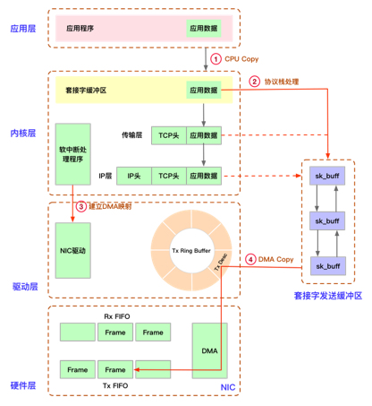
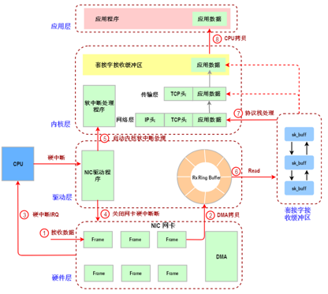

## 一 网络数据包发送流程
  

✅	第一：用户程序发送数据，一般都会先写入缓冲区ByteBuffer，然后满了之后调用write或者send函数发送，此时因为用户程序调用了系统调用write或者send则CPU进入内核态，将用户程序中的缓冲区数据通过CPU拷贝内核中的套接字发送缓冲区  
✅	第二：内核调用协议栈开始对数据进行处理，比如添加TCP首部，然后添加IP首部，此时数据还在套接字缓冲区中  
✅	第三: 内核启动软中断，调用中断处理程序，告知NIC驱动(网卡驱动程序)有数据需要发送  
✅	第四: 内核驱动程序将从套接字发送队列读取数据包，放入网卡中的缓冲队列Ring Buffer，然后通知网卡(NIC)将Ring Buffer中的数据发送出去  

## 二 网络数据包接收流程
  
✅	第一: 网卡(NIC)接收网络数据包  
✅	第二: 网卡接收的网络数据包会放到自己的Ring Buffer缓存中  
✅	第三: 网卡向CPU发送硬件中断处理请求IRQ，然后CPU开始调用中断处理程序   
✅	第四: 为了避免中断处理程序占用很长时间处理，则关闭网卡的硬中断，表示驱动程序已经知道Ring Buffer有数据了，然后后续网卡数据可以写Ring Buffer中  
✅	第五：打开内核软中断处理程序，这样就不影响CPU执行其他进程或者中断  
✅	第六：内核的软中断会从Ring Buffer中读取数据到内核套接字接收缓冲区  
✅	第七：内核接收缓冲区中的数据包调用协议栈处理  
✅	第八：然后用户程序发起read/recv调用，则从内核套接字接收缓冲区返回数据  

🧠 **结论:**  
✅	内核套接字接收和发送缓冲区大小在Linux系统为  
1. [ ] /proc/sys/net/ipv4/tcp_rmem (读队列大小配置)
2. [ ] /proc/sys/net/ipv4/tcp_wmem (写队列大小配置)
