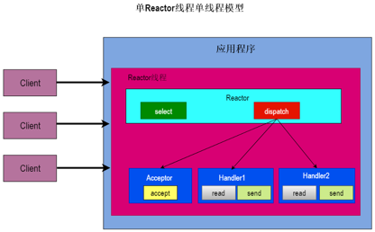
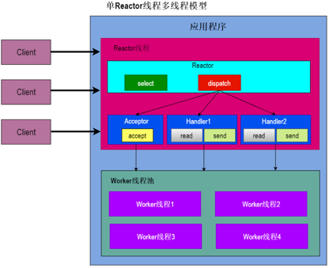
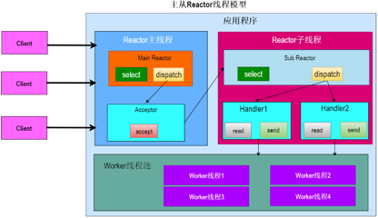

## 一 传统阻塞模型
### 1.1 传统阻塞单线程模型
✅	服务器端accept, 阻塞等待客户端连接请求  
✅	收到客户端连接请求，创建socket描述符  
✅	调用read函数，根据socket描述符读数据  
✅	阻塞等待内核准备数据  
✅	数据准备好，返回数据  

🎯 **缺点:**   
只有一个主线程来处理网络请求这种同步阻塞模式很垃圾，因为一旦某个客户端发生阻塞，就会影响其他客户端  

📖 **示例代码:**   
```java
import java.io.*;
import java.net.*;
public class SingleThreadBlockingServer {
    public static void main(String[] args) throws Exception {
        ServerSocket serverSocket = new ServerSocket(9999);
        System.out.println("服务启动，等待客户端连接...");

        while (true) {
            Socket socket = serverSocket.accept(); // 接收连接（阻塞）
            System.out.println("客户端连接：" + socket.getRemoteSocketAddress());

            // 读取数据（阻塞）
            BufferedReader reader = new BufferedReader(new InputStreamReader(socket.getInputStream()));
            String line = reader.readLine();
            System.out.println("收到数据：" + line);

            socket.close(); // 处理完关闭连接
        }
    }
}
```

## 1.2 传统阻塞多线程模型
✅ 服务器端accept, 阻塞等待客户端连接请求  
✅ 收到连接请求，为每一个客户端创建或者分配一个线程来处理具体的业务  
✅ 每一个线程中的I/O操作，即便阻塞，也只是阻塞自己，不会影响其他客户端  

🎯 **缺点:**  
如果有大量客户端发起网络请求，那么服务端就会创建大量的线程，线程是操作系统中成本比较高的资源，既会占用较多的内存，也会频繁的进行CPU上线文切换，系统是扛不住的

📖 **示例代码:**  
```java
import java.io.*;
import java.net.*;

public class MultiThreadBlockingServer {
    public static void main(String[] args) throws Exception {
        ServerSocket serverSocket = new ServerSocket(9999);
        System.out.println("服务启动，等待客户端连接...");

        while (true) {
            Socket socket = serverSocket.accept(); // 接收连接（阻塞）
            new Thread(() -> handleClient(socket)).start(); // 每个连接新起一个线程处理
        }
    }

    private static void handleClient(Socket socket) {
        try {
            System.out.println("处理客户端：" + socket.getRemoteSocketAddress());
            BufferedReader reader = new BufferedReader(new InputStreamReader(socket.getInputStream()));
            String line = reader.readLine(); // 阻塞等待数据
            System.out.println("收到数据：" + line);

            socket.close();
        } catch (IOException e) {
            e.printStackTrace();
        }
    }
}
```


## 二 Reactor单线程模型
   

### 2.1 什么是Reactor单线程模型
✅ 指的是创建连接、监听事件和I/O操作都是在相同的Reactor线程中进行的  

### 2.2 Reactor单线程模型角色
✅ 主线程: Reactor  
✅ AcceptHandler: 创建客户端连接，并向Selector注册，他是运行在Reactor线程之内的  
✅ DataHandler: 业务处理器，处理读写I/O事件，他是运行在Reactor线程之内的  

### 2.3 工作流程
#### 2.3.1 Reactor线程
✅ 创建Reactor线程，并启动Reactor线程  
✅ Reactor线程初始化的时候:  
1. [ ] 会初始化Selector
2. [ ] 创建ServerSocketChannel
3. [ ] 向Selector注册ServerSocketChannel，监视ON_ACCEPT事件
4. [ ] 绑定AcceptHandler

✅ Reactor线程运行的时候:  
1. [ ] 不断的轮询，从Selector获取就绪事件
2. [ ] 如果有事件就绪，根据事件类型进行dispatch分发:

* 如果是ACCEPT事件，则调用AcceptHandler的run方法
* 如果是读写事件就绪，则调用DataHandler的run方法

#### 2.3.2 AcceptHandler:
✅ 接收连接, 创建SocketChannel   
✅ 将SocketChannel注册到 Selector 上，绑定一个新的业务Handler， 监听感兴趣的读写事件    

#### 2.3.3 DataHandler:
✅ 读数据：SocketChannel.read()，缓存到缓冲区  
✅ 写数据：SocketChannel.write()，将缓冲区内容发送回客户端  


### 2.4 示例代码
```java
public class Main {
    public static void main(String[] args) throws IOException {
        new Thread(new Reactor(8080)).start();
    }
}


public class Reactor implements Runnable {
    private final Selector selector;
    private final ServerSocketChannel serverSocket;

    public Reactor(int port) throws IOException {
        selector = Selector.open();
        serverSocket = ServerSocketChannel.open();
        serverSocket.bind(new InetSocketAddress(port));
        serverSocket.configureBlocking(false);
        SelectionKey sk = serverSocket.register(selector, SelectionKey.OP_ACCEPT);
        sk.attach(new AcceptorHandler());
    }

    @Override
    public void run() {
        try {
            while (!Thread.interrupted()) {
                selector.select(); // 阻塞等待就绪事件
                Iterator<SelectionKey> it = selector.selectedKeys().iterator();
                while (it.hasNext()) {
                    SelectionKey key = it.next();
                    dispatch(key);
                    it.remove();
                }
            }
        } catch (IOException e) {
            e.printStackTrace();
        }
    }

    private void dispatch(SelectionKey key) {
        Runnable handler = (Runnable) key.attachment();
        if (handler != null) handler.run(); // 这里调用EchoHandler.run执行I/O操作
    }

    // AcceptorHandler 内部类
    class AcceptorHandler implements Runnable {
        @Override
        public void run() {
            try {
                SocketChannel client = serverSocket.accept();
                if (client != null) {
                    new EchoHandler(selector, client); // 这里只是创建，并没有启动，并不是以线程方式运行
                }
            } catch (IOException e) {
                e.printStackTrace();
            }
        }
    }
}


public class EchoHandler implements Runnable {
    private final SocketChannel socket;
    private final SelectionKey sk;
    private final ByteBuffer buffer = ByteBuffer.allocate(1024);
    private static final int READING = 0, SENDING = 1;
    private int state = READING;

    public EchoHandler(Selector selector, SocketChannel client) throws IOException {
        socket = client;
        socket.configureBlocking(false);
        sk = socket.register(selector, SelectionKey.OP_READ);
        sk.attach(this);
        selector.wakeup(); // 唤醒 selector 立即处理注册
    }

    @Override
    public void run() {
        try {
            if (state == READING) read();
            else if (state == SENDING) send();
        } catch (IOException e) {
            e.printStackTrace();
            sk.cancel();
            try { socket.close(); } catch (IOException ex) { }
        }
    }

    private void read() throws IOException {
        int len = socket.read(buffer);
        if (len > 0) {
            buffer.flip();
            state = SENDING;
            sk.interestOps(SelectionKey.OP_WRITE);
        }
    }

    private void send() throws IOException {
        socket.write(buffer);
        if (!buffer.hasRemaining()) {
            buffer.clear();
            state = READING;
            sk.interestOps(SelectionKey.OP_READ);
        }
    }
}

```

## 三 Reactor多线程模型
  
💡 **注意:** 有的地方AcceptHandler并没有使用线程池  

### 3.1 什么是Reactor多线程模型
✅ 创建连接、监听事件在Reactor线程中执行，但是I/O事件提交给线程池中执行，将I/O事件异步解耦，提升Reactor线程执行效率   

### 3.2 Reactor单线程和Reactor多线程比较
✅ Reactor单线程: 业务Handler执行是在Reactor主线程进行的    
✅ Reactor多线程: 业务Handler执行是提交给线程池执行的，而不是Reactor主线程    

### 3.3 Reactor多线程模型角色
✅ 主线程: Reactor  
✅ AcceptHandler: 创建客户端连接，并向Selector注册，他是运行在Reactor线程之内的  
✅ DataHandler: 业务处理器，处理读写I/O事件，他是运行在Reactor线程之内的  
✅ 线程池: 执行提交的DataHandler任务  

### 3.4 工作流程
#### 3.4.1 Reactor线程
✅ 创建Reactor线程，并启动Reactor线程  
✅ Reactor线程初始化的时候:  
1. [ ] 会初始化Selector
2. [ ] 创建ServerSocketChannel
3. [ ] 向Selector注册ServerSocketChannel，监视ON_ACCEPT事件
4. [ ] 绑定AcceptHandler

✅ Reactor线程运行的时候:  
1. [ ] 不断的轮询，从Selector获取就绪事件  
2. [ ] 如果有事件就绪，根据事件类型进行dispatch分发:  

* 如果是ACCEPT事件，则调用AcceptHandler的run方法  
* 如果是读写事件就绪，则将DataHandler提交给线程池执行  

#### 3.4.2 AcceptHandler
✅ 接收连接, 创建SocketChannel   
✅ 将SocketChannel注册到 Selector 上，绑定一个新的业务Handler， 监听感兴趣的读写事件  

#### 3.4.3 DataHandler
✅ 读数据：SocketChannel.read()，缓存到缓冲区  
✅ 写数据：SocketChannel.write()，将缓冲区内容发送回客户端  

### 3.5 示例代码
```java
import java.io.IOException;
import java.net.InetSocketAddress;
import java.nio.ByteBuffer;
import java.nio.channels.*;
import java.util.Iterator;
import java.util.Set;
import java.util.concurrent.ExecutorService;
import java.util.concurrent.Executors;

public class MultiThreadReactorServer {
    private Selector selector;
    private ServerSocketChannel serverSocketChannel;
    private ExecutorService workerPool;

    public MultiThreadReactorServer(int port, int workerThreads) throws IOException {
        selector = Selector.open();
        serverSocketChannel = ServerSocketChannel.open();
        serverSocketChannel.bind(new InetSocketAddress(port));
        serverSocketChannel.configureBlocking(false);

        // 注册accept事件
        serverSocketChannel.register(selector, SelectionKey.OP_ACCEPT);

        // 线程池处理读写业务
        workerPool = Executors.newFixedThreadPool(workerThreads);
    }

    public void start() throws IOException {
        System.out.println("Server started on port ...");

        while (true) {
            selector.select(); // 阻塞等待就绪事件
            Set<SelectionKey> keys = selector.selectedKeys();
            Iterator<SelectionKey> it = keys.iterator();

            while (it.hasNext()) {
                SelectionKey key = it.next();
                it.remove();

                if (key.isAcceptable()) {
                    handleAccept();
                } else if (key.isReadable()) {
                    // 读事件交给线程池异步处理
                    key.interestOps(key.interestOps() & ~SelectionKey.OP_READ); // 先取消读监听，防止重复触发
                    workerPool.submit(new ReadHandler(key));
                }
            }
        }
    }

    private void handleAccept() throws IOException {
        SocketChannel client = serverSocketChannel.accept();
        client.configureBlocking(false);
        System.out.println("Accepted connection from " + client.getRemoteAddress());

        // 注册读事件，监听客户端数据
        client.register(selector, SelectionKey.OP_READ);
    }

    // 读取客户端数据任务
    private class ReadHandler implements Runnable {
        private SelectionKey key;

        public ReadHandler(SelectionKey key) {
            this.key = key;
        }

        @Override
        public void run() {
            SocketChannel client = (SocketChannel) key.channel();
            ByteBuffer buffer = ByteBuffer.allocate(1024);
            int bytesRead = 0;
            try {
                bytesRead = client.read(buffer);
                if (bytesRead > 0) {
                    buffer.flip();
                    byte[] data = new byte[buffer.remaining()];
                    buffer.get(data);

                    String received = new String(data);
                    System.out.println("Received: " + received);

                    // Echo 回客户端
                    buffer.clear();
                    buffer.put(("Echo: " + received).getBytes());
                    buffer.flip();
                    while (buffer.hasRemaining()) {
                        client.write(buffer);
                    }
                } else if (bytesRead == -1) {
                    // 客户端关闭连接
                    System.out.println("Client disconnected: " + client.getRemoteAddress());
                    client.close();
                    key.cancel();
                    return;
                }
            } catch (IOException e) {
                e.printStackTrace();
                try {
                    client.close();
                } catch (IOException ex) {
                }
                key.cancel();
            } finally {
                // 重新开启读监听
                if (key.isValid()) {
                    key.interestOps(key.interestOps() | SelectionKey.OP_READ);
                    selector.wakeup();  // 重要，唤醒selector，更新事件注册
                }
            }
        }
    }

    public static void main(String[] args) throws IOException {
        MultiThreadReactorServer server = new MultiThreadReactorServer(9000, 4);
        server.start();
    }
}
```

## 四 主从Reactor多线程模型
### 4.1 什么是主从Reactor多线程模型
✅ 就是将以前单个Reactor，拆分成2部分Reactor: MainReactor和SubReactor  

### 4.2 主从Reactor多线程模型角色有哪些
✅ MainReactor: 将新创建的的ServersocketSocketChannel注册到Selector， 主要是监听ON_ACCEPT事件  
✅ SubReactor: 将新创建的的SocketChannel注册到Selector, 循环监听就绪的I/O事件   
✅ AcceptHandler: 创建客户端连接，并向Selector注册，他是运行在Reactor线程之内的  
✅ DataHandler: 业务处理器，处理读写I/O事件，他是运行在Reactor线程之内的  
✅ 线程池: 执行提交的DataHandler任务  

### 4.3 工作流程
  
#### 4.3.1 MainReactor
✅ 创建Selector  
✅ 创建ServerSocketChannel,让后将其注册到Selector，监听ON_ACCEPT事件  
✅ 负责初始化和启动从Reactor  
✅ 监听到ON_ACCEPT事件，创建SocketChannel, 然后从Reactor中选择一个Reactor去向Selector新注册创建的SocketChannel，以及监听读写事件  

#### 4.3.1 SubReactor
✅ 创建Selector
✅ 从Reactor本身是一个单独的线程，他在初始化的时候会初始化线程池
✅ 然后当从Reactor监听到就绪事件，创建业务Handler交给线程池执行

### 4.4 示例代码
```java
import java.io.IOException;
import java.net.InetSocketAddress;
import java.nio.ByteBuffer;
import java.nio.channels.*;
import java.util.Iterator;
import java.util.Set;
import java.util.concurrent.ExecutorService;
import java.util.concurrent.Executors;

public class MasterSlaveReactor {
    // 主 Reactor 线程
    static class MainReactor implements Runnable {
        private final Selector selector;
        private final ServerSocketChannel serverSocket;
        private final SubReactor[] subReactors;
        private int nextSubReactor = 0;

        public MainReactor(int port, int subReactorCount) throws IOException {
            selector = Selector.open();
            serverSocket = ServerSocketChannel.open();
            serverSocket.bind(new InetSocketAddress(port));
            serverSocket.configureBlocking(false);
            serverSocket.register(selector, SelectionKey.OP_ACCEPT);

            subReactors = new SubReactor[subReactorCount];
            for (int i = 0; i < subReactorCount; i++) {
                subReactors[i] = new SubReactor();
                new Thread(subReactors[i], "SubReactor-" + i).start();
            }
        }

        @Override
        public void run() {
            System.out.println("MainReactor started...");
            try {
                while (true) {
                    selector.select();
                    Set<SelectionKey> keys = selector.selectedKeys();
                    Iterator<SelectionKey> it = keys.iterator();

                    while (it.hasNext()) {
                        SelectionKey key = it.next();
                        it.remove();

                        if (key.isAcceptable()) {
                            acceptClient();
                        }
                    }
                }
            } catch (IOException e) {
                e.printStackTrace();
            }
        }

        private void acceptClient() throws IOException {
            SocketChannel client = serverSocket.accept();
            client.configureBlocking(false);
            System.out.println("Accepted connection from " + client.getRemoteAddress());

            // 轮询分配给某个从 Reactor
            SubReactor subReactor = subReactors[nextSubReactor];
            nextSubReactor = (nextSubReactor + 1) % subReactors.length;
            subReactor.registerChannel(client);
        }
    }

    // 从 Reactor 线程
    static class SubReactor implements Runnable {
        private final Selector selector;
        private final ExecutorService workerPool = Executors.newFixedThreadPool(4);

        public SubReactor() throws IOException {
            selector = Selector.open();
        }

        // 主 Reactor 调用此方法，将新连接注册到从 Reactor Selector
        public void registerChannel(SocketChannel channel) throws IOException {
            selector.wakeup();
            channel.register(selector, SelectionKey.OP_READ, new Handler(channel, selector, workerPool));
        }

        @Override
        public void run() {
            System.out.println(Thread.currentThread().getName() + " started...");
            try {
                while (true) {
                    selector.select();

                    Set<SelectionKey> keys = selector.selectedKeys();
                    Iterator<SelectionKey> it = keys.iterator();

                    while (it.hasNext()) {
                        SelectionKey key = it.next();
                        it.remove();

                        if (key.isReadable()) {
                            Handler handler = (Handler) key.attachment();
                            // 提交线程池处理读写
                            workerPool.submit(handler);
                        }
                    }
                }
            } catch (IOException e) {
                e.printStackTrace();
            }
        }
    }

    // 业务处理器，负责读写和业务逻辑处理
    static class Handler implements Runnable {
        private final SocketChannel channel;
        private final Selector selector;
        private final ExecutorService workerPool;
        private final ByteBuffer buffer = ByteBuffer.allocate(1024);

        public Handler(SocketChannel channel, Selector selector, ExecutorService workerPool) {
            this.channel = channel;
            this.selector = selector;
            this.workerPool = workerPool;
        }

        @Override
        public void run() {
            try {
                int bytesRead = channel.read(buffer);
                if (bytesRead > 0) {
                    buffer.flip();
                    byte[] data = new byte[buffer.remaining()];
                    buffer.get(data);
                    String received = new String(data);
                    System.out.println(Thread.currentThread().getName() + " received: " + received);

                    // 业务处理（示例：简单 echo）
                    buffer.clear();
                    buffer.put(("Echo: " + received).getBytes());
                    buffer.flip();

                    while (buffer.hasRemaining()) {
                        channel.write(buffer);
                    }
                } else if (bytesRead == -1) {
                    System.out.println("Client closed: " + channel.getRemoteAddress());
                    channel.close();
                }
            } catch (IOException e) {
                try {
                    channel.close();
                } catch (IOException ex) {
                }
                e.printStackTrace();
            }
        }
    }

    public static void main(String[] args) throws IOException {
        int port = 9000;
        int subReactorCount = 2;

        MainReactor mainReactor = new MainReactor(port, subReactorCount);
        new Thread(mainReactor, "MainReactor").start();
    }
}
```

