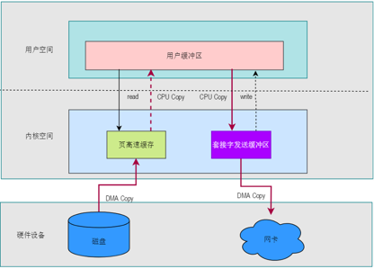
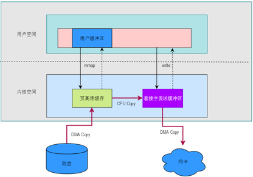
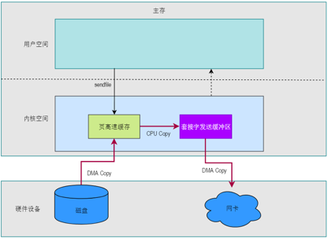
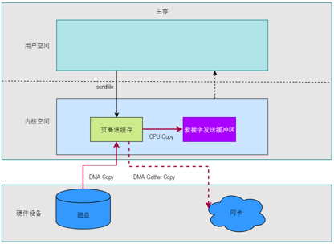
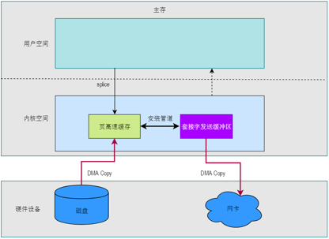

## 一 什么是零拷贝
✅ 零拷贝不是指一次CPU拷贝都没发生，而是指用户进程在I/O操作的时候，而是指在内核空间到用户空间没有CPU拷贝  
✅ 在I/O操作的时候，通过减少或者不使用CPU拷贝，降低上下文切换次数等，提升系统性能  

## 二 传统读文件再写网络数据操作CPU拷贝
  
✅ 首先: 用户程序需要从磁盘读取数据，调用read函数，此时CPU会把参数等拷贝到内核，内核程序从磁盘读取数据后，需要把数据通过CPU拷贝到用户进程，发生第1次CPU拷贝  
✅ 然后: 用户程序需要把读取出来的数据，写入到网络，调用write/send函数，此时CPU会把写缓冲区数据拷贝到内核，发生第2次CPU拷贝  
✅ 调用read函数会发生两次上下文切换，调用send函数也会发生两次上下文切换  

🧠 **结论:**  
✅ 传统读文件再写网络数据操作会发生2次CPU拷贝和4次上下文切换  

## 三 mmap + write 方案
  
📌 **mmap**  
✅ 用户进程通过 mmap函数向内核发起系统调用，上下文从用户态切换为内核态   
✅ 将文件物理地址和用户进程地址空间的文件映射区域的首地址进行映射  
✅ CPU 利用 DMA 控制器将数据从硬盘拷贝到内核空间页高速缓存  
✅ CPU上下文从内核态切换回用户态，mmap 系统调用执行返回  

📌 **write**  
✅ 用户进程通过write函数向内核发起系统调用，上下文从用户态切换为内核态  
✅ CPU 将页高速缓存 中的数据拷贝到的套接字发送缓冲区  
✅ CPU 利用 DMA 控制器将数据从套接字发送缓冲区拷贝到网卡进行数据传输  
✅ 上下文从内核态 切换回用户态 ，write 系统调用执行返回  

🧠 **结论:**   
✅ 发生一次CPU拷贝和4次上下文切换  
✅ 所以mmap+write的效率比传统 read/write效率高一些  

## 四 sendfile
  
✅ 用户程序发起sendfile调用，此时CPU上下文从用户态切换到内核态  
✅ CPU利用DMA控制器从磁盘读取数据到内核空间的页高速缓存  
✅ CPU将页高速缓存的数据拷贝到套接字发送缓冲区  
✅ CPU利用DMA控制器将套接字发送缓冲区的数据结果协议栈处理后拷贝到网卡  
✅ CPU上下文从内核态切换到用户态，继续往下执行  

🧠 **结论:**   
✅ 总共发生1次CPU数据拷贝，2次上下文切换  
✅ 所以sendfile的效率比 mmap + write 这种方式效果好些  

## 五 sendfile64(sendfile+DMA gather copy)
  
✅ 用户程序发起sendfile64调用，此时CPU上下文从用户态切换到内核态  
✅ CPU利用DMA控制器从磁盘读取数据到内核空间的页高速缓存  
✅ CPU将页高速缓存中的**文件描述符和数据长度等元数据**等通过CPU拷贝到套接字发送缓冲区  
✅ 触发内核软中断，用中断处理程序，告知NIC驱动(网卡驱动程序)有数据需要发送。NIC驱动程序将从套接字发送缓冲区获取源文件描述符、以及数据长度和偏移量等，然后触发DMA gather copy，从已知的文件描述符和数据长度，将数据直接从页高速缓存拷贝到网卡  
✅ CPU上下文从内核态切换到用户态，继续往下执行  

🧠 **结论:**   
✅ 总共发生1次CPU数据拷贝，2次上下文切换  
✅ 但是CPU拷贝的不是数据，只是文件描述符、数据长度等元数据，并不是真正的数据  
✅ 真正的数据是通过DMA Copy到网卡  
✅ 所以sendfile的效率比sendfile64这种方式效果要好些  

## 六 splice
  
✅ 用户进程通过 splice函数向内核发起系统调用，上下文从用户态切换为内核态  
✅ CPU 利用 DMA 控制器将数据从主存或硬盘拷贝到内核空间页高速缓存  
✅ CPU 在内核空间的页高速缓存和套接字发送缓冲区之间建立管道  
✅ CPU 利用 DMA 控制器将数据从套接字发送缓冲区拷贝到网卡进行数据传输  
✅ CPU上下文从内核态切换回用户态，splice 系统调用执行返回  

🧠 **结论:**   
✅ splice只需要0次CPU拷贝，2次上下文切换，效率和sendfile64，也就是sendfile+DMA gather copy差不多  
✅ 但是他却可以用于文件到文件的拷贝，而不仅仅局限于文件到网络套接字的拷贝  
