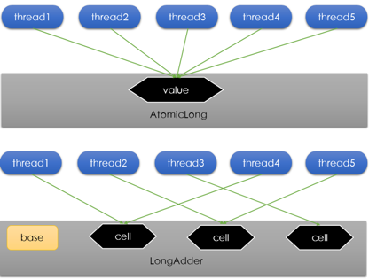
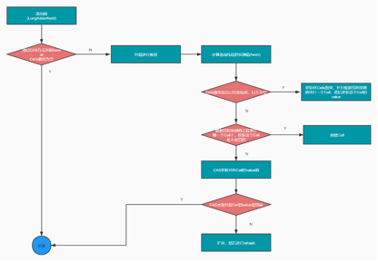

## 一  LongAdder原理

### 1.1 LongAdder 背景
✅ 所有的原子类都有一个通病，因为他们是基于CAS实现的，所以当设置值失败的时候就会重试，如果并发数比较高的时候，就可能造成更多的线程不停地重试，我们知道线程是消耗CPU资源的，太多的线程进行上下文切换，会影响系统性能  
✅ LongAdder原理就是将对value的并发更新，分散到多个value上，最后对分散的value进行汇总，这样可以提升并发的效率和性能  
✅ LongAdder的本质就是降低对value更新的并发数，也就是将对单一value的变更压力分散到多个value值上，降低单个value的热度，最后进行汇总  


**_我们知道，对于Long，在并发情况下，我们可以选择使用AtomicLong也可以使用LongAdder, 测试发现LongAdder的效率比AtomicLong要高，为什么呢？**_


## 二 Striped64原理
Striped设计的核心思路就是通过内部的分散计算来避免或者减少竞争  
内部包含一个base值和一个Cell数组，这个Cell数组是一个哈希表，通过对线程的探测值进行hash计算，从而确定这个线程要在哪一个Cell上操作  

1. [ ] 首先：内部维护一个base变量，在没有发生并发情况，是可以直接更新base
2. [ ] 其次：如果base进行CAS操作失败了，说明此时已经存在并发的情况。这是需要初始化Cells数组对象，并且设置到该线程对应的Cell上
3. [ ] 然后：如果Cells数组不为空，则需要根据线程计算hash值，然后直接定位到哪一个Cell中，如果这个槽位没有Cell，则创建Cell,有的话就直接更新value.
4. [ ] 还有：如果更新每一个Cell的value失败，说明有多个线程更新相同的Cell，存在竞争的情况，这时候需要进行扩容，每次扩容是之前的2倍。
5. [ ] 最后：在获取最终值的时候，即调用longValue的时候，此时会将base的值和Cell数组中各个Cell中的value进行累加，才是最终计算的值。

所以：在并发大的时候，比如100线程。如果使用AtomicLong，那么将会是100个线程进行CAS更新一个值  
缺点：CAS是Compare And Swap的缩写，属于CPU并发原语，会调用操作系统指令cmpxchg指令，但是这里依然是串行的，100个线程同时更新，但是只有一个线程更新成功，其余的线程都会失败  

比如三个线程A，B,C 同时CAS更新base, 当前base=100  
* 线程A: cmpxchg（base,100,101）  
* 线程B: cmpxchg（base,100, 101）  
* 线程C: cmpxchg（base,100, 101）  
但是只有一个线程会更新成功，其余2个线程就属于陪跑线程，更新失败，需要自旋重新获取base值，然后更新  
如果是LongAdder的话，则可以是100个线程并发竞争多个cell，这样充分利用计算机的CPU资源  
    
比如现在有3个线程在并发增加值10,20,30。那么就不会修改base值，而是根据线程计算一个哈希，让后将这些值放入Cell数组，假设Cell数组长度为3，分别为[30,50,10], 根据计算的哈希值，10、20、30分别落在Cell数组的0，1，2索引位置,此时Cell数组[40,70,40], 假设base=100，那么此时整个Striped的值为100+40+70+40=250  


## 三 源码分析
```java
//为提高性能，使用注解@sun.misc.Contended，用来避免伪共享
@sun.misc.Contended static final class Cell {
    // 用来保存要累加的值
    volatile long value;
    Cell(long x) { value = x; }
    // 使用Unsafe类的CAS来更新value值
    final boolean cas(long cmp, long val) {
        return UNSAFE.compareAndSwapLong(this, valueOffset, cmp, val);
    }

    private static final sun.misc.Unsafe UNSAFE;
    // value在Cell类中存储位置的偏移量
    private static final long valueOffset;
    // 用于获取value的偏移量
    static {
        try {
            UNSAFE = sun.misc.Unsafe.getUnsafe();
            Class<?> ak = Cell.class;
            valueOffset = UNSAFE.objectFieldOffset
                (ak.getDeclaredField("value"));
        } catch (Exception e) {
            throw new Error(e);
        }
    }
}

// Cell数组
transient volatile Cell[] cells;

/** 
 * 基础值，在没有竞争的时候或者初始化的时候用来进行值的更新和累加
 * 1. 在没有竞争时会更新这个值；
 * 2. 在Cell数组初始化的过程中，Cell数组处于不可用的状态，这时候也会尝试将通过CAS操作值累加到base。 
 */  
transient volatile long base;

/** 
 * 自旋锁，通过CAS操作加锁，用于保护创建或者扩展Cell表。 
 * cellsBusy，它有两个值0 或1，它的作用是当要修改cells数组时加锁，防止多线程同时修改cells数组，0为无锁，1为加锁，加锁的状况有三种 
 * 1. cells数组初始化的时候； 
 * 2. cells数组扩容的时候； 
 * 3. 如果cells数组中某个元素为null，给这个位置创建新的Cell对象的时候；
 */  
transient volatile int cellsBusy;


public void add(long x) {
    Cell[] as; long b, v; int m; Cell a;
    // Cell数组不为空或者操作base值的时候失败(表示操作失败)，表示有并发情况，导致CAS操作失败，此时如果cell数组没有初始化则初始化
    // 否则表示修改成功
    if ((as = cells) != null || !casBase(b = base, b + x)) {
        boolean uncontended = true; 
        // 如果cell数组为空，或者cell数组不为空，但是计算hash值对饮数组的位置(代表cell位置)如果为空，或者CAS操作cell失败
        if (as == null || (m = as.length - 1) < 0 ||
            (a = as[getProbe() & m]) == null ||
            !(uncontended = a.cas(v = a.value, v + x)))
            longAccumulate(x, null, uncontended); // 进行累加
    }
}

// 以CAS方式更新value，如果和指定的向相同则更新
final boolean casBase(long cmp, long val) {
    return UNSAFE.compareAndSwapLong(this, BASE, cmp, val);
}

// 通过CAS方式获取Cell锁,如果没有锁则获取锁
final boolean casCellsBusy() {
    return UNSAFE.compareAndSwapInt(this, CELLSBUSY, 0, 1);
}

// 获取当前线程一个探测值
static final int getProbe() {
    return UNSAFE.getInt(Thread.currentThread(), PROBE);
}

final void longAccumulate(long x, LongBinaryOperator fn, boolean wasUncontended) {
    //获取当前线程的threadLocalRandomProbe值作为hash值,如果当前线程的threadLocalRandomProbe为0，
    // 说明当前线程是第一次进入该方法，则强制设置线程的threadLocalRandomProbe为ThreadLocalRandom类的成员静态私有变量probeGenerator的值，后面会详细将hash值的生成;
	int h; // hash值
    if ((h = getProbe()) == 0) { // 获取一个hash值，即线程的探测值
        // 如果探测值为0，通过ProbeGenerator强制产生一个probe
        ThreadLocalRandom.current(); // force initialization
        // 重新获取probe
        h = getProbe();
        wasUncontended = true; //设置未竞争标记为true
    }
    //冲突标志，表示当前线程的hash到的Cells数组的位置，做CAS累加操作时与其它线程发生了冲突，CAS失败;
    boolean collide = false;
    for (;;) {
        Cell[] as; Cell a; int n; long v;
        // 处理cells数组已经正常初始化，且有元素了
        if ((as = cells) != null && (n = as.length) > 0) {
            // 如果被hash到的位置为null，说明没有线程在这个位置设置过值，没有竞争，可以直接使用，则用x值作为初始值创建一个新的Cell对象，
            // 对cells数组使用cellsBusy加锁，然后将这个Cell对象放到cells[m%cells.length]位置上 
            if ((a = as[(n - 1) & h]) == null) {
                if (cellsBusy == 0) { // 锁状态为0，尝试获取cell
                    Cell r = new Cell(x); // 获取到，则创建Cells对象
                    // 通过CAS获取锁，获取成功更新cell中对应位置的值，如果没有则自旋等待
                    if (cellsBusy == 0 && casCellsBusy()) {
                        boolean created = false; //标记Cell是否创建成功并放入到cells数组被hash的位置上
                        try { // 再次检查cells数组不为null，且长度不为null,但是hash的位置是空的
                            Cell[] rs; int m, j;
                            if ((rs = cells) != null &&
                                (m = rs.length) > 0 &&
                                rs[j = (m - 1) & h] == null) {
                                // 将新的cell设置到该位置
                                rs[j] = r;
                                created = true;
                            }
                        } finally {
                            cellsBusy = 0; // 释放锁
                        }
                        if (created)//生成成功，跳出循环
                            break;
                        continue; //如果created为false，说明上面指定的cells数组的位置cells[m%cells.length]已经有其它线程设置了cell了，继续执行循环。
                    }
                }
                collide = false;
            }
            // 如果Cell数组中这个位置不为空,且设置失败了，在说明已经发生竞争，wasUncontended标记为true
            else if (!wasUncontended)       // CAS already known to fail
                wasUncontended = true;      // Continue after rehash
            // 如果Cell数组中这个位置不为空，然后通过CAS更新，更新成功退出循环
            else if (a.cas(v = a.value, ((fn == null) ? v + x :fn.applyAsLong(v, x))))
                break;
            // 如果Cell数组中这个位置不为空，然后CAS更新失败，如果表长度大于CPU核数，或者哈希表已经变化了，比如扩容
            else if (n >= NCPU || cells != as)
                collide = false;            // At max size or stale
            // 如果发生了冲突，collide置为true
            else if (!collide)
                collide = true;
            // 如果获取到了Cell数组的锁则开始扩容，是之前的2倍，并且把之前的哈希表的元素移到新的哈希表中
            else if (cellsBusy == 0 && casCellsBusy()) {
                try {
                    if (cells == as) {      // Expand table unless stale
                        Cell[] rs = new Cell[n << 1];
                        for (int i = 0; i < n; ++i)
                            rs[i] = as[i];
                        cells = rs;
                    }
                } finally {
                    cellsBusy = 0; // 释放锁
                }
                collide = false;
                continue;                   // Retry with expanded table
            }
            h = advanceProbe(h); // 进行rehash操作
        }
        // 如果没有初始化或者初始化了没有元素，且成功获取锁
        else if (cellsBusy == 0 && cells == as && casCellsBusy()) {
            boolean init = false;
            try {                           // Initialize table
                if (cells == as) {
                    // 创建Cell数组，并且根据要更新的值创建Cell对象，然后放入到计算的指定位置
                    Cell[] rs = new Cell[2];
                    rs[h & 1] = new Cell(x);
                    cells = rs;
                    init = true;
                }
            } finally {
                cellsBusy = 0; // 释放锁
            }
            if (init) break; // 如果已经初始化则退出循环
        } 
        // 如果以上操作都失败了，则尝试将值累加到base上
        else if (casBase(v = base, ((fn == null) ? v + x : fn.applyAsLong(v, x))))
            break; 
    }
}
```


## 四 LongAdder面试总结
### 4.1 LongAdder和AtomicLong
#### 4.1.1 LongAdder性能比AtomicLong好
✅ AtomicLong底层是完全通过CAS来实现的原子性的  
✅ 如果多个线程竞争，那么只有一个会成功，其余线程都是陪跑线程，然后继续自旋  
✅ CAS底层是通过调用CPU原语指令cmpxchg指令，一个时刻只能执行一个线程  
✅ 如果有很多线程在竞争更新资源，就会出现很多线程等待，浪费资源，性能不高  
####  4.1.2 LongAdder相对于AtomicLong的优点
✅ LongAdder在线程竞争严重的时候，不再是只对一个变量进行更新，而是分散了计算到哈希表的桶里面  
✅ 当需要统计数量的时候再遍历各个桶内的数量，进行累加即可。这样的话就提升了并发能力，改善了很多线程无效的自旋  

### 4.2 LongAdder工作原理
#### 4.2.1 没有线程竞争更新base,不需要使用哈希表
如果没有线程竞争，则直接更新base的值就可以  

#### 4.2.2 有线程竞争更新base,需要使用哈希表分散计算
##### 4.2.2.1 竞争初始化哈希表Cell[],默认2个桶的容量
✅ 如果多个线程更新base, 发生竞争，需要初始化哈希表  
✅ 防止多个线程同时初始化哈希表，则需要上锁，将cellsBusy置为1  
✅ 创建2个Cell桶容量的哈希表  
✅ 释放锁，将cellsBusy置为0  

##### 4.2.2.2 已经初始化，竞争创建Cell桶
✅ 哈希表已经初始化，但是根据线程计算的hashcode计算的索引，即数据需要在哪一个桶Cell中参加更新，这个Cell还没有初始化  
✅ 为了防止并发初始化Cell桶，也需要上锁，将cellsBusy置为1  
✅ 然后创建桶Cell，设置到哈希表对应的索引上  
✅ 释放锁，将cellsBusy置为0  

##### 4.2.2.3 已经初始化，且对应的位置Cell桶存在，则更新值
✅ 哈希表已经初始化，但是根据线程计算的hashcode计算的索引，即数据需要在哪一个桶Cell中参加更新，而且这个桶Cell存在了  
✅ 通过CAS方式更新Cell中的值  
✅ 如果更新成功，则退出；如果更新失败，则判断当前是否需要或者可以扩容  
👉 情况一：如果哈希表的容量已经超过了机器CPU核数，则不再希望扩容，则直接进行rehash，然后重新更新  
👉 情况二：如果有其他的线程已经扩容了，则当前线程不会扩容，则直接进行rehash，然后重新更新  

##### 4.2.2.4 扩容
如果哈希表数量没有达到机器CPU核数或者并没有其他线程扩容，进行rehash操作之后，仍然存在并发竞争更新值失败的情况，所以这时候就会扩容，减少冲突的概率，提升性能  
✅ 如果哈希表容量没有变化，则上锁，设置cellsBusy=1，防止其他线程扩容  
✅ 创建一个新哈希表，容量是现在的2倍大小  
✅ 将旧的哈希表的元素拷贝到新的哈希表中  
✅ 释放锁，将cellsBusy置为0  
✅ 扩容之后，仍然需要进行rehash操作  

