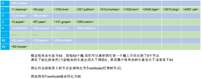

## 前言:

Map是编程常用数据结构之一，HashMap继承了AbstractMap类，也实现了Map接口。底层依赖的数据结构就是哈希表+链表+红黑树。

HashMap允许null的key，也允许null值，但是null可以只允许一个，因为多个null不会报错，但是更新是同一个key，所以只允许一个null key。但是有的Map，比如TreeMap默认是不允许有null key的，TreeMap因为涉及到排序，存储的对象会实现Comparator接口，如果Comparator接口中考虑了null，则不会抛出空指针异常，否则还是抛出空指针异常。

另外经常和HashTable比较，最主要的区别就是是否是线程安全的，HashTable是线程安全的，但是在高并发的时候有性能影响，后面出现了ConcurrentHashMap来代替的HashTable，支持更多的并发，同时也是线程安全的。

HashMap底层是一个基于哈希表，链表和红黑树数据结构的字典。默认的哈希表长度或者叫做桶数是16，如果超过了(桶数*加载因子)就需要扩容。
一般情况向，相同的哈希的key放在桶内，桶内是通过双向链表维护的。如果当桶内有一个链表的长度超过了8，并且哈希表长度超过了64，则需要将链表转化为红黑树进行存储。  



## 一 向HashMap添加元素
### 1.1 如果哈希表还没有初始化
调用resize进行初始化扩容

### 1.2 计算元素落入哪一个桶中
对key进行hash计算，然后(桶数 – 1) & hash 计算落在哪一个桶中

### 1.3 如果这个桶是一个空桶
如果该桶内链表为空，即还没有加入过元素，链表是空的,需要创建新的节点，放在桶里面，这个也是头结点。 如果已经有了则忽略此步骤。

### 1.4 桶内已经有链表节点了
如果桶内链表不为空，已经有元素了。如果桶内链表为空，则忽略此步骤。  
* 先判断第一个节点是否和要存储的key相同，如果相同则直接覆盖
* 再看存储结构是不是红黑树，如果是红黑树，则从根节点遍历红黑树，然后找到合适的位置插入或者更新
* 如果不是红黑树，那么肯定就是链表了，我们需要遍历链表，并记录遍历次数，如果链表中节点个数超过了阀值(默认是8)，而且哈希表的桶数大于64， 则会进行树化；如果没有超过，则判断是否存在，如果存在则更新，不存在则在末尾添加新节点。

```java
final V putVal(int hash, K key, V value, boolean onlyIfAbsent,boolean evict) {
    Node<K,V>[] tab; Node<K,V> p; int n, i;
    // 如果哈希表为null或者哈希表没有元素，长度为0，调用resize进行初始化扩容
    if ((tab = table) == null || (n = tab.length) == 0)
        // 调用resize进行初始化扩容，返回哈希表的桶大小
        n = (tab = resize()).length;
    // 将每一个key对应的hash值和(n-1) 进行与运算，计算这个元素应该落在哈希表中哪一个桶中
    // 根据计算的桶，从哈希表中获取对应的链表，如果这个桶之前没有插入过节点，则这时候创建一个新的节点
    // 使用(n-1)&hash去计算落在哪一个桶上，一般n-1 作为 3，4，15，31，63，127，511等数，才会均匀的把
    // 数据分散到不同的桶，这也就是为什么哈希表的容量要是2的指数倍数的原因之一
    if ((p = tab[i = (n - 1) & hash]) == null)
        tab[i] = newNode(hash, key, value, null);
    else {// 如果这个桶里已经存在节点了，则需要在后面添加新的节点，构建链表
        Node<K,V> e; K k;
        // 如果要存储的key和hash都和桶中第一个节点一致，则直接覆盖
        if (p.hash == hash && ((k = p.key) == key || (key != null && key.equals(k))))
            e = p;
        // 如果桶里面节点是红黑树，则表示链表已经转换成了红黑树，我们底层现在用的是红黑树，则调用putTreeVal添加节点
        else if (p instanceof TreeNode)
            e = ((TreeNode<K,V>)p).putTreeVal(this, tab, hash, key, value);
        else {
            // 如果既不是红黑树结构，也不是第一个节点，表示这个链表已有多个节点，就需要遍历链表，找到合适的位置存储
            for (int binCount = 0; ; ++binCount) {
                // 直接获取当前节点的下一个节点，如果为空，则根据要存储的key和value创建新节点
                if ((e = p.next) == null) {
                    p.next = newNode(hash, key, value, null);
                    // 判断链表的长度是否超过TREEIFY_THRESHOLD树化阀值，如果没有直接退出遍历
                    // 否则需要判断是否要进行树化，如果哈希表桶数量大于64则会树化，否则就算该链表长度超过阀值，也只是链表扩容而已
                    if (binCount >= TREEIFY_THRESHOLD - 1)
                        treeifyBin(tab, hash);
                    break;
                }
                // 如果当前下一个节点不为空，则可能存在要存储的key和该节点对应的key相同，如果相同，跳出遍历
                if (e.hash == hash && ((k = e.key) == key || (key != null && key.equals(k))))
                    break;
                // 如果key不相同，则将节点后移，准备遍历下一个
                p = e;
            }
        }
        // 如果key存在相同，则需要更新value
        if (e != null) { // existing mapping for key
            V oldValue = e.value;
            // 如果允许只要key相同就更新值，则更新值；如果key存在相同，不允许更新，则不更新
            if (!onlyIfAbsent || oldValue == null)
                e.value = value;
            afterNodeAccess(e);
            return oldValue;
        }
    }
    // 增加修改次数和，map的size,并且size和阀值比较，如果大于了阀值就需要扩容
    ++modCount;
    // 如果当前哈希表的大小已经超过扩容阀值，则需要开始扩容，比如初始化指定容量为20，那么哈希表大小就是32，
    // 然后扩容阀值是32 * 0.75 = 24,则说明只要哈希表的size达到了24，就要开始扩容。扩容默认是之前的一倍，
    // 即32 * 2 = 64；然后新哈希表的扩容阀值 = 64 * 0.75 = 48.
    if (++size > threshold)
        resize();
    afterNodeInsertion(evict);
    return null;
}

final TreeNode<K,V> putTreeVal(HashMap<K,V> map, Node<K,V>[] tab, int h, K k, V v) {
    Class<?> kc = null;
    boolean searched = false;
    // 获取红黑树根节点
    TreeNode<K,V> root = (parent != null) ? root() : this;
    // 从根节点开始遍历，如果hash小于父节点的，在左树找到合适的位置存储；否则在右树找到合适位置存储
    // 如果相等，更新节点，直接返回
    for (TreeNode<K,V> p = root;;) {
        int dir, ph; K pk;
        if ((ph = p.hash) > h)
            dir = -1;
        else if (ph < h)
            dir = 1;
        else if ((pk = p.key) == k || (k != null && k.equals(pk)))
            return p;
        else if ((kc == null &&
                  (kc = comparableClassFor(k)) == null) ||
                 (dir = compareComparables(kc, k, pk)) == 0) {
            if (!searched) {
                TreeNode<K,V> q, ch;
                searched = true;
                if (((ch = p.left) != null &&
                     (q = ch.find(h, k, kc)) != null) ||
                    ((ch = p.right) != null &&
                     (q = ch.find(h, k, kc)) != null))
                    return q;
            }
            dir = tieBreakOrder(k, pk);
        }
        // 下面是找到合适位置的逻辑
        // 如果hash小于父节点，则判断左子节点是否为空，如果为空，则作为左子节点；不为空的话则继续往下找
        // 如果hash大于父节点，则判断右子节点是否为空，如果为空，则作为右子节点；不为空的话则继续往下找
        TreeNode<K,V> xp = p;
        if ((p = (dir <= 0) ? p.left : p.right) == null) {
            Node<K,V> xpn = xp.next;
            TreeNode<K,V> x = map.newTreeNode(h, k, v, xpn);
            if (dir <= 0)
                xp.left = x;
            else
                xp.right = x;
            xp.next = x;
            x.parent = x.prev = xp;
            if (xpn != null)
                ((TreeNode<K,V>)xpn).prev = x;
            // 插入之后，有可能造成红黑树不平衡，所以需要平衡调整，并且将新的root移到链表开始(如果root发生了变化)
            moveRootToFront(tab, balanceInsertion(root, x));
            return null;
        }
    }
}
```

## 二 HashMap删除流程
1. 判断是不是空的哈希表，如果是空表，直接返回
2. 根据key计算hash，判断落在哪一个桶内
3. 判断桶内是否有元素，如果没有则直接返回
4. 获取链表第一个节点，判断是不是要删除的key，如果是则头结点移到下一个节点
5. 如果第一个节点不是，则判断节点是不是TreeNode类型，即判断是不是红黑树，如果是红黑树则从红黑树查找这个key
6. 如果红黑树中存在这个节点，则删除这个TreeNode.  
* 首先你需要将他们在TreeNode维系的链表中的前驱和后继关系删除
* 然后从待删除的右子树中查找最小的节点和待删除节点替换
* 替换之后进行平衡操作
* 最后将替换元素删除，即删除父子和左右关系。

```java
final Node<K,V> removeNode(int hash, Object key, Object value, boolean matchValue, boolean movable) {
    Node<K,V>[] tab; Node<K,V> p; int n, index;
    // 判断哈希表是否为空,且根据key的hash计算落在哪一个桶中
    if ((tab = table) != null && (n = tab.length) > 0 &&
        (p = tab[index = (n - 1) & hash]) != null) {
        Node<K,V> node = null, e; K k; V v;
        // 如果要删除的是第一个节点，则直接将该节点赋给待删除节点变量
        if (p.hash == hash &&
            ((k = p.key) == key || (key != null && key.equals(k))))
            node = p;
        // 否则我们需要获取下一个节点
        else if ((e = p.next) != null) {
            // 如果下一个节点是TreeNode,则从红黑树中获取key代表的节点
            if (p instanceof TreeNode)
                node = ((TreeNode<K,V>)p).getTreeNode(hash, key);
            else { // 如果不是红黑树,说明是链表结构,则遍历链表,如果找到了则赋给待删除节点变量
                do {
                    if (e.hash == hash &&
                        ((k = e.key) == key || (key != null && key.equals(k)))) {
                        node = e;
                        break;
                    }
                    p = e;
                } while ((e = e.next) != null);
            }
        }
        
        // 待删除节点不为null,不需要根据指定的value的值去判断是否删除
        if (node != null && (!matchValue || (v = node.value) == value ||
                             (value != null && value.equals(v)))) {
            // 如果节点是TreeNode节点,则从红黑树中删除
            if (node instanceof TreeNode)
                ((TreeNode<K,V>)node).removeTreeNode(this, tab, movable);
            // 如果待删除节点就是头结点，直接将头节点置为下一个节点
            else if (node == p)
                tab[index] = node.next;
            // 如果不是头结点，则待删除节点的下一个置为待删除节点前一个节点的下一个
            else
                p.next = node.next;
            ++modCount;
            --size;
            afterNodeRemoval(node);
            return node;
        }
    }
    return null;
}

final void removeTreeNode(HashMap<K,V> map, Node<K,V>[] tab, boolean movable) {
    int n;
    // 哈希表为空,则直接返回
    if (tab == null || (n = tab.length) == 0)
        return;
    // 计算落到了哪一个槽位或者桶中
    int index = (n - 1) & hash;
    // 获取该桶中的第一个节点，并且初始作为root节点
    TreeNode<K,V> first = (TreeNode<K,V>)tab[index], root = first, rl;
    // 找到当前待删除节点的前驱和后继节点
    TreeNode<K,V> succ = (TreeNode<K,V>)next, pred = prev;
    // 如果没有前驱,表示是第一个节点,那么后继节点直接置为第一个节点
    if (pred == null)
        tab[index] = first = succ;
    // 如果有前驱节点，则将前驱的后继节点置为待删除节点的后继节点
    else
        pred.next = succ;
    // 如果后继存在，则后继的前驱置为待删除节点的前驱
    if (succ != null)
        succ.prev = pred;

    if (first == null)
        return;

    if (root.parent != null)
        root = root.root();
    // 如果太小了，则将TreeNode退化成Node,即由红黑树转化成链表
    if (root == null || root.right == null ||
        (rl = root.left) == null || rl.left == null) {
        tab[index] = first.untreeify(map);  // too small
        return;
    }
    // 获取当前待删除节点, 待删除节点的左节点和右节点都不为空
    TreeNode<K,V> p = this, pl = left, pr = right, replacement;
    if (pl != null && pr != null) {
        // 
        TreeNode<K,V> s = pr, sl;
        // 从右节点中找到一个最小的节点去替换待删除的节点
        // 在右节点一直遍历左节点，找到最小的
        while ((sl = s.left) != null) // find successor
            s = sl;
        // 找到了最小的节点去替换，然后和被替换的节点互换颜色
        boolean c = s.red; s.red = p.red; p.red = c; // swap colors
        TreeNode<K,V> sr = s.right;
        TreeNode<K,V> pp = p.parent;
        // 待删除的右节点就是最小的，则和待删除元素互换位置即可
        if (s == pr) {
            p.parent = s;
            s.right = p;
        }
        // 开始进行替换
        else {
            TreeNode<K,V> sp = s.parent;
            if ((p.parent = sp) != null) {
                if (s == sp.left)
                    sp.left = p;
                else
                    sp.right = p;
            }
            if ((s.right = pr) != null)
                pr.parent = s;
        }
        p.left = null;
        if ((p.right = sr) != null)
            sr.parent = p;
        if ((s.left = pl) != null)
            pl.parent = s;
        if ((s.parent = pp) == null)
            root = s;
        else if (p == pp.left)
            pp.left = s;
        else
            pp.right = s;
        if (sr != null)
            replacement = sr;
        else
            replacement = p;
    }
    // 如果左节点不为空
    else if (pl != null)
        replacement = pl;
    // 如果右节点不为空
    else if (pr != null)
        replacement = pr;
    else // 如果都是空的，即待删除节点没有子节点
        replacement = p;
    if (replacement != p) {
        TreeNode<K,V> pp = replacement.parent = p.parent;
        if (pp == null)
            root = replacement;
        else if (p == pp.left)
            pp.left = replacement;
        else
            pp.right = replacement;
        p.left = p.right = p.parent = null;
    }
    // 替换完成之后，有可能在成红黑树不平衡，所以需要平衡处理
    TreeNode<K,V> r = p.red ? root : balanceDeletion(root, replacement);
    // 删除替换节点和其他节点之间的链接
    if (replacement == p) {  // detach
        TreeNode<K,V> pp = p.parent;
        p.parent = null;
        if (pp != null) {
            if (p == pp.left)
                pp.left = null;
            else if (p == pp.right)
                pp.right = null;
        }
    }
    // 有可能造成根节点变成了其他节点，需要将根节点移到链表头
    if (movable)
        moveRootToFront(tab, r);
}
```

## 三 HashMap的树化和退化过程
**HashMap树化：**  
* 就是将普通的链表(Node)，转换成能够表示红黑树的链表(TreeNode)  
* 普通的链表只有前驱和后继指针，但是代表红黑树的链表，还有父节点指针，左节点和右节点指针以及代表节点的颜色是否是红色的red属性

### 3.1 要进行树化，是需要一定条件的，如果不满足，是不能进行树化的
第一：该桶内的链表长度大于或者等于8  
第二：整个哈希表的长度必须大于或者等于64  
所以哈希表为空或者哈希表的某个链表长度虽然大于8但是哈希表的长度不够，也不会树化，这个时候，有可能需要对链表扩容  

### 3.2 计算key的hash code,判断落在哪一个桶内

### 3.3 然后开始遍历链表节点，根据key和value创建一个TreeNode，然后构建一个新的带有前驱和后继的TreeNode链表

### 3.4 将原始链表的头结点更新为TreeNode链表的头结点

### 3.5 然后开始树化
1. 第一个元素默认作为根节点
2. 遍历链表后面的元素
* 情况一：如果hash值小于父节点，则判断父节点的左子节点是否为空，如果为空则作为父节点的左子节点；如果hash值大于父节点，则判断父节点的右子节点是否为空，如果为空则作为父节点的右子节点
* 情况二：如果不为空，获取后面的节点，进行hash code比较，直到找到一个节点的左子节点或者右子节点为空的，则插入这个位置
3. 插入之后，有可能造成红黑树失衡，所以需要进行再平衡

```java
final void treeifyBin(Node<K,V>[] tab, int hash) {
    int n, index; Node<K,V> e;
    // 如果哈希表为空或者哈希表的长度，且哈希表的长度(即桶的长度<64),都不会树化，而只是扩容而已
    // 因为完全有可能某一个桶上的链表长度已经超过了阀值，默认是8，则需要判断bucket的长度是否超过了64，
    // 如果超过了，才会树化，没有的话只是扩容而已，扩容之后，可能会将该链表的数据分出一部分到其他链表
    if (tab == null || (n = tab.length) < MIN_TREEIFY_CAPACITY)
        resize();
    // 如果满足条件，哈希表的长度已经超过64
    // 这个桶上的链表不为空
    else if ((e = tab[index = (n - 1) & hash]) != null) {
        // 说白了就是就是建立一个TreeNode链表,然后将TreeNode链表转化为成红黑树
        TreeNode<K,V> hd = null, tl = null;
        do {
            // 根据当前节点创建TreeNode
            TreeNode<K,V> p = replacementTreeNode(e, null);
            // tail为空，则将创建的新TreeNode初始化为head
            if (tl == null)
                hd = p;
            else { // 如果tail不为空，在tail后面新加节点
                p.prev = tl;
                tl.next = p;
            }
            tl = p; // 尾部指针移到最后的节点上去
        } while ((e = e.next) != null);
        // 将新链表的第一个节点放入原始的桶中，然后开始遍历后面节点，进行树化
        if ((tab[index] = hd) != null)
            hd.treeify(tab);
    }
}


final void treeify(Node<K,V>[] tab) {
    TreeNode<K,V> root = null; // 声明红黑树的根节点
    // 从头开始遍历节点
    for (TreeNode<K,V> x = this, next; x != null; x = next) {
        // 获取当前节点的下一个节点
        next = (TreeNode<K,V>)x.next;
        // 默认将当前节点左右孩子节点置为空
        x.left = x.right = null;
        // 如果是第一次,根节点为空,则第一个元素作为根节点，然后根节点颜色都是黑色，而且根节点没有父节点
        if (root == null) {
            x.parent = null;
            x.red = false;
            root = x;
        }
        else {
            // 获取每一个元素的key和key的hash值
            K k = x.key;
            int h = x.hash;
            Class<?> kc = null;
            // 从根节点开始遍历
            for (TreeNode<K,V> p = root;;) {
                int dir, ph;
                K pk = p.key;
                // 如果当前元素的hash值大于新元素的hash值则放在左边；否则放在右边，作为右边子节点
                if ((ph = p.hash) > h)
                    dir = -1;
                else if (ph < h)
                    dir = 1;
                else if ((kc == null &&
                          (kc = comparableClassFor(k)) == null) ||
                         (dir = compareComparables(kc, k, pk)) == 0)
                    dir = tieBreakOrder(k, pk);
                // 将当前遍历的元素作为
                TreeNode<K,V> xp = p;
                if ((p = (dir <= 0) ? p.left : p.right) == null) {
                    x.parent = xp;
                    if (dir <= 0)
                        xp.left = x;
                    else
                        xp.right = x;
                    // 插入一条数据之后，确保插入平衡
                    root = balanceInsertion(root, x);
                    break;
                }
            }
        }
    }
    // 将新的root节点移到链表头部
    moveRootToFront(tab, root);
}

```

## 3.6 HashMap的树的退化过程
HashMap在者扩容的时候，可能会遇到一个桶里的元素分成2个链表，即高低位链表，在新的哈希表中，低位链表存储在原桶中，高位链表存储在(原桶+oldCap)桶中  
这时候如果低位或者高位链表的节点数量小于树退化阀值，默认是6，则需要将红黑树退化成普通链表，即TreeNode退化成Node  

```java
final Node<K,V> untreeify(HashMap<K,V> map) {
    Node<K,V> hd = null, tl = null;
    // 遍历每一个节点，将TreeNode转换成Node,即用TreeNode的key,value，以及hash值构建新的Node链表
    for (Node<K,V> q = this; q != null; q = q.next) {
        Node<K,V> p = map.replacementNode(q, null);
        if (tl == null)
            hd = p;
        else
            tl.next = p;
        tl = p;
    }
    return hd;
}
```

## 四 HashMap扩容机制
初始化或者重新初始化哈希表的大小，如果哈希表为空，则分配默认初始化大小容量  
如果不为空，则以2的指数倍扩容  

### 4.1 获取当前的哈希表，并获取当前哈希表的长度，即桶的个数
### 4.2 获取哈希表扩容的阀值threshold

### 4.3 计算新的哈希表的容量和阀值
#### 4.3.1 哈希表不为空，即容量大于0
如果哈希表不为空，且长度(桶个数)已经达到2的30次方，则阀值置为Integer.MAX_VALUE；否则新的哈希表容量=旧的容量 * 2  
#### 4.3.2 如果旧的哈希表为空，但是阀值大于0，则以阀值作为新哈希表的容量
#### 4.3.3 如果什么都没有，默认情况下就是初始容量为16，初始扩容阀值为16 * 0.75 = 12

### 4.4 新的扩容阀值为0，则使用哈希表新容量 * 加载因子，然后重新赋给threshold
### 4.5 然后根据新容量初始化哈希表

### 4.6 获取旧哈希表的链表节点，如果旧哈希表为空，则直接返回新哈希表；如果不为空将原始桶内链表置空。然后开始遍历哈希表中每一个桶
#### 4.6.1 如果只有一个节点，则重新计算这个节点hash位置，然后放入新的哈希表，返回新哈希表
#### 4.6.2 如果该节点是红黑树，则开始进行分裂，返回新哈希表
#### 4.6.3 它是普通的链表，我们需要遍历每一个节点，然后重新根据新的哈希表长度计算落在哪一个桶中。
注意：我们会发现一个问题，我们能简单将原来旧表的元素直接拷贝到新标中吗？  
如果这样搞，会造成数据分布不均与，影响插入和查询效率，并没有发挥哈希表的优势。所以在这里才会对之前表的里每一桶的数据进行再哈希操作。  

**怎么进行再哈希操作呢？**  
* 需要2个链表，一个链表维护落在原桶的节点；另外一个维护落在(原桶+原哈希表容量)的桶里，比如原哈希表长度为16，假设2号桶里有10个元素，那么对这10个元素进行再哈希，然后这些数据在新表中就可能落在2和18号桶中。
* 对key的hash和原始表容量进行与运算，即(key.hash & oldCap)
* 如果结果是0，在落在一个链表，这个链表就是原桶的链表；如果不是0，则落在另外一个链表，这个链表就是(原桶+oldCap)位置的桶的链表

```java
final Node<K,V>[] resize() {
    // 获取哈希表，如果还没有初始化，则此时需要初始化，默认大小为16，默认扩容阀值为12
    Node<K,V>[] oldTab = table;
    // 获取原始哈希表长度，即链表数组的长度，也就是桶个数
    int oldCap = (oldTab == null) ? 0 : oldTab.length;
    // 原始哈希表容量的扩容阀值
    int oldThr = threshold;
    int newCap, newThr = 0;
    // 原始哈希表不为空，如果数量大于了最大桶数，则阀值最大为Integer.MAX_VALUE
    if (oldCap > 0) {
        if (oldCap >= MAXIMUM_CAPACITY) {
            threshold = Integer.MAX_VALUE;
            return oldTab;
        }
        // 否则就哈希表桶数 * 2赋给新的新的桶数，如果新桶数小于最大桶数，且旧桶数大于默认初始化桶数(16)
        else if ((newCap = oldCap << 1) < MAXIMUM_CAPACITY &&
                 oldCap >= DEFAULT_INITIAL_CAPACITY)
            // 则新的阀值为原始扩容阀值 * 2
            newThr = oldThr << 1; // double threshold
    }
    // 如果原始哈希表没有元素，则新容量就是旧的容量(说明就是初始化)
    else if (oldThr > 0) // initial capacity was placed in threshold
        newCap = oldThr;
    else {// 否则按照没有指定初始容量的，使用默认的属性
        // 新容量等于默认的容量(16)
        newCap = DEFAULT_INITIAL_CAPACITY;
        // 新的阀值 = 默认加载因子 * 默认初始桶数
        newThr = (int)(DEFAULT_LOAD_FACTOR * DEFAULT_INITIAL_CAPACITY);
    }
    
    // 新的阀值如果等于0，则使用新容量 * 加载因子计算，新的阀值
    if (newThr == 0) {
        float ft = (float)newCap * loadFactor;
        newThr = (newCap < MAXIMUM_CAPACITY && ft < (float)MAXIMUM_CAPACITY ?
                  (int)ft : Integer.MAX_VALUE);
    }
    threshold = newThr; // 将新的阀值赋给threshold
    @SuppressWarnings({"rawtypes","unchecked"})
    // 根据新容量初始化哈希表
    Node<K,V>[] newTab = (Node<K,V>[])new Node[newCap];
    table = newTab; // 给哈希表赋值
    // 如果旧的哈希表为空，则直接返回新的哈希表
    if (oldTab != null) {
        for (int j = 0; j < oldCap; ++j) {
            Node<K,V> e;
            // 获取旧的哈希表中节点，可能是链表也可能是红黑树
            if ((e = oldTab[j]) != null) {
                oldTab[j] = null; // 将原哈希表中该桶置为空
                if (e.next == null) 
                    // 如果之前这个位置就没有节点，则根据hash值和新的哈希表
                    // 的容量计算新的索引位置，然后将这个值赋给新哈希表中新计算的位置
                    newTab[e.hash & (newCap - 1)] = e;
                // 如果该节点是红黑树节点，则开始分裂
                else if (e instanceof TreeNode)
                    ((TreeNode<K,V>)e).split(this, newTab, j, oldCap);
                else { 
                    // 需要2个链表，一个链表维护落在原桶的节点；
                    // 另外一个维护落在(原桶+原哈希表容量)的桶里，比如原哈希表长度为16，假设2号桶里有10个元素，
                    // 那么对这10个元素进行再哈希，然后这些数据在新表中就可能落在2和18号桶中。
                    Node<K,V> loHead = null, loTail = null;
                    Node<K,V> hiHead = null, hiTail = null;
                    Node<K,V> next;
                    do {
                        next = e.next; // 获取下一个不为空的节点
                        if ((e.hash & oldCap) == 0) {
                            // 最后一个节点如果为空，表示链表中一个都没有，则初始化一个头结点
                            if (loTail == null)
                                loHead = e;
                            // 最后一个节点如果不为空，则将当前节点接一个节点置为新节点，并且
                            else
                                loTail.next = e;
                            loTail = e;
                        } 
                        // 否则如果该节点的hash比oldCap大且不是oldCap倍数，则落在这个链表中
                        else {
                            if (hiTail == null)
                                hiHead = e;
                            else
                                hiTail.next = e;
                            hiTail = e;
                        }
                    } while ((e = next) != null);
                    // 把分出来的第一个链表放在新哈希表中原桶的位置
                    if (loTail != null) {
                        loTail.next = null;
                        newTab[j] = loHead;
                    }
                    // 把分出来的第一个链表放在新哈希表中(原桶+的位置
                    if (hiTail != null) {
                        hiTail.next = null;
                        newTab[j + oldCap] = hiHead;
                    }
                }
            }
        }
    }
    return newTab;
}
```

## 五 HashMap的红黑树分裂过程

HashMap在者扩容的时候，我们需要将一颗红黑树分裂成2部分，有可能是树也有可能是链表，取决于分裂后的大小。

### 5.1 使用2个链表，即高低位链表存储，并且统计每一个链表的大小
使用2个链表，即高低位链表，在新的哈希表中，低位链表存储在原桶中，高位链表存储在(原桶+oldCap)桶中。判断如何落到哪一个桶中的算法就是，通过key的hash值和哈希表之前的容量进行与操作，即(key.hash & oldCap),如果是0落在低位链表，否则落在高位

### 5.2 将新的高低位链表存储到自己对应的桶内
### 5.3 如果低位链表的数量少于树退化阀值，则需要将红黑树退化成普通链表；否则重新进行树化(因为数据已经分成2部分了)
### 5.4 如果高位链表的数量少于树退化阀值，则需要将红黑树退化成普通链表；否则重新进行树化(因为数据已经分成2部分了)

```java
final void split(HashMap<K,V> map, Node<K,V>[] tab, int index, int bit) {
    TreeNode<K,V> b = this; // 获取当前节点
    // Relink into lo and hi lists, preserving order
    // 重新连接到一个高和一个低链表
    TreeNode<K,V> loHead = null, loTail = null;
    TreeNode<K,V> hiHead = null, hiTail = null;
    int lc = 0, hc = 0;
    // 从当前节点开始遍历
    for (TreeNode<K,V> e = b, next; e != null; e = next) {
        // 获取当前节点的下一个节点
        next = (TreeNode<K,V>)e.next;
        e.next = null;
        // 将该节点的key的hash和哈希表大小进行与操作，如果为0
        if ((e.hash & bit) == 0) {
            // 如果低链表没有尾节点,说明这是第一个节点，所以作为头结点;否则之前的尾节点应该作为当前节点的前驱
            if ((e.prev = loTail) == null)
                loHead = e;
            else
                loTail.next = e;
            loTail = e; // 更新尾节点
            ++lc;// 增加次数
        }
        // 将该节点的key的hash和哈希表大小进行与操作，如果不为0
        else {
            // 如果高链表没有尾节点,说明这是第一个节点，所以作为头结点;否则之前的尾节点应该作为当前节点的前驱
            if ((e.prev = hiTail) == null)
                hiHead = e;
            else
                hiTail.next = e;
            hiTail = e;// 更新尾节点
            ++hc;// 增加次数
        }
    }
    // 如果低位链表头结点不为空
    if (loHead != null) {
        // 则检查链表数量是否低于树退化阀值，如果小于这个阀值，则TreeNode开始退化成Node,即红黑树退化成链表
        if (lc <= UNTREEIFY_THRESHOLD)
            tab[index] = loHead.untreeify(map);
        else {// 如果不需要退化
            // 更新原始链表头结点
            tab[index] = loHead;
            // 高位链表头结点不为空，需要重新树化链表
            if (hiHead != null) // (else is already treeified)
                loHead.treeify(tab);
        }
    }
    // 如果高位置链表头结点不为空
    if (hiHead != null) {
    	 // 则检查链表数量是否低于树退化阀值，如果小于这个阀值，则TreeNode开始退化成Node,即红黑树退化成链表
        if (hc <= UNTREEIFY_THRESHOLD)
            tab[index + bit] = hiHead.untreeify(map);
        else {
            // 如果不需要退化，更新原始链表头结点
            tab[index + bit] = hiHead;
            // 低位置链表头结点不为空，需要重新树化链表
            if (loHead != null)
                hiHead.treeify(tab);
        }
    }
}

六 HashMap在添加元素时候的平衡操作
static <K,V> TreeNode<K,V> balanceInsertion(TreeNode<K,V> root, TreeNode<K,V> x) {
    x.red = true; // 插入的元素默认都是红色
    for (TreeNode<K,V> xp, xpp, xppl, xppr;;) {
        // 检查当前节点是否有父节点，如果没有说明是根节点，所以必须保证颜色是非红色的
        if ((xp = x.parent) == null) {
            x.red = false;
            return x;
        }
        // 当前节点是黑色，或者父节点是黑色或者父节点的父节点是为空的
        else if (!xp.red || (xpp = xp.parent) == null)
            return root;

        // 如果父节点是祖父节点的左节点
        if (xp == (xppl = xpp.left)) {
            // 判断右节点是否是红色的节点，如果是红色的
            if ((xppr = xpp.right) != null && xppr.red) {
                // 右叔叔节点置黑
                xppr.red = false;
                // 父节点置黑
                xp.red = false;
                // 祖父节点置红
                xpp.red = true;
                // 祖父节是红色，有可能造成失衡，所以祖父节点代入上层，继续平衡处理
                x = xpp;
            }
            // 右节点为空或者黑色
            else {
                // 如果当前节点是父节点的右节点，则需要左旋，重新获取祖父节点
                if (x == xp.right) {
                    root = rotateLeft(root, x = xp);
                    xpp = (xp = x.parent) == null ? null : xp.parent;
                }
                // 父节点不为空，父节点置为黑色，祖父节点置为红色，然后向右旋转
                if (xp != null) {
                    xp.red = false;
                    if (xpp != null) {
                        xpp.red = true;
                        root = rotateRight(root, xpp);
                    }
                }
            }
        }
        // 如果父节点是祖父节点的右节点
        else {
            // 判断左节点是否是红色的节点，如果是红色的
            if (xppl != null && xppl.red) {
                // 左叔叔节点置黑
                xppl.red = false;
                // 父节点置黑
                xp.red = false;
                // 祖父节点置红
                xpp.red = true;
                // 祖父节是红色，有可能造成失衡，所以祖父节点代入上层，继续平衡处理
                x = xpp;
            }
           // 节点为空或者黑色
            else {
               // 如果当前节点是父节点的左节点，则需要右旋，重新获取祖父节点
                if (x == xp.left) {
                    root = rotateRight(root, x = xp);
                    xpp = (xp = x.parent) == null ? null : xp.parent;
                }
                // 父节点不为空，父节点置为黑色，祖父节点置为红色，然后向左旋转
                if (xp != null) {
                    xp.red = false;
                    if (xpp != null) {
                        xpp.red = true;
                        root = rotateLeft(root, xpp);
                    }
                }
            }
        }
    }
}
```