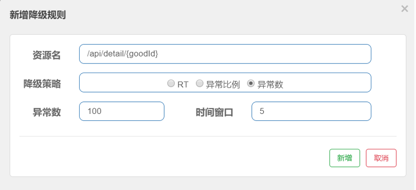
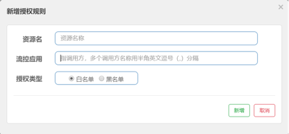

## 一 流控
### 1.1 什么是资源
资源：API接口就是资源，限流降级都是针对资源而言的  
### 1.2 什么是阈值类型
即流控手段类型，主要分为QPS限流和线程数限流，类似Hystrix有线程池限流和信号量限流。一般配合单机阈值使用，单机阈值表示每一秒有多少QPS或者线程数就开始限流  
### 1.3 什么是流控模式
#### 1.3.1 直接
API达到限流条件的时候，直接限流  

#### 1.3.2 关联
当关联的资源(API)达到阈值的时候,则对被关联的API(自己)进行限流，比如/api/a关联资源/api/b，当/api/b挂的时候，与牵连到/api/a，会对/api/a限流。总而言之，我这边压力大了，你那边就别进来了，比如支付接口达到阈值，则限流下订单的接口  

#### 1.3.3 链路
### 1.4 什么是流控效果
#### 1.4.1 快速失败
即当达到阈值的时候，直接抛出错误  

#### 1.4.2 预热(warm up)
不直接一开始就使用预设的QPS，而是从一个比较低的QPS经过一段时间之后，在升至预设的QPS. 预热一般存在三个重要因素：冷加载因子(codeFactor)、预先设定的QPS以及时长  
* 首先计算初始QPS(初始QPS = 预设QPS / codeFactor)  
* 统计时长  
* 当经过时长之后，QPS主键升到预设QPS  


#### 1.4.3 排队等待
当达到QPS或者线程数阈值的时候，不快速失败，而是将后面的请求放入队列等待，直到超时，如果还没有处理则停止等待，使用的是漏斗限流算法。适合处理间隔性的突发流量，一会大量的请求过来，又是空闲；过一段时间又是大量的请求过来，又开始空闲  
注意：只是针对QPS的，不针对线程数  


## 二 降级
### 2.1 降级策略有哪些？什么是RT, 时间窗口的作用是什么?
#### 2.1.1 RT(响应时间)
根据响应时间降级，即当响应时间超过了超时时间，则会引发降级。默认是5秒钟以内，如果需要设置更大-Dcsp.sentinel.statistic.marx.rt=XXXX生效，但是一般情况下，5秒钟以内绝对够了  
另外会指定时间窗口，即在时间窗口内通过的请求数量大于5，而且响应时间超过了RT的阈值  
比如响应时间阈值为200毫秒，如果请求数量大于5，而且耗时小于200毫秒，则表示请求通过；如果超过200毫秒，表示请求失败，在未来时间窗口1秒内，打开断路器，服务不可用，1秒过后再次闭合断路器，如果依旧200毫秒没有处理完则需要再次打开断路器1秒钟，然后服务不可用  

#### 2.1.2 异常比例(失败率)
当每一秒请求的失败率达到这个比例则开始降级。
当每一秒异常比例达到70%，则开始限流5秒钟，即5秒钟内服务不可用，5秒过后再闭合断路器  

#### 2.1.3 异常数(失败数量)
当资源近 1 分钟的异常数目超过阈值之后会进行熔断，比如：
当资源在1分钟内异常数目超过100，则开始降级，在未来5秒钟内无法对外提供服务。


## 三 热点key限流
有时候我们希望对热点数据中访问频次最高的Top N的数据进行限流，比如：
商品 ID 为参数，统计一段时间内最常购买的商品 ID 并进行限制  
用户 ID 为参数，针对一段时间内频繁访问的用户 ID 进行限制  
那么热点参数限流就是利用URL后面的参数，作为热点参数，由自己选择，然后配置这个参数限流阈值等，开始进行限流  
### 3.1 创建热点参数限流时候的降级方法
```java
@GetMapping("/api/catalog/brand")
@SentinelResource(value = "api-catalog-brand",blockHandler = "getGoodsByBrandFallback")
public List<Good> getGoodsByBrand(@RequestParam("brand") String brand) {
    log.info("根据商品查询商品, 参数是 brand = {}",brand);
    return this.catalogService.findGoodsByBrand(brand);
}

public List<Good> getGoodsByBrandFallback(String brand, BlockException exception) {
    System.out.println("Fallback Goods Brand ---> "+brand);
    return Collections.emptyList() ;
}
```
SentinelResource注解类似于Hystrix中HystrixCommand注解，提供了blockHandler参数，指定降级方法，用于对发生BlockException的时候进行降级的处理器  
### 3.2 dashboard配置


### 3.3 参数例外项
如果希望某些参数值的时候不被限流，即出现例外的情况，我们需要对这种参数进行单独配置。如果参数不是配置例外项配置的值，则走普通热点参数限流；否则走例外热点参数限流。比如根据brand查询商品，对于普通商品限流阈值为1，但是对于Dell这个品牌，限流阈值为200  


## 四 系统自适应限流(慎用，因为针对真个系统，有可能某一个系统不行导致整个系统)

Sentinel 系统自适应限流从整体维度对应用入口流量进行控制，结合应用的 Load、CPU 使用率、总体平均 RT、入口 QPS 和并发线程数等几个维度的监控指标，通过自适应的流控策略，让系统的入口流量和系统的负载达到一个平衡，让系统尽可能跑在最大吞吐量的同时保证系统整体的稳定性  
系统规则支持以下的模式：
1. [ ] Load 自适应（仅对 Linux/Unix-like 机器生效）：系统的 load1 作为启发指标，进行自适应系统保护。当系统 load1 超过设定的启发值，且系统当前的并发线程数超过估算的系统容量时才会触发系统保护（BBR 阶段）。系统容量由系统的 maxQps * minRt 估算得出。设定参考值一般是 CPU cores * 2.5  
2. [ ] CPU usage（1.5.0+ 版本）：当系统 CPU 使用率超过阈值即触发系统保护（取值范围 0.0-1.0），比较灵敏
3. [ ] 平均 RT：当单台机器上所有入口流量的平均 RT 达到阈值即触发系统保护，单位是毫秒
4. [ ] 并发线程数：当单台机器上所有入口流量的并发线程数达到阈值即触发系统保护
5. [ ] 入口 QPS：当单台机器上所有入口流量的 QPS 达到阈值即触发系统保护

## 五 黑白名单控制
很多时候，我们需要根据调用来源来判断该次请求是否允许放行，这时候可以使用 Sentinel 的来源访问控制（黑白名单控制）的功能。来源访问控制根据资源的请求来源（origin）限制资源是否通过，若配置白名单则只有请求来源位于白名单内时才可通过；若配置黑名单则请求来源位于黑名单时不通过，其余的请求通过。


## 六 @SentinelResource
### 6.1 按照资源名称限流
```java
@GetMapping("/api/catalog/brand")
@SentinelResource(value = "api-catalog-brand",blockHandler = "getGoodsByBrandFallback")
public List<Good> getGoodsByBrand(@RequestParam("brand") String brand) {
log.info("根据商品查询商品, 参数是 brand = {}",brand);
    return this.catalogService.findGoodsByBrand(brand);
}
```
SentinelResource中的value就是资源名字，可以根据这个名字进行限流。
### 6.2 按照URL地址限流
即按照GetMapping或者PostMapping等注解中指定的URL作为限流依据

### 6.3 客户自定义限流处理逻辑
兜底方案面临的问题：
1. [ ] 系统默认的，没有体现我们自己的业务要求
2. [ ] 依照现有条件的，我们自定义的处理方法有何业务代码耦合在一起
3. [ ] 每一个业务方法都添加兜底，代码膨胀
4. [ ] 全局统一处理方法没有体现
解决方案：
创建CustomBlockHandler类用于自定义限流处理逻辑
```java
public class CustomBlockHandler {

    public static ResponseEntity handlerException(BlockException exception) {
        return new ResponseEntity("按照客户自定义全局异常处理", HttpStatus.resolve(50000));
    }

    public static ResponseEntity handlerException2(BlockException exception) {
        return new ResponseEntity("按照客户自定义全局异常处理2", HttpStatus.resolve(50000));
    }
}


@GetMapping("/api/catalog/brand")
@SentinelResource(value = "api-catalog-brand",blockHandlerClass = CustomBlockHandler.class,
blockHandler = "handlerException2")
public List<Good> getGoodsByBrand(@RequestParam("brand") String brand) {
    log.info("根据商品查询商品, 参数是 brand = {}",brand);
    return this.catalogService.findGoodsByBrand(brand);
}
```

### 6.4 blockHandler和fallback区别
* blockHandler：主要是针对BlockException，一般用于流控  
* fallback：主要针对任何异常，一般用于熔断降级  


