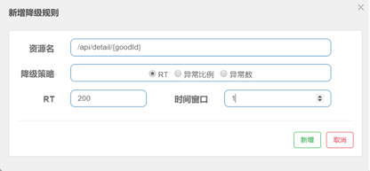

## 一 什么是熔断？为什么需要熔断？熔断和限流、降级有关系没有?
### 1.1 什么是熔断？
在调用某个服务或组件的过程中，如果持续发生失败（如超时、异常），则自动中断调用请求，防止错误继续传递和资源继续浪费  
熔断的目标是保护系统，防止雪崩  

### 1.2 常见的熔断场景
1. [ ] 下游服务挂掉，调用失败，上游服务资源被拖死
2. [ ] 响应特别慢，请求堆积，服务线程被占满
3. [ ] 接口错误率高，请求失败，大量异常堆积

### 1.3 熔断 vs 限流 vs 降级：三者关系
#### 1.3.1 目的不一样
* 限流: 控制并发/速率
* 熔断: 快速失败，防止拖垮系统
* 降级: 限流或者熔断后的提供兜底方案

#### 1.3.2 典型触发条件
* 限流: 请求太多
* 熔断: 异常/超时率过高
* 降级: 熔断/异常

#### 1.3.3 处理方式
* 限流: 拒绝/延迟部分请求
* 熔断: 暂停调用、快速失败
* 降级: 调 fallback、返回默认值

## 二 熔断框架对比
### 2.1 Sentinel
### 2.1 降级策略有哪些？什么是RT, 时间窗口的作用是什么?
#### 2.1.1 RT(响应时间)
根据响应时间降级，即当响应时间超过了超时时间，则会引发降级。默认是5秒钟以内，如果需要设置更大-Dcsp.sentinel.statistic.marx.rt=XXXX生效，但是一般情况下，5秒钟以内绝对够了  
另外会指定时间窗口，即在时间窗口内通过的请求数量大于5，而且响应时间超过了RT的阈值  
比如响应时间阈值为200毫秒，如果请求数量大于5，而且耗时小于200毫秒，则表示请求通过；如果超过200毫秒，表示请求失败，在未来时间窗口1秒内，打开断路器，服务不可用，1秒过后再次闭合断路器，如果依旧200毫秒没有处理完则需要再次打开断路器1秒钟，然后服务不可用  

#### 2.1.2 异常比例(失败率)
当每一秒请求的失败率达到这个比例则开始降级。
当每一秒异常比例达到70%，则开始限流5秒钟，即5秒钟内服务不可用，5秒过后再闭合断路器  

#### 2.1.3 异常数(失败数量)
当资源近 1 分钟的异常数目超过阈值之后会进行熔断，比如：
当资源在1分钟内异常数目超过100，则开始降级，在未来5秒钟内无法对外提供服务。


### 2.2 Resilience4j
解析@CircuitBreaker注解，获取属性
断路器有三种状态:CLOSED, OPEN, HALF_OPEN
获取当前断路器的状态，如果是OPEN, 说明已经打开则直接拒绝；如果是CLOSE或者HALF_OPEN就可以继续
对下游进行调用，根据成功和失败状态分别进行处理，并进行断路器判断
**成功**： 
1. [ ] 记录调用时长
2. [ ] 判断是否为“慢调用”
3. [ ] 总调用数 +1；如果慢，慢调用计数 +1
4. [ ] 判断是否达到最小调用数，比如时间窗口内，必须要有20个请求才会进行断路器检查
5. [ ] 如果达到断路器检查，检查慢调用比例是否超过阈值，如果是则会打开断路器，即断路器处于OPEN状态

**失败**:  
1. [ ] 记录失败调用
2. [ ] 总调用数 +1；如果慢，失败调用次数+1；
3. [ ] 判断是否达到最小调用数；如果未达 minimumNumberOfCalls，不会触发熔断
4. [ ] 如果达到断路器检查阈值，则计算失败率；同时检查慢调用比例

**Resilience4j 中，如果当前熔断器状态是 OPEN，它是如何检测服务是否恢复，从而“闭合断路器”的？**
1. [ ] 当前熔断器状态为 OPEN 时，每次有请求到来时，会判断当前时间是否超过 waitDurationInOpenState 计算出的重试时间点。
2. [ ] 如果没到时间：请求直接被拒绝，走降级策略。
3. [ ] 如果到了时间：状态从 OPEN → HALF_OPEN，开始允许部分请求通过（permittedNumberOfCallsInHalfOpenState）。
4. [ ] 进入 HALF_OPEN 后，会基于这部分请求的结果统计失败率或慢调用比率（根据配置），
5. [ ] 如果失败率仍高于阈值，则状态回到 OPEN，并重新设置下一次允许尝试的时间点；
6. [ ] 否则，说明服务恢复，熔断器闭合，状态转为 CLOSED。
这个流程是一个典型的惰性状态机判断 + 滑动窗口统计 + 状态自恢复机制。

**配置说明：**  
```yaml
resilience4j.circuitbreaker.instances.orderService:
  failureRateThreshold: 50                         # 熔断阈值：失败率超过 50% 时触发熔断
  slidingWindowSize: 100                           # 滑动窗口大小：统计最近 100 个请求来计算失败率
  minimumNumberOfCalls: 10                         # 最小请求数：只有当请求数 ≥ 10 才会开始计算失败率
  waitDurationInOpenState: 10s                     # 熔断后的等待时间：保持 OPEN 状态 10 秒后尝试恢复
  permittedNumberOfCallsInHalfOpenState: 5         # HALF_OPEN 状态下允许通过的请求数（用来检测服务是否恢复）
```

**Resilience4j只有信号量隔离模式，没有线程池模式:**  
```yaml
resilience4j:
  bulkhead:
    instances:
      orderServiceBulkhead:
        maxConcurrentCalls: 3         # 最多允许3个并发请求
        maxWaitDuration: 0           # 不等待，立即拒绝
```
### 2.3 Hystrix
#### 2.3.1 Hystrix工作模式
Hystrix有两种工作模式: 线程池和信号量。其中线程池是默认模式
线程池：请求到来，从Hystrix线程池获取线程执行。如果线程池满了，没有额外的线程执行则会进行降级  
信号量：请求到来，获取信号量，如果没有信号量则进行降级处理; 如果有，使用完之后需要返还给Hystrix
默认情况下Hystrix只有一个线程池，如果在并发量高的时候，可能很容易被某个高频打满了，从而影响到其他服务或者接口。因此，一般线程池最好针对服务或者接口单独设置线程池

#### 2.3.2 Hystrix断路器工作原理
1. [ ] 1、当调用发生错误的时候，开启一个默认10s的时间滑动窗口，每隔1s做一次滑动
2. [ ] 2、在时间窗口内，会统计请求次数以及请求失败次数
3. [ ] 3、10s内如果请求次数没有超过指定阈值requestVolumeThreshold，默认是20个，那么就重置请求次数和请求失败次数，回到第一步
4. [ ] 4、如果超过了requestVolumeThreshold阈值，则判断当前失败请求百分比是否超过了50%(默认值)。如果超过，则跳闸，进行短路；如果没超过则重置统计状态，回到步骤1
5. [ ] 5、熔断之后，并不是不给一点机会。而是另外开启一个5s的时间窗口，每隔5秒，放行一个请求看是否可以正常请求。如果成功，闭合断路器，回到第一步；如果还是失败，则继续回到第5步骤，开启一个5s的时间窗口进行探测


## 三 熔断框架Resilience4j、Sentinel、Hystrix如何选型
### 3.1 是否维护
1. [ ] Hystrix: 停止维护，Hystrix在SpringBoot3.X 已经不兼容
2. [ ] Resilience4j: 维护中，Spring官方推荐
3. [ ] Sentinel: 维护中

### 3.2 隔离策略
1. [ ] Hystrix: 支持线程池和信号量
2. [ ] Resilience4j: 信号量默认
3. [ ] Sentinel: 信号量

### 3.3 熔断策略
1. [ ] Hystrix: 失败率
2. [ ] Resilience4j: 失败率、慢调用次数
3. [ ] Sentinel: 慢调用、异常数等更丰富

### 3.4 控制台
1. [ ] Hystrix: 没有
2. [ ] Resilience4j: 没有
3. [ ] Sentinel: 有

### 3.5 限流
1. [ ] Hystrix: 不提供限流功能
2. [ ] Resilience4j: 有
3. [ ] Sentinel: 有并且丰富

### 3.6 使用场景
1. [ ] Hystrix: springboot2.x 之前的一些老项目
2. [ ] Resilience4j: 微服务稳定性主流方案，支持springboot 3.x 以上版本
3. [ ] Sentinel: 大流量系统、需细粒度限流控制的系统