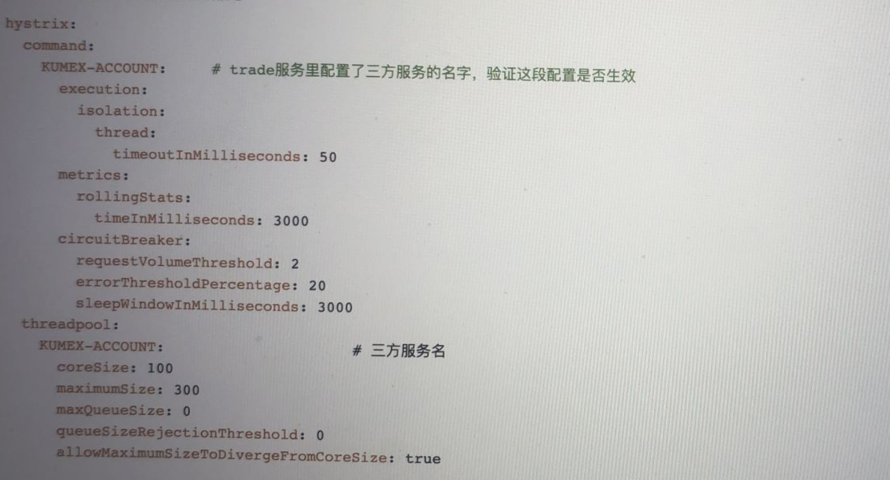

## 一 描述一下项目中你是如何保证系统稳定性的
每一个系统，在资源一定的情况下，能处理的请求一定是有限制的。当接收的请求超过了限制，此时系统就会变得不稳定。  
另外，系统对外部服务的依赖，如果外部服务不稳定，比如错误率很高，慢调用很多，也可能会将当前系统拖垮。所以，微服务中，系统的稳定性一定是需要考虑的。  
所以我们需要利用限流、熔断、降级等手段来保证系统的稳定性。


### 1.1 熔断 + 降级
#### 1.1.1 之前的配置
订单服务会依赖合约基础服务、账务服务、仓位服务等。如果外部依赖的这些服务出现了不可用、或者错误率攀升、或者慢调用增加等，会导致当前订单服务系统不稳定。  
比如当前服务错误率飙升或者当前服务耗时增加等。

在早期版本中，通过Hystrix实现熔断，以账务服务为例子:    

kumex-account就是需要再kumex-order订单服务进行熔断的服务
如果这里还指定了default选项，那么在feign中定义的外部接口，如果没有在配置文件单独配置，就会走这个default配置，比如:
```yaml
hystrix:
  command:
    default:
      execution:
        isolation:
          thread:
            timeoutInMilliseconds: 500
```
如果在这里有定义服务或者接口作为command key，那就先按照服务或者接口定义来执行。总而言之:  
* 如果定义了接口，比如AccountClient#getAccountInfo(...)默认使用这个
* 如果没定义接口，但是定义了服务，那么就使用服务的配置
* 如果即没定义接口，也没定义服务，那么就是使用配置的default配置
* 但是，我们的服务用的是spring cloud + feign, 默认的command key就是接口AccountClient#getAccountInfo(...)

如果是配置的线程池，那么线程池也可能全局统一使用一个，也可能是每一个依赖的服务一个等等，所以可以单独对线程池定义，如上图所示:
这里自定义了kumex-account的线程池，还可以定义kumex-contract和kumex-position的线程池配置

#### 1.1.2 存在的问题
1. [ ] 第一: 降级措施做的不好。 或者说根本就没有降级措施，就直接抛出500的异常
2. [ ] 第二: 循环熔断
3. [ ] 第三: 配置不当

**怎么解决呢？**  
**降级措施:**   
首先, 定义降级统一异常类，在兜底方法时候，如果不能返回什么默认值的时候就返回这个异常  
然后, 在统一异常捕获这个类的时候，返回一个通用的异常信息，比如:  
```java
@RestControllerAdvice
public class GlobalExceptionHandler {

    @ExceptionHandler(RemoteServiceFallbackException.class)
    public ResponseEntity<?> handleFallback(RemoteServiceFallbackException ex) {
        return ResponseEntity.status(HttpStatus.SERVICE_UNAVAILABLE)
                .body(Map.of("code", 503, "msg", ex.getMessage()));
    }
}
```

**循环熔断:**  
当部署或者重启一个服务的时候，合约服务需要访问订单服务某接口，导致访问不了，所以进行熔断，而订单服务访问合约服务，因为熔断也访问不了，所以也对合约服务熔断，出现循环熔断场景
对于基础服务，我们不需要进行熔断，把对外部的依赖应该分散出去，不要放在基础服务中，基础服务只允许被外部服务依赖，而不允许自己调用外部服务

另外一个就是配置了服务级别的熔断，所以导致对整个服务进行熔断。因此要么自定义接口或者使用默认，默认就是根据接口进行熔断的  

**配置不当:**  
requestVolumeThreshold: 设置在统计窗口中触发熔断的最小请求量， 默认是20，在高并发场景下，可以适当提高这个值，避免因少量失败就触发断路器，比如并发量1000，设置为100  

比如交易、支付等场景，这些服务一旦出错可能会造成严重的后果。可以适当提高requestVolumeThreshold的值；因为对于这些关键服务，需要更谨慎地触发熔断，确保在有足够多的请求数据表明服务确实出现问题时才进行熔断操作，避免因少量异常请求而误熔断，影响正常业务  

长响应时间服务：requestVolumeThreshold应该设置得较低，例如 10 - 50 次请求。因为长响应时间意味着在相同时间内能够处理的请求数量较少，如果按照高流量业务的阈值设置，可能在很长时间内都无法触发熔断，而实际上服务可能已经出现问题。较低的阈值可以在服务响应时间较长且可能出现故障时，更快地触发熔断机制来保护系统  

errorThresholdPercentage：一般不建议调整，默认就是50核心业务: 比如交易、金融应设置比较少，比如10-20非核心业务: 可以设置30-50  

对于kumex-account线程池的配置:   
* coreSize: 100	❌ 严重偏高，易打满 CPU
* maximumSize: 300	❌ 不合理，超过 core 近3倍
* maxQueueSize: 0	❌ 零容忍排队，容易拒绝请求  

可是订单服务实例，每一个只有4c8g，有的是4c12g, 就只有4个核心，那么配置coreSize和maximumSize完全没有意义，另外如果没有队列，无法蓄洪  
将coreSize调整为8-20，maxPoolSize调整为30-50。根据超时程度，maxQueueSize调整为30-50。否则太多的线程导致资源不足，上下文切换，CPU100%或者无法创建本地线程，那么服务就崩溃，Hystrix没起到作用。  
除Hystrix线程池，还有其他任务或者tomcat的web线程池，每一个线程占据1-2M，那1000个线程就需要占据1-2g左右内存，所以，肯定合不合适。  


### 1.2 限流 + 处置
1. [ ] 当订单的请求量逐渐增多的时候，达到5000左右QPS的时候，5xx错误和超时等问题就会频繁触发。导致这一块的问题是多方面的，有大事务，有分库分表中数据量太大等问题。  
2. [ ] 一些恶意请求频繁刷新某些接口，导致出现大量无效请求和错误日志  

但是，这些问题是属于被动问题，我们自己也应该主动做一些事情，当目前系统无法支持足够高的流量，为了保证系统稳定性，就应该进行流量控制，这个是之前没有做的。
怎么做呢？首先在网关层做一种服务级别的全局的流控限制，然后在服务层在做一些精细化的流量控制。  

#### 1.2.1 网关层限流
1. [ ] 第一: 在网关层，我们对kumex-order服务进行限流，最多只允许每秒5000的流量进入到kumex-order
2. [ ] 第二: 在网关层，还需要对IP限流进行黑名单限流，防止恶意刷接口
```yaml
spring:
  redis:
    host: localhost
    port: 6379

  cloud:
    gateway:
      routes:
        - id: kumex-order
          uri: lb://kumex-order
          predicates:
            - Path=/order/**
          filters:
            - name: RequestRateLimiter
              args:
                redis-rate-limiter.replenishRate: 5000  # 每秒生成令牌数
                redis-rate-limiter.burstCapacity: 6000  # 突发容量
                key-resolver: "#{@ipKeyResolver}"        # 限流维度

```
```java
@Bean
public KeyResolver ipKeyResolver() {
    return exchange -> Mono.just(exchange.getRequest().getRemoteAddress().getHostString());
}
```

```java
public GlobalFilter ipBlockFilter() {
    return (exchange, chain) -> {
        String ip = exchange.getRequest().getRemoteAddress().getAddress().getHostAddress();
        if (redisTemplate.hasKey("ip:blacklist:" + ip)) {
            return exchange.getResponse().setComplete(); // 拒绝访问
        }
        return chain.filter(exchange);
    };
}
```
网关限流后会直接返回： HTTP 状态码：429 Too Many Requests   


#### 1.2.2 服务层限流
1. [ ] 针对接口进行限流，有些核心接口访问量大，流量应该给高点，非核心接口流量低，应该给少一点
```java
@RestController
public class OrderController {

    @GetMapping("/order/submit")
    @SentinelResource(value = "submitOrder", blockHandler = "handleBlock")
    public String submitOrder() {
        return "订单提交成功";
    }

    public String handleBlock(BlockException ex) {
        return "系统繁忙，请稍后再试";
    }
}
```


