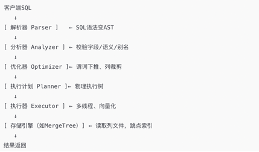

##  一 什么是ClickHouse，适用于什么场景
### 1.1 什么是ClickHouse
✅ ClickHouse是一款开源的高效的列式存储数据库，专注于高性能OLAP查询  

### 1.2 主要有以下特点
✅ 第一: 无法保证事务，不支持原子性更新，也无法进行事务回滚等  
✅ 第二: 不适合频繁修改的场景  
1. [ ] 因为无论哪一个引擎本质上都是追加写+异步合并，没有像 MySQL 这种通过主键定位然后覆盖一行的逻辑
2. [ ] 这就意味着：更新 = 插入新版本 + 等待后台合并删除旧版本
3. [ ] 但这个合并不是实时的，而且是高成本操作，更新越多，merge 越频繁，IO 和 CPU 压力越大

✅ 第三: 不支持高并发写入场景  
1. [ ] 会触发大量小段 Part → 后台 Merge 频繁 → IO、CPU 飙升
2. [ ] PageCache 抖动，导致写入抖动、查询受影响

✅ 第四: 查询 IO 更少、压缩比高、聚合性能强  

## 1.3 适用于什么场景
日志分析场景、历史数据，比如订单历史、交易历史等等

## 二 行式存储和列式存储区别？
### 2.1 行式存储和列式存储比较
🎯 **存储方式**   
1. [ ] 行式存储按照行存储数据
2. [ ] 列式存储按照列存储数据

🎯 **写入性能**  
1. [ ] 行式写入是"顺序追加"，一次写入整行数据，效率高
2. [ ] 列式写入涉及分列处理、压缩编码、索引重建、页组织等，开销较大

🎯 **读取性能**  
1. [ ] 行式存储一次读取一行，适合查询整行数据
2. [ ] 列式存储一次读取某列，适合查询部分字段

🎯 **压缩效果**    
1. [ ] 行式存储:一般  
2. [ ] 列式存储:优秀(因为列内数据类型一致)

🎯 **适合场景**     
1. [ ] 行式存储:OLTP(事务型系统)
2. [ ] 列式存储:OLAP(分析型系统)

### 2.2 为什么有的系统选列式，有的选行式
✅ OLTP 业务系统（如订单系统、账户管理）：需要高频写入 + 多字段同时读写 → 用行式  

✅ OLAP 数据仓库、BI 报表、日志分析系统：大量扫描/聚合 → 用列式  

## 三 ClickHouse 的表引擎有哪些？常用的是哪种
✅ MergeTree（最常用，支持索引、分区）  
✅ ReplacingMergeTree（去重）  
✅ SummingMergeTree（自动聚合）  
✅ Distributed（分布式表）  
✅ Kafka、S3（数据接入）  
🎯 **结论**: MergeTree使用的最多，他提供了主键机制，可以根据主键查询速度更快  

## 四 ClickHouse 内核工作原理
### 4.1 整体工作流程
   

##### 4.1.1 接口层接收客户端SQL语句
##### 4.1.2 解析层进行SQL解析，解析成抽象语法树
树中包含操作符、字段名、表名、过滤条件等  
举例:  
SELECT price FROM trades WHERE symbol = 'BTC'  
会生成 AST 结构类似于:  
SelectQuery  
├── Columns: [price]  
├── Table: trades  
└── Filter: symbol = 'BTC'  

##### 4.1.3 对语法树通过优化器优化
比如:  
* 谓词下推（filter pushdown）: 尽可能提前过滤数据
* 投影剪裁：只读取所需的列
* 聚合预计算优化（物化视图等）
* 索引使用（主键/稀疏索引等）

##### 4.1.4 将逻辑语法树转换成一棵 物理执行计划
比如:  
* 读取哪些 Part、哪些列？
* 使用并行任务（多线程）还是

##### 4.1.5 执行计划执行计划
执行器将操作转化为一系列流水线 task，交给一系列处理器进行执行，这些处理器会通过和存储引擎进行交互，读写数据

### 4.2 MergeTree存储引擎工作机制
🧩 **概述**: MergeTree 是 ClickHouse 的默认列式存储引擎，支持高效读写、分区、主键排序、索引、并发查询、后台合并等功能  

#### 4.2.1 列式存储
✅ 每列独立压缩存储，查询时只读需要的列，效率极高  

#### 4.2.2 支持主键排序
✅ 写入前按主键排序，写入落盘有序，加速范围查询  
✅ 另外异步合并小part的时候也会根据主键进行排序  
✅ 因此并发量大导致小part较多，会给系统带来较大压力  

#### 4.2.3 支持分区  
✅ 可按天/小时分区，便于管理、清理、分区裁剪  

#### 4.2.4 后台合并机制
✅ 当写一批次数据，就会创建一个Part目录  
✅ 假设包含 id symbol price volume 五个字段, 每一个目录下包含一些文件，这些文件主要包括:  
/part  
── id.bin  
── symbol.bin  
── price.bin  
── volume.bin  
── id.mrk3   
── symbol.mrk3  
── price.mrk3  
── volume.mrk3  
── checksums.txt  
── columns.txt  
── primary.idx  
── count.txt 

👉 .bin: 写入该列存储的数据  
👉 .mrk3: 索引跳点  

🧠 **结论:**  
✅ 插入单条数据并不划算，也无法发挥ClickHouse的能力。因此会建议多条数据按照批次写入  
✅ 另外，每次写入都会创建小Part, 那么多个小 Part 在查询的时候会带来性能问题，因此需要自动合并为大 Part，提升查询效率  

#### 4.2.5 二级索引
✅ 加快过滤条件判断(minmax、bloom、set索引等)  

#### 4.2.6 支持 TTL、采样、物化视图, 内置生命周期管理和数据预聚合能力

## 五 ClickHouse和ElasticSearch、TiDB、MongoDB、HBase、Parquet、MySQL等比较
### 5.1 事务保证
✅ ClickHouse:  没有事务  
✅ ElasticSearch: 没有事务  
✅ MongoDB: 没有事务  
✅ HBase: 没有事务  
✅ Parquet: 没有事务  
✅ MySQL: 有  
✅ TiDB: 有  

### 5.2 数据模型
✅ ClickHouse: 
✅ ElasticSearch: 
✅ MongoDB: 行存储
✅ HBase: 列式存储
✅ Parquet: 列式存储
✅ MySQL: 行存储
✅ TiDB: 行存储

### 5.3 写入能力
✅ ClickHouse:  批量写性能很高，单条写每秒也就几千  
✅ ElasticSearch:  支持批量写和单条写，但是性能一般，算不上优秀  
✅ MongoDB: 高  
✅ HBase: 高  
✅ Parquet:  
✅ MySQL: 批量写性能很高，单条写每秒也就几千  
✅ TiDB: 高  

### 5.5 更新能力
✅ ClickHouse:  弱  
✅ ElasticSearch: 强  
✅ MongoDB: 强  
✅ HBase: 强  
✅ Parquet: 只读  
✅ MySQL: 强  
✅ TiDB: 强  

### 5.6 聚合能力
✅ ClickHouse:  强  
✅ ElasticSearch:  中等  
✅ MongoDB: 有限  
✅ HBase: 差  
✅ Parquet: 有限  
✅ MySQL: 强  
✅ TiDB: 中等  

### 5.7 适合场景
✅ ClickHouse: 更新少、并发不是特别高、需要进行OLAP能力比较强的场景，比如历史订单、历史成交、K线数据等等，而且对事务没有要求  
✅ ElasticSearch:  主要用于存储文档，提供一些文档搜索、需要进行聚合分析的  
✅ MongoDB:  适合非结构化数据场景，比如评论、产品，不要求字段必须一样，而且允许嵌入式  
✅ HBase:   海量存储  
✅ Parquet:  
✅ MySQL: 不适合大数据量的场景，适合强事务的场景  
✅ TiDB: 需要进行分布式事务的场景  

## 六 ClickHouse 的数据是如何压缩的？为什么压缩比高
✅ 第一: 列式存储天然更适合压缩  
1. [ ] 同一列的数据类型一致，重复值多
2. [ ] 可以用更高效的压缩算法(不像行式要混着不同类型的字段)

✅ 第二: ClickHouse 内置了多种优化压缩算法  
1. [ ] 会根据数据特点自动选择最合适的压缩方法
2. [ ] 还能搭配“编码 + 压缩”组合拳，例如“稀疏编码 + LZ4”

## 七 ClickHouse 支持哪些 SQL 特性？
支持标准 SQL，大部分功能:  
JOIN、GROUP BY  
WINDOW FUNCTION（窗口函数）  
ARRAY, MAP, TUPLE  
WITH, SUBQUERY, CTE  
不支持事务、不支持 update/delete（可通过 ReplacingMergeTree 实现伪更新）  

## 八 ClickHouse 的分布式架构怎么设计？
### 8.1 ClickHouse 分布式架构的核心概念
#### 8.1.1 集群

✅ ClickHouse 集群由多个节点组成，每个节点可以是一个独立的 ClickHouse 实例  
✅ 每个集群在配置文件中定义(如 config.xml 或 metrika.xml)  
✅ 节点之间是松耦合的，没有中心化的控制节点  

#### 8.1.2 分布式表
✅  逻辑上的表，会将整个表分片，分片才会真正进行读写，类似于ES中索引，索引并不直接读写，而是根据分片进行读写的  

#### 8.1.3 分片

✅ 分布式表数据被水平分割成多个分片，每个分片存储一部分数据  
✅ 所有分片加起来的数据才是分布式表真实的数据  
✅ 通过分片可以提高读写的并发能力和方便扩展  

#### 8.1.4 副本
✅ 每一个分片可以有1个或者副本，用于容灾本分  

#### 8.1.5 本地表
✅ 每一个分片或者副本都会对应一个本地表，本地表才会真实存储上数据  

🧩 **总结:**
➡️ 假设分布式表symbols[`id`,`symbol`,`multipier`]:  
➡️ 我理解 ClickHouse 的分布式表（如 symbols）是一种逻辑抽象，它不会直接存数据，而是通过分片把数据分布在多个节点的本地表上  
➡️ 每个分片可以配置多个副本用于高可用  
➡️ 每个本地表是列式存储，分别存储 id、symbol、multiplier 三个字段的数据  
➡️ 在写入或查询时，系统会根据路由算法定位分片，然后再选一个副本去操作对应的本地表  

### 8.2 数据分布与查询执行
#### 8.2.1 数据写入
⚙️ 分片规则:
👉 数据写入时，根据分片键（通常是主键或指定字段）的哈希值确定数据归属的分片  

⚙️ 副本同步:
👉 数据写入主副本后，会通过 ZooKeeper 协调异步复制到其他副本  

#### 8.2.2 查询执行
⚙️ 分布式表:
👉 ClickHouse 使用分布式表作为逻辑视图，屏蔽底层分片和副本的复杂性   

⚙️ 查询流程:
👉 客户端向分布式表发送查询  
👉 分布式表将查询分发到所有相关分片  
👉 各分片并行执行查询，并将结果返回给协调节点  
👉 协调节点汇总结果并返回给客户端  

## 九 为什么ClickHouse查询速度快
✅ 列式存储: 只读所需列，大幅减少 IO  
✅ 稀疏索引: 减少全扫描、支持范围过滤  
✅ 批处理插入: 写入合并，避免碎片  
✅ 向量化执行: CPU Cache 命中率高、处理效率高  
✅ DAG并行查询执行: 多核并发利用，吞吐高  
✅ 异步预读 + 缓存: 降低延迟，隐藏磁盘延时  
✅ Append-Only写入: 查询稳定性高，读无锁  

## 十 如何提高 ClickHouse 查询性能？
✅ 合理设计 Partition BY 和 Order BY  
✅ 只读需要的列（列存优势）  
✅ 使用 FINAL 慎重（避免大合并）  
✅ 设置物化视图缓存热点结果  
✅ 表结构避免 JOIN 时使用低基数字段  
