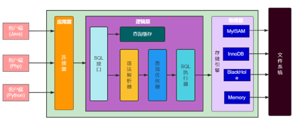
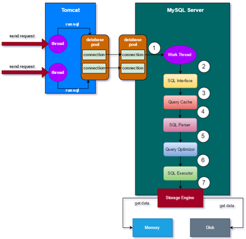
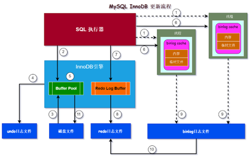
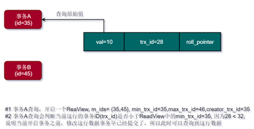
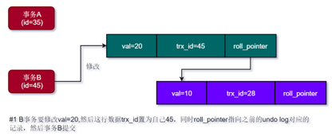
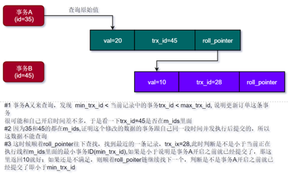

## 一 MySQL概述
### 1.1 MySQL架构
   
✅ MySQL主要分为三层，应用层，逻辑层和物理层  
✅ 应用层主要负责和客户端进行交互，建立连接  
✅ 逻辑层主要负责SQL执行、事务管理等  
✅ 物理层主要负责日志和数据的存储  

### 1.2 MySQL请求流程
#### 1.2.1 **MySQL查询流程**
  
✅ 工作线程获取到请求后，交给SQL接口  
✅ SQL接口先从查询缓存看能不能获取到数据，如果有则返回  
✅ 查询缓存没有就交给语法解析器，生成一颗语法解析树  
✅ 然后语法解析树交给查询优化器，查询优化器生成多条SQL执行计划  
✅ 然后选择成本最优的一条执行计划，交给SQL执行器，SQL执行器开始进行查询  
✅ 从Buffer Pool中查询数据，如果命中返回，写入查询缓存  
✅ 未命中，则从磁盘加载数据到Buffer Pool中，然后再返回  

#### 1.2.2  MySQL更新流程
  
✅ 工作线程获取到请求后，交给SQL接口  
✅ 创建事务，并且为当前线程分配一块内存空间叫做binlog cache，用于写binlog日志  
✅ 从Buffer Pool查找要更新的数据，如果没有找到则从磁盘加载到Buffer Pool中   
✅ 如果有，方便回滚和进行MVCC并发控制，需要将更新之前的数据相关信息写入undo log日志中  
✅ 然后再Buffer Pool中更新数据  
✅ 将产生binlog event写入到binlog cache, 如果binlog cache空间不足，则先写入到一个临时文件中  
✅ 本次更新的相关信息，写入到redo log buffer中, 用于恢复数据  
✅ 提交事务  
1. [ ] 首先: 将redo log buffer中的数据flush到磁盘
2. [ ] 然后: 将binlog cache和binlog临时文件中的数据刷到binlog磁盘文件中
3. [ ] 最后: 将binlog更新的文件信息、位置等数据写入到redo log, 然后写一个commit标记，标志事务最终完成


## 二 MySQL核心对象
### 2.1 BufferPool
✅ 为了减少磁盘I/O， 提升查询效率，MySQL设计了一个缓冲区  
✅ 缓冲区用于缓存读写的数据，然后通过其他手段和一定算法进行刷盘  
✅ 查询的时候首先从缓冲区查询有无数据，没数据再从磁盘加载；写数据先看缓冲区有没有，没有的话从磁盘加载到缓冲区，如果是新增先直接写入到缓冲区  


✅ Buffer Pool是由缓存页组成的，每一个缓存页大小是16KB。这参数可以通过innodb_page_size参数决定。由于Buffer Pool默认大小128M，所以每一个Buffer Pool可以有8192个缓存页  
✅ 由于数据在磁盘上是按照数据页存储的，每一个数据页大小是4KB, 因此Buffer Pool中的缓存页大小是4个磁盘数据页大小。这么设计的原因是根据局部性原理，数据库查询涉及到范围查询，有可能会连续查询多条数据，因此多加载一些数据页到内存中，避免频繁磁盘I/O  
✅ Buffer Pool中的缓存页为元数据页和数据页。每一个元数据页对应一个数据页，默认大小都是16K。其中元数据页保存的是对应数据页的地址、编号和所属的表空间等信息。并且元数据页是一个双向链表的形式存在的  
✅ Buffer Pool中有2个重要列表，一个是空闲链表，叫做free list, 用于表示还没有被使用的缓存页; 一个是刷新链表，叫做flush list，用于表示已经发生修改的缓存页。这两个都是通过元数据页关联起来的  

### 2.2 UndoLog
✅ 为了方便回滚, MySQL需要针对增删改之前的数据相关信息进行记录，防止数据修改后，需要回滚找不到之前数据是什么。这个记录的信息的就是undo log  
✅ 为了实现MVCC，每一个undo log日志都有一个db_roll_ptr回滚指针，用户指向这个条数据之前的回滚日志是哪一个  
✅ 表中的行记录，默认有三个字段：db_trx_id事务id、db_row_id行id和db_roll_ptr回滚指针，然后这个回滚指针就会指向undo log中最新事务提交后的undo log  

### 2.3 RedoLog
✅ RedoLog: 用于记录当前DML操作的数据。因为我们知道，MySQL数据DML操作是发生在内存中的，如果还没有刷到磁盘发生宕机、断电或者重启等行为，导致内存的修改丢失。因此为了保证数据修改后不会丢失，在更新到内存后，将相关数据信息写一份到redo log中，然后提交事务的时候刷到磁盘中。这样即便，重启等行为发生，到时候可以重放redol log,将这些数据不会丢失  
✅ RedoLogBuffer: 一块用于临时存储redo log日志的内存缓冲区  
✅ 当一个RedoLog写满了怎么办？redo log有两个日志文件，ib_logfile0和ib_logfile1，当ib_logfile0写满了则写入ib_logfile1，当ib_logfile1写满了则写入ib_logfile0，如此循环  

### 2.4 Binlog
✅ binlog日志是MySQL数据库的记录数据库更改操作归档日志，是MySQL服务器通用日志，不仅仅Innodb会用，MyISAM也可以用
✅ binlog日志主要记录的是逻辑数据，而不是物理数据
🧠 **作用:**  
💡 数据恢复(前提是每次提交事务的时候必须刷盘): 当数据库发生故障或数据丢失时，可以通过回放binlog来还原数据库到故障发生前的状态  
💡 数据复制: 可以通过订阅某节点的binlog日志，将数据复制到当前数据库实例，比如主从同步场景  

✅ binlog cache是事务开启后，为每一个线程分配的一个用于写binlog的内存区域，如果binlog cache写满了，刷到一个binlog临时文件，在事务提交的时候一起刷到binlog的磁盘文件中  
✅ 刷盘时机: 提交事务  


### 2.5 RedoLog vs Binlog
#### 2.5.1 存储的数据性质不一样
✅ redo log: 存储的是物理数据  
✅ binlog: 存储的是逻辑数据  

#### 2.5.2 作用不一样
✅ redo log: 一般用于数据重启恢复  
✅ binlog: 一般用于数据备份和数据复制  

#### 2.5.3 刷盘先后顺序不一样
✅ redo log：先于binlog刷盘  
✅ binlog: 在redo log刷盘后才刷  

#### 2.5.4 缓存特点不一样
✅ redo log: redo log buffer是所有线程共享  
✅ binlog: 是每一个线程都会分配一块内存空间binlog cache  


## 三 MySQL事务
### 3.1 常见的并发问题
✅ 脏读(未提交读):  A事务读取了B事务还未提交的更新，而B事务是有可能回滚的  
✅ 虚读(不可重复读,提交读): A事务读取了B事务提交的更新，导致A事务范围内多次查询，返回的结果不一样  
✅ 幻读: A事务读取了B事务新增的数据，导致事务内每次查询结果数量不一样  
✅ 第一类丢失更新(回滚了别人提交的事务): A事务先发起，B事务后发起，修改同一行数据，B事务先提交，A事务回滚，就会回滚到A事务之前状态，那么就把提交的B事务的值也给回滚了  
✅ 第二类就是更新(覆盖了别人提交的事务): A事务先发起，B事务后发起，修改同一行数据，B事务先提交，A事务后提交，因为修改金额不一样，导致A事务的结果可能会出错  


### 3.2 事务隔离级别
#### 3.2.1 未提交读(read uncommitted)
允许读取别的事务未提交的更新或者提交的更新，即允许发生脏读、不可重复读(虚读)和幻读，一般数据库不会设置这个隔离级别  

#### 3.2.2 提交读(read committed)
简称RC, 允许读取别人提交的事务，即不允许发生脏读，但是可能发生不可重复读(虚读)或者是幻读  

#### 3.2.3 可重复读(repeatable read)
简称RR，顾名思义，就是每次读取的数据都是一样的。它是MySQL默认的事务隔离机制，只能允许每一个事务在查询的时候，查询的内容都是一样的，不存在脏读、不可重复读和幻读，生产环境一般使用这种  

#### 3.2.4 串行读(serializable)
不允许多事务并发执行，肯定不会用  


### 3.3 什么是undo log和undo log chain?
#### 3.3.1 undo log
在进行DML操作的时候，将数据写到Buffer Pool缓冲池之前，为了防止用户需要回滚数据，会先将更新、删除前的数据写入到一个日志文件中，从而保证在回滚的时候，可以根据这个日志进行回滚。这个日志就是undo log  

#### 3.3.2 undo log chain
✅ 第一: 我们知道，一条数据，可能会发生多次变更，那么他肯定就有多条undo log日志记录，那么MySQL到底将根据哪一条日志记录进行回滚呢？  
✅ 第二: MySQL因此将undo log记录设计成了一个链表结构，新增加的日志记录添加到链表的表头。每一个undo log日志包括事务id和回滚指针roll_ptr  
✅ 第三: 日志记录是通过什么链起来的呢？我们知道每一条表中的行记录都有三个隐藏字段: 事务ID(DB_TRX_ID)、回滚指针(DB_ROLL_PTR)和唯一ID(DB_ROW_ID), 那么行记录的回滚指针就会指向对应的undo log日志数据，然后如果这个行记录又被修改，然后又回新建一个undo log记录，然后行记录将回滚指针指向将这个新的undo log记录。而这个新的undo log就会将自己的回滚指针roll_ptr指向到之前上一个版本的undo log记录  

### 3.4 什么是ReadView
✅ ReadView是InnoDB引擎在启动事务时生成的快照一致性视图，它不保存数据，而是记录当前哪些事务是活跃的，从而决定我当前能看到哪些版本的数据  
✅ 生成ReadView时，它会维护以下信息:  
1. [ ] m_ids: 当前活跃的所有事务id列表
2. [ ] up_limit_id: 当前活跃事务列表中最大的事务id，表示mysql下一个要生成的事务id
3. [ ] low_limit_id: 当前活跃事务列表中最小的事务id
4. [ ] creator_trx_id: 创建当前事务的id


🎯 **MySQL可以基于ReadView查询出在当前事务之前就已经提交的数据更新，怎么实现的呢？**
之前已经提交的记录：  
  

此时，来了2个事务，事务A(id=35)和事务B(id=45)事务B有操作更新数据，事务A有操作要读这个数据：   
  

  

  


### 3.5 什么是MVCC
✅ MVCC: Multi-Version Concurrent Control的缩写，是MySQL中用于事务多版本并发控制的一种机制  
✅ 用于实现高并发和一致性读的机制，它通过 undo log 保存旧版本数据，通过 ReadView 决定可见性，实现了事务间的非阻塞读操作  

### 3.6 已提交读(RC)如何实现
当你一个事务设置RC(提交读)的时候，在事务内每一次查询都会重新生成一个ReadView，这样每次就可以查询到已经提交的事务的数据更新


### 3.7 可重复读(RR)如何实现的
当前事务内，在第一次读取的时候会产生一个ReadView，以后无论读取多少次，都不产生新的ReadView，即视图在事务内始终是第一次读取是产生的ReadView的情况

### 3.8 RC和RR事务隔离机制比较
#### 3.8.1 锁机制
✅ RC: 只对索引列添加记录锁(Record Lock)  
✅ RR: 为了解决当前读的幻读问题，它不仅添加记录锁(Record Lock)，还支持间隙锁和临键锁  

#### 3.8.2 binlog 格式
✅ RC: 只支持ROW格式的binlog  
✅ RR: 同时支持statement row 和 mixed三种格式的binlog  

#### 3.8.3 实现一致性读的机制不一样
✅ RC: 为了实现每次查询可以读取到其他事务的提交，在事务范围内，每次查询都会生成一个新的Read View  
✅ RR: 只会在事务开启的时候生成一个Read View  

#### 3.8.4 事务隔离级别范围不一样
✅ RC: 事务内能读取别人提交的是事务  
✅ RR: 事务内不能读取别人提交的是事务  

### 3.9 MySQL默认事务隔离级别是什么？为什么？为什么大厂喜欢使用RC?
MySQL默认事务隔离级别是RR, 因为需要兼容statement格式的binlog  
🧠 **为什么大厂喜欢使用RC隔离级别？**  
✅ 提升并发: 因为RC只会对索引列添加记录锁，不会添加间隙锁和临键锁，因此可以提升并发度  
✅ 减少死锁: 因为RR会使用间隙锁和临键锁，导致发生死锁的概率增大，但是RC只会发生记录锁，因此减少了死锁发生的概率  

### 3.10 InnoDB的RR到底解决幻读没有？
✅ 并没有完全解决幻读，只是解决了部分幻读问题
✅ 比如在快照读的事务中，更新别的事务提交的新增数据
✅ MVCC他解决的是读的是读的并发问题，但是没有办法解决写场景的并发问题，所以才有了锁机制

## 四 MySQL锁
### 4.1 锁的分类
#### 4.1.1 按照范围分类
📌 **全局锁**  
✅ 对整个数据库加的锁。比如flush tables with read lock;  

📌 **表级锁**  
**在表级别加的锁，它又分为表锁、元数据锁、意向锁**  
💡 **表锁**  
✅ 就是对整个表加的锁   

💡 **元数据锁**  
✅ 当一个事务需要修改数据库的元数据时，比如表结构、索引等，会获取元数据锁来防止其他事务同时修改相同的元数据，从而避免数据的不一致性  
✅ 元数据共享读锁：可以访问表结构和读数据，但是不能写  
✅ 元数据共独占锁：防止其他线程读写元数据,比如CREATE/DROP/RENAME TABLE  
✅ 共享读但是不共享写锁：当前事务持有锁，允许其他事务读取元数据，但是不允许其他事务写，比如alter table操作  

💡 **意向锁**  
✅ 意向锁用于协调多个事务对同一表的访问，它的作用是告诉其他事务，当前事务有意向对表进行锁定，但并不会阻止其他事务获取锁  
✅ 意向锁只是辅助机制，实际的数据访问控制由行锁或表锁完成  
✅ 意向共享锁(IS): 当一个事务需要对表中的某个行或某个区间的行进行共享锁定时，它会先尝试获取意向共享锁。如果获取成功，则表示该事务有意向对表进行共享锁定，其他事务也可以获取共享锁。如果获取失败，则表示有其他事务已经获取了表级排他锁，该事务需要等待  
✅ 意向排他锁(IX): 表示事务将要在该表中的某些行上加排他锁,当其他事务已经对该表加了 不兼容的 表级锁（如 S 或 X 锁）时，IX 锁就会加失败，需要等待或死锁  

📌 行级锁
✅ 对数据行加的锁。行锁主要包括记录锁(Record Lock)、间隙锁(Gap Lock)、临键锁(Next-Key Lock)  

#### 4.1.1 按照互斥关系
📌 **共享锁**  
✅ 多个事务都可以同时获取的锁，比如读共享锁  

📌 **排他锁**  
✅ 当某个事务获取到锁之后，其他事务不能获取锁，只能等待当前锁释放  


### 4.2 记录锁(Record Lock)
✅ 记录锁: 在主键索引或者唯一索引，等值查询会锁住索引中具体的一条记录
✅ 如果是非唯一索引等值查询，RC隔离级别加RC锁，RR隔离级别加临建锁
✅ RC隔离级别默认加记录锁，因此不能完全防止幻读

### 4.3 间隙锁(Gap Lock)
✅ 间隙锁: 锁住两个索引记录之间的间隙, 范围查询/防止幻读
✅ 间隙锁不区分主键索引、唯一索引还是普通索引，只要是RR隔离级别、范围查询且没有记录存在就是间隙锁

### 4.4 临建锁(Next-Key Lock)
✅ 临建锁: 记录锁 + 间隙锁 = 锁住记录+间隙
✅ 间隙锁不区分主键索引、唯一索引还是普通索引，只要是RR隔离级别、范围查询且有记录存在一定是临健锁
✅ RR隔离级别默认加临建锁，解决幻读问题

  
#### 4.4.1 主键等值查询
🧠 **情况一: 值存在**
🔍 **SQL:** ```SELECT * FROM student WHERE id = 10 FOR UPDATE;```
🔑 **加锁情况：**
1. [ ] 记录锁：锁住 id=10 的记录
2. [ ] 无间隙锁：因为等值查询主键，无需防幻读（不会产生新主键）
🔒 **锁类型总结**: 记录锁(临健锁退化成记录锁), 锁范围: [10]


🧠 **情况二: 值不存在**
🔍 **SQL**: ```SELECT * FROM student WHERE id = 11 FOR UPDATE;```
🔑 **加锁情况：**
1. [ ] 间隙锁：锁住 (10,12) 间隙（10 和 12 是相邻存在的主键）
2. [ ] 不加记录锁，因为 11 不存在
🔒 **锁类型总结**: 间隙锁（防止11被插入）,锁范围: (10,12)
   

#### 4.4.2 普通索引等值查询
🧠 **情况一: 值存在**
🔍 **SQL:** ```SELECT * FROM student WHERE score = 85 FOR UPDATE;```
🔑 **加锁情况：**
1. [ ] 记录锁 ：锁定 score=85 的所有记录（id=1 和 id=37）
2. [ ] 间隙锁 ：锁定 (82, 85) 和 (85, 88) 的间隙。
🔒 **锁类型总结**: 记录锁 + 间隙锁, 锁范围: (82, 85], (85, 88)

🧠 **情况一: 值不存在**
🔍 **SQL:** ```SELECT * FROM student WHERE score = 86 FOR UPDATE;```
🔑 **加锁情况：**
1. [ ] 记录锁 ：锁定 score=85 的所有记录（id=1 和 id=37）
2. [ ] 间隙锁 ：锁定 (85, 88) 的间隙
🔒 **锁类型总结**: 间隙锁, 锁范围:(85, 88)

#### 4.4.3 主键范围查询
🧠 **情况一: 包含记录**
🔍 **SQL:** ```SELECT * FROM student WHERE id > 8 AND id < 24 FOR UPDATE;```
🔑 **加锁情况：**
1. [ ] 记录锁 ：表中匹配记录有：id = 10, 12, 15, 18, 21
2. [ ] 间隙锁 ：(8,10),(10,12),(12,15),(15,18),(18,21),(21,24)
🔒 **锁类型总结**: 间隙锁 + 记录锁，锁范围是(8,10],(10,12],(12,15],(15,18],(18,21],(21,24)

🧠 **情况二: 不包含记录**
🔍 **SQL:** ```SELECT * FROM student WHERE id > 24 AND id < 27 FOR UPDATE;```
🔑 **加锁情况：**
1. [ ] 记录锁 ：没有
2. [ ] 间隙锁 ：加一把间隙锁 (24,27)
🔒 **锁类型总结**: 间隙锁，锁范围是(24,27)

#### 4.4.3 普通索引范围查询
🧠 **情况一: 包含记录**
🔍 **SQL:** ```SELECT * FROM student WHERE id > 8 AND id < 24 FOR UPDATE;```
🔑 **加锁情况：**
1. [ ] 记录锁 ：91,92
2. [ ] 间隙锁 ：(90,91),(91,92),(92,95)
🔒 **锁类型总结**: 间隙锁，锁范围是(90, 91] + (91, 92] + (92, 95)  →  实际就是连续的 (90, 95)

🧠 **情况二: 包含记录，且有等值查询**
🔍 **SQL:** ```SELECT * FROM student WHERE id >= 60 AND id < 70 FOR UPDATE;```
🔑 **加锁情况：**
1. [ ] 记录锁 ：60,67
2. [ ] 间隙锁 ：(...,60),(60,67),(67,70)
🔒 **锁类型总结**: 间隙锁，锁范围是(...,60],(60,67],(67,70) →  实际就是连续的 (.....,70)

🧠 **情况三: 不包含记录**
🔍 **SQL:** ```SELECT * FROM student WHERE score >= 30 AND score < 55 FOR UPDATE;```
🔑 **加锁情况：**
1. [ ] 记录锁 ：没有
2. [ ] 间隙锁 ：(30,55)
🔒 **锁类型总结**: 间隙锁，锁范围是(30,55), 虽然score >= 30，但是30没有记录

### 4.5 InnoDB的RR到底解决幻读没有？
✅ 幻读指的是：在同一个事务中，两次执行同样的查询，第二次查询返回了第一次查询时不存在的新记录  

#### 4.5.1 为什么MVCC快照读在RR隔离级别下无法完全解决幻读问题
✅ **事务A:**
```sql
--事务A开启
START TRANSACTION;

-- 查询所有 age = 20 的用户
SELECT * FROM users WHERE age = 20;
```
假设现在结果是 0 行  


✅ **事务B:**
```sql
-- 事务B
START TRANSACTION;
INSERT INTO users (id, age) VALUES (1, 20);
COMMIT;
```

✅ **事务A:**
```sql
-- 事务A继续
SELECT * FROM users WHERE age = 20;
```


**现在结果是 0 行, 这么看确实好像没有幻读发生。 但是，如果我们这么操作呢？**  
```sql
-- 事务A
START TRANSACTION;

-- 查询所有 age = 20 的用户
SELECT * FROM users WHERE age = 20;

-- 插入一条 age = 20 的用户
INSERT INTO users (id, age) VALUES (2, 20);

-- 再次查询
SELECT * FROM users WHERE age = 20;

```
❗**问题出现了：**
➡️ 快照读基于 ReadView，理论上看不到别的事务的数据(没问题)  
➡️ 但是现在事务A自己插入了一个新行(id=2，age=20)，这行是看得见的；  
➡️ 所以第二次查询，结果是 1 行；和第一次结果（0行）不同。
➡️ 这就是“幻读” —— 同一个查询条件、同一个事务，不同时间点返回了不同的结果 

#### 4.5.2 临健锁解决幻读
➡️ 通过 Next-Key Lock（间隙锁 + 行锁） 来锁定范围：  
➡️ 当你执行 SELECT ... WHERE age = 20 FOR UPDATE 这种加锁查询时  
➡️ InnoDB 会锁住 age=20 的记录 以及它周围的“间隙”， 其他事务就不能在这个范围内插入新行了， 从而防止幻读  


## 六 MySQL索引
### 6.1 MySQL索引底层数据结构
#### 6.1.1 B树 和 B+树
🧠 **什么是B树**  
🎯 **B树也叫作多路平衡树或者多叉平衡树，M阶B树具有以下性质:**    
➡️ 第一: 每一个节点可以包含多个关键字，但是最多包含M-1个关键字，超过就开始分裂  
➡️ 第二: 节点内的关键字以递增顺序排列，便于有序查找  
➡️ 第三: 第 i 个关键字的左子树中所有关键字 < 第 i 个关键字；第 i 个关键字的右子树中所有关键字 > 第 i 个关键字  
➡️ 第四: 每一个节点既包含关键字，也包含数据域  
➡️ 第五: 所有叶子节点在同一层  

🧠 **什么是B+树**  
🎯 **B+树是一种多路平衡树或者多叉平衡树的数据结构。M阶B+树具有以下性质:**   
➡️ 第一: 每一个节点可以包含多个关键字，但是最多包含M-1个关键字，超过就开始分裂  
➡️ 第二: 节点内的关键字以递增顺序排列，便于有序查找  
➡️ 第三: 第 i 个关键字的左子树中所有关键字 < 第 i 个关键字；第 i 个关键字的右子树中所有关键字 > 第 i 个关键字  
➡️ 第四: 所有叶子节点在同一层  
➡️ 第五: 非叶子节点仅存储关键字用于导航，不存储实际数据；叶子节点存储所有关键字及对应的数据  
➡️ 第六: 所有叶子节点按关键字顺序组成一个有序链表(通常是双向链表)，支持范围查询  

🧠 **B树和B+树区别**  
🎯 **数据存储位置**  
➡️ B树: 所有节点都存数据  
➡️ B+树: 只有叶子节点存数据  

🎯 **查询方式**  
➡️ B树: 查找可能在非叶子节点结束，查询性能也不稳定  
➡️ B+树: 所有查找都走到叶子节点， 查询性能比B树稳定  

🎯 **范围查询**  
➡️ B树: 不如 B+ 高效  
➡️ B+树: 叶子节点链表顺序结构，支持快速范围查询  

🧠 **MySQL中InnoDB使用哪种数据? 为什么?**  
➡️ 第一: B树的查找性能不稳定，有可能是根节点就找到了，有可能分支指点找到，有可能叶子节点才找到，因此查询性能不稳定  
➡️ 第二: B树对于范围查询，需要更多的磁盘I/O  
➡️ 第三: B树每一个节点存在data域，那么每一个页面上存储的数据就相对更少，那么就需要更多的页来存储数据，从而增加树的高度，增加查询I/O次数  


### 6.2 MySQL为什么需要主键索引，如果没有主键索引，MySQL怎么处理?
MySQL需要通过主键来组织数据，主键将索引和数据放在一起  
**如果没有主键，MySQL怎么处理？**   
✅ 首先: 如果表中定义了主键，MySQL会根据定义的主键进行索引  
✅ 其次: 如果表中没有定义主键，但是定义了唯一索引，会根据第一个唯一索引列作为主键，创建主键索引  
✅ 再次: 如果表中既没有定义主键，也没定义了唯一索引，这时候因为每一条记录创建的时候，MySQL会自动生成一个row_id, 然后会根据这个row_id创建主键索引  

### 6.3 索引有哪些使用规则? 排序和分组是如何才能使用索引的？
#### 6.3.1 等值匹配规则
✅ WHERE条件通过索引字段等值查询，会进行索引匹配  

#### 6.3.2 范围匹配规则
✅ WHERE 条件中针对索引字段使用范围查询，比如>= <= 或者 BETWEEN AND 或者 IN 

#### 6.3.3 模糊最左前缀匹配
✅ WHERE条件Like查询，最左边进行前缀匹配查询，可以使用索引，比如'su%'

#### 6.3.4 联合索引等值匹配规则(grade+class+sname)
✅ 如果全部索引字段参与查询,不需要考虑顺序，MySQL可以优化，索引可以使用
* SELECT * FROM students WHERE grade = 2 and class =2 and sname = '南宫雪'   
* SELECT * FROM students WHERE sname ='南宫雪' and class =2 and grade = 2  

✅ 如果部分字段参与查询，第一个字段必须存在，后面字段可以部分查询，可以不考虑顺序，MySQL会优化  
* SELECT * FROM students WHERE class =2 and grade = 2  

✅ 如果部分字段参与查询，第一个字段没有参与查询，那么不会使用索引  
* SELECT * FROM students WHERE sname ='南宫雪' and class =2

#### 6.3.5 联合索引范围匹配规则(grade+class+sname)
✅ 针对联合索引字段范围匹配，第一个字段必须存在，其他字段可以是其他查询，也可以缺少  
* SELECT * FROM students WHERE grade BETWEEN 1 AND 2 AND sname = '南宫雪'

✅ 针对联合索引字段范围匹配，第一个字段不存在，其他字段的范围匹配查询不会走索引  
* SELECT * FROM students WHERE class BETWEEN 1 AND 2 AND sname = '南宫雪'

#### 6.3.6 引联合索引最左前缀匹配规则(grade+class+sname)
✅ 针对联合索引字段最左前缀匹配，第一个字段必须存在，其他字段可以是其他查询，也可以缺少
* SELECT * FROM students WHERE name LIKE '张%' AND english > 100;

✅ 针对联合索引字段最左前缀匹配，第一个字段不存在，其他字段的范围匹配查询不会走索引  
* SELECT * FROM students WHERE nick_name LIKE '张%' AND english > 100;

#### 6.3.7 引联合索引最左列匹配规则(grade+class+sname)
✅ 针对联合索引字段, 第一个列必须存在，其他列可以不存在，也可以存一部分，且与顺序没有关系  
* SELECT * FROM students WHERE class =2 and grade = 2

### 6.4 索引什么时候会失效？
#### 6.4.1 字段参与了计算，你如函数或者加减乘除
✅ 针对索引列使用函数，不一定会造成索引失效，但是他可能会。因为函数可能会改变索引的值  

#### 6.4.2 范围查询返回来太多的数据
✅ 无论是>= <= 或者between and 还是in 或者! 等范围查询，只要返回来太多的数据，都有可能走全表扫描，不走索引  

#### 6.4.3 如果索引字段中，存在大量相同的值，也可能不会走索引
✅ 本质上也是可能需要查询大量的数据，导致走全表扫描  

#### 6.4.4 模糊匹配未使用最左侧匹配查询
✅ 本质上也是可能需要查询大量的数据，导致走全表扫描  

#### 6.4.5 联合索引中，如果第一列没有参与查询，会导致索引失效
✅ 因为索引是按照联合字段顺序存储的，如果第一个字段没有参与查询，那么就会导致索引失效  

### 6.5 什么是回表(Return to table)? 什么是覆盖索引(Index Coverage)? 什么是索引下推(Index Pushing)
#### 6.5.1 回表
✅ 第一: 二级索引叶子结点存储的是主键id  
✅ 第二: 主键索引会存储数据  
✅ 第三: 因此根据二级索引查询会需要根据主键id再去从主键中查询数据  

#### 6.5.2 索引下推
✅ 第一: 当有多个索引字段参与查询的时候，MySQL5.6以前的版本是根据第一个索引字段过滤数据后，通过主键id回表查询，再来进行其他索引字段的过滤。因此当有多个索引字段查询就会有多次回表。我们知道，回表会进行多次I/O，发生多次回表势必影响查询性能  
✅ 第二: MySQL5.6以后针对这种场景进行了优化，当有多个索引字段参与查询的时候，根据第一个索引字段过滤数据后，会将后续的索引字段也进行过滤，这样就可以过滤掉更多的数据，从而减少回表查询。提升查询性能  
✅ 第三：索引下推最适合联合索引，因为这些索引字段在一个索引树上  

#### 6.5.3 覆盖索引
✅ 当要查询的列(select .... from ) 全部是查询的索引字段，就表示索引覆盖，因为这种情况，不需要根据主键id进行回表  
✅ 比如单个索引：SELECT nick_name FROM students WHERE nick_name = 'Victoria.Yan'  
✅ 比如联合索引：SELECT grade, class, sname FROM students WHERE grade = 2 and class =2 and sname = '南宫雪'  


## 七 SQL排查
### 7.1 慢SQL排查
✅ 开启慢 SQL 日志  
✅ 将慢 SQL 日志发送告警群  
✅ 自己查看慢 SQL 日志文件  
✅ 或者自己通过慢接口排查到慢SQL    
✅ performance_schema 监控  
🎯 判断performance_schema是否打开，没打开的话需要打开  
```mysql
[mysqld]
performance_schema = ON
```
🎯查询 SQL 语句执行统计  
➡️ 核心表： performance_schema.events_statements_summary_by_digest  

🎯 这是所有 SQL 模板（digest）的汇总统计表，包含了每类语句的：

1. [ ] 总执行次数（COUNT_STAR）
2. [ ] 总耗时（SUM_TIMER_WAIT）
3. [ ] 平均耗时（AVG_TIMER_WAIT）
4. [ ] 最大最小耗时等

🎯 查找平均最慢的前 10 条 SQL 模板：  
```mysql
SELECT 
    DIGEST_TEXT,
    COUNT_STAR,
    AVG_TIMER_WAIT/1000000000000 AS avg_time_s,
    SUM_TIMER_WAIT/1000000000000 AS total_time_s
FROM performance_schema.events_statements_summary_by_digest
ORDER BY avg_time_s DESC
LIMIT 10;
```

🎯 查找执行次数最多的 SQL（分析热点语句）:  
```mysql
SELECT 
    DIGEST_TEXT,
    COUNT_STAR,
    AVG_TIMER_WAIT/1000000000000 AS avg_time_s
FROM performance_schema.events_statements_summary_by_digest
ORDER BY COUNT_STAR DESC
LIMIT 10;
```

### 7.2 慢SQL优化
#### 7.2.1 定位到慢SQL
#### 7.2.2 通过EXPLAIN 查看SQL执行计划
🧠 通过Explain指令查看SQL执行计划，我们可以了解到以下的一些信息:  
📌 possible keys: 可能存在的索引，NULL的话表示很危险  
📌 key: 使用的哪一个索引  
📌 type: 通过什么类型访问表  
➡️ system: 表只有一行，无需优化  
➡️ const: 通过主键或者唯一索引进行等值查询  
➡️ eq_ref: 多表联合通过唯一索引进行等值匹配  
➡️ ref: 普通索引等值查询  
➡️ range: 使用索引做范围扫描，如 BETWEEN、<、>。比 ref 慢一些  
➡️ index: 查询字段是索引字段，但是没有带where条件(只扫索引页)  
➡️ all: 全表扫描(扫数据页)  

📌 ref: 通过什么字段、值去查索引   
➡️ const: 用常量匹配索引(如 user_id = 1001)  
➡️ func: 使用函数返回值做匹配(如 WHERE id = MD5('x'))  
➡️ table.column	JOIN 查询中，用驱动表某列的值来查被驱动表的索引  
```mysql
-- JOIN 例子
SELECT * FROM orders o JOIN users u ON o.user_id = u.id;
```
| 字段   | 值          | 含义                                   |
| ---- | ---------- | ------------------------------------ |
| type | eq\_ref    | 用唯一索引连接，每行最多匹配一条                     |
| ref  | o.user\_id | 使用 `orders.user_id` 去查 `users.id` 索引 |

➡️ NULL: 没用上索引(type = ALL)或没有索引匹配  

📌 extra: 关于排序的一些信息, 性能自上而下  
➡️ Using index/ Using index condition: 使用索引查询  
➡️ Using where: 用WHERE条件过滤  
➡️ Using temporary: 建立临时表来保存中间结果，查询完成后临时表删除  
➡️ Using FileSort: 无法利用索引排序，只能利用排序算法排序进行全文件排序  

📌 rows: 扫描行数

根据上面的信息做出一些判断，是扫描的行数太多，还是走的全表扫描，还是没有使用索引等等，然后进行优化

#### 7.2.3 观察是否有大事务、锁竞争的情况
SQL慢有可能不是SQL本身慢，也可能是锁竞争严重，事务执行时间太长

查看当前是否有锁等待:
```mysql
SELECT * FROM performance_schema.data_locks;
```

查看是否存在长事务:
```mysql
SELECT
    trx_id,
    trx_state,
    trx_started,
    trx_mysql_thread_id,
    trx_query
FROM information_schema.innodb_trx
ORDER BY trx_started ASC;
```
trx_started 时间越早，说明事务执行时间越长
一些“挂着不提交”的事务，可能长期占有锁，阻塞别人

查当前有哪些线程阻塞或被阻塞（死锁/锁竞争排查）
```mysql
SELECT
    r.trx_id waiting_trx_id,
    r.trx_mysql_thread_id waiting_thread,
    r.trx_query waiting_query,
    b.trx_id blocking_trx_id,
    b.trx_mysql_thread_id blocking_thread,
    b.trx_query blocking_query
FROM information_schema.innodb_lock_waits w
JOIN information_schema.innodb_trx b ON b.trx_id = w.blocking_trx_id
JOIN information_schema.innodb_trx r ON r.trx_id = w.requesting_trx_id;
```
可以看到是谁在阻塞谁，具体 SQL 是什么
非常适合排查死锁或者严重锁等待

排查执行慢的 SQL 是不是被锁拖慢
```mysql
SHOW FULL PROCESSLIST;
```
看状态列是否是：
1. [ ] Waiting for table metadata lock
2. [ ] Waiting for row lock
3. [ ] Locked
4. [ ] Sending data（可能也说明数据读被锁住）


#### 7.2.4 观察CPU、磁盘、内存、网络情况
#### 7.2.4.1 CPU：关注计算能力是否饱和
🎯 **观察CPU使用率**  
➡️ 超过80%就认为是基本满载

🎯 **观察平均负载率load average**  
➡️ 它表示在一段时间内系统的平均任务队列长度  
➡️ 核心原则：Load Average 和 CPU 核心数的关系  

**理想状态** ：load average 小于或等于 CPU 核心数。  
这意味着系统有足够的 CPU 资源处理所有任务，没有明显的过载。  

**警告状态** ：load average 接近 CPU 核心数。  
系统可能开始出现性能瓶颈，CPU 资源接近饱和。  

**过载状态** ：load average 大于 CPU 核心数。  
系统任务队列中有大量等待的进程，CPU 已经过载。 

📖 **假设你的服务器有 4 个 CPU 核心**  
➡️ 如果 load average 在 4.0 以下 ：系统处于正常状态  
➡️ 如果 load average 在 4.0~6.0 之间 ：系统可能开始过载，需要关注  
➡️ 如果 load average 超过 6.0 ：系统严重过载，可能会影响性能  

🎯 **%iowait**  
等待 IO 的 CPU 时间，越高越说明磁盘瓶颈
执行 SQL 时 %iowait 高 → 说明不是 CPU 耗尽，而是等磁盘

🛠️ **工具：**   
➡️ top / htop / vmstat 1  
➡️ mpstat -P ALL 1（看各核心负载）  


#### 7.2.4.2 关注 IO 性能是否拖慢了查询
| 指标        | 含义                          |
| --------- | --------------------------- |
| IOPS（读/写） | 每秒读写次数（高并发压力）               |
| 吞吐量 MB/s  | 传输数据量（带宽压力）                 |
| `await`   | IO 请求平均等待时间（毫秒）             |
| `%util`   | 磁盘利用率，> 80% 表示繁忙，> 95% 表示拥塞 |
| `svctm`   | 服务时间（是否均匀）                  |

🛠️ **工具：**   
➡️ iostat -x 1  
➡️ dstat -d  
➡️ pidstat -d（看哪个进程最耗 IO）  

🧠 **如何判断是磁盘瓶颈？**
➡️ await > 10ms，IO 响应慢（尤其对 SSD 来说）  
➡️ %util > 90%，磁盘被打满  
➡️ InnoDB 突然大量 redo flush、undo purge，可能后台线程写不动  

#### 7.2.4.3 内存：关注缓存和 swap 是否健康
| 指标                              | 含义               |
| ------------------------------- | ---------------- |
| free / available                | 剩余内存（但不是最关键）     |
| `buffers/cache`                 | OS 缓存，不能认为是“占用”  |
| swap 使用量                        | 使用 swap 说明物理内存不够 |
| `innodb_buffer_pool_pages_free` | InnoDB 缓冲池是否吃满   |
| page faults                     | 缺页率高 → 内存紧张，频繁换页 |

🛠️ **工具：**  
➡️ free -m  
➡️ top  
➡️ vmstat 1  
➡️ MySQL：SHOW ENGINE INNODB STATUS / SHOW GLOBAL STATUS LIKE 'Innodb_buffer_pool%';  

🧠 **如何判断内存是瓶颈？**
➡️ 有大量 swap 使用（并且 swap in/out 很频繁）  
➡️ available 内存 < 10% 且不释放  
➡️ InnoDB buffer pool 告警：命中率低、页淘汰频繁  
➡️ vmstat 中 si/so 非 0，说明开始用 swap 了  

#### 7.2.4.4 网络：关注连接与数据传输是否正常
| 指标             | 含义                           |
| -------------- | ---------------------------- |
| 网络延迟（ping）     | 是否稳定，是否丢包                    |
| `rx/tx` 带宽     | 网络接口收/发字节量                   |
| socket wait    | 应用或数据库连接阻塞                   |
| `netstat -anp` | TCP 状态数量（TIME\_WAIT 多说明连接频繁） |

🛠️ **工具：**  
➡️ iftop / nload / vnstat  
➡️ netstat -s  
➡️ ping / mtr  
➡️ SHOW PROCESSLIST 查看 SQL 是否在 Waiting for socket、sending data  

🧠 **如何判断网络瓶颈？**
➡️ 丢包严重或 ping 延迟 > 50ms(本地局域网)
➡️ MySQL连接建立慢、连接中断多
➡️ 网卡带宽 > 80% 使用率，数据传不动
➡️ 查询结果发送慢，状态卡在 Sending data很久


## 八 死锁
### 8.1 什么是死锁
✅ 死锁是数据库系统中两个或多个事务相互等待对方释放资源，导致所有事务都无法继续执行的状态。在MySQL中，死锁通常发生在以下场景：  
1. [ ] 事务A持有锁1，请求锁2
2. [ ] 事务B持有锁2，请求锁1
3. [ ] 双方都在等待对方释放资源

✅ 死锁的四个必要条件：  
1. [ ] 互斥使用：资源不能被共享
2. [ ] 不可抢占：资源只能由持有者释放
3. [ ] 请求和保持：事务持有资源的同时请求新资源
4. [ ] 循环等待：事务间形成等待环路

### 8.2 怎么排查死锁
📌 **开启死锁日志**  
➡️ 可以在配置文件或者SET GLOBAL innodb_print_all_deadlocks = ON;  
➡️ 死锁日志会记录到错误日志文件中，路径通常为 /var/log/mysql/error.log 或 MySQL 配置文件中指定的日志路径  

📌 使用 SHOW ENGINE INNODB STATUS
❗ 在输出中搜索: LATEST DETECTED DEADLOCK
🔎 输出内容会告诉你：
1. [ ] 哪两个事务产生了死锁
2. [ ] 它们执行的 SQL
3. [ ] 哪一行、哪一个表上的锁冲突
4. [ ] 最终哪个事务被 InnoDB 主动回滚


📌 查看应用系统日志
🔎 当 InnoDB 检测到两个或多个事务相互等待资源而无法继续时，它会：  
1. [ ] 自动分析当前锁等待图
2. [ ] 判断这是一个死锁(Deadlock cycle)
3. [ ] 自动选出其中一个代价最小的事务回滚(通常是持锁资源少的那个)
4. [ ] 把另一个事务继续执行下去

ERROR 1213 (40001): Deadlock found when trying to get lock; try restarting transaction  
也就是说，被回滚的事务会抛出这个错误，你需要在应用层处理，比如捕获异常并重试事务  

📌 查看当前锁状态
```mysql
-- 查看当前锁等待
SELECT * FROM performance_schema.data_lock_waits;

-- 查看当前锁持有情况
SELECT * FROM performance_schema.data_locks;
```

### 8.3 MySQL会自动终止死锁，抛出错误，选出其中一个代价最小的事务回滚，那么我们还需要关注和分析死锁吗？
✅ 死锁问题没解决，以后还会发生，甚至频繁发生  
✅ MySQL不会立刻判断出这是一个死锁，然后选出其中一个代价最小的事务回滚  
✅ 但是如果频发发生，会降低系统吞吐量  

✅ 所以我们需要分析死锁，找到根因所在，才好优化或者根本上解决这个问题:  
1. [ ] 找出表访问顺序是否不一致: 规范事务加锁顺序
2. [ ] 判断是否缺少索引: 避免间隙锁、范围锁
3. [ ] 分析哪些业务冲突频繁: 拆分事务、优化热点更新


### 8.4 怎么解决死锁
#### 8.4.1 数据库层面的优化
✅ **启用死锁检测**
1. [ ] 默认情况下，InnoDB 启用了死锁检测（innodb_deadlock_detect=ON）
2. [ ] 如果检测到死锁，MySQL 会选择一个事务回滚以解除死锁

✅ **设置锁超时时间**
1. [ ] 配置 innodb_lock_wait_timeout 参数，限制事务等待锁的最大时间(默认 50 秒)
2. [ ] SET innodb_lock_wait_timeout = 10; -- 设置为 10 秒

✅ **合理设计索引**
1. [ ] 保查询能够利用索引，避免全表扫描导致的表级锁

#### 8.4.2 应用程序层面优化
✅ 大事务拆分或者优化
1. [ ] 使用手动事务，把不必要的事务内部操作放到事务外边
2. [ ] 如果可能，将多次更新合并为一次批量操作，减少锁的竞争

✅ 优化查询逻辑
1. [ ] 避免不必要的 SELECT ... FOR UPDATE 或 LOCK IN SHARE MODE。
2. [ ] 使用索引优化查询，避免全表扫描带来的锁升级

✅ **保持固定的表访问顺序**  
1. [ ] 所有事务按相同顺序访问资源，避免交叉等待  

✅ **减少事务持有锁的时间**  
1. [ ] 尽量缩短事务的执行时间，避免长时间持有锁。
2. [ ] 避免在事务中执行耗时操作(如网络调用、复杂计算)

✅ **减少事务粒度**
1. [ ] 使用行级锁而非表级锁
2. [ ] 避免对整个表加锁，尽量只锁定需要修改的行

✅ 遇到异常，手动重试事务
```java
// Java重试机制示例
int retryCount = 0;
while(retryCount < 3) {
    try {
        // 执行数据库操作
        break;
    } catch (MySQLTransactionRollbackException ex) {
        if(ex.getErrorCode() == 1213) { // 死锁错误码
            Thread.sleep(50 + (int)(Math.random() * 100)); // 随机等待
            retryCount++;
        } else {
            throw ex;
        }
    }
}
```

## 九 MySQL经验
### 9.1 表结构设计
✅ 避免使用不能顺序增长的主键，比如UUID或不能顺序增长的数字等，防止频繁的页分裂，导致大量I/O  
✅ 业务上唯一的字段必须创建唯一索引，即使是多个联合字段可以保证唯一  
✅ 索引字段最好不要超过5个  
✅ 联合索引字段最好不要超过5个  
✅ 对于未来业务不确定，可以多创建几个字段，留着以后使用，避免到时候需要进行DDL,数量控制在5个以内  
✅ 可以适当冗余字段，避免联合查询，冗余字段最好不是特别大的字段  
✅ 针对于更新时间可以在创建表的时候指定自动更新，防止在业务更新的时候还要去更新时间字段  
✅ 如果是bool类型的字段，可以使用unsigned tinyint  
✅ 考虑业务场景可能的情况，对于某些字段应该尽可能大一些，比如下单数量、仓位数量等，极端行情可能会查过int类型限制，所以最好使用bigint；又比如说金额字段等需要精度的场景，精度最好设置大一些，防止精度行情精度问题导致业务问题，到时候数据量大的时候来修改精度也是一件很痛苦的事情 

### 9.2 索引设计
✅ 索引字段最好不要超过5个  
✅ 联合索引字段最好不要超过5个   
✅ 针对于散列程度低的字段不是一定不能创建索引，只要不是类似于男女这种性质的字段，也可以创建字段，比如状态类的字段，NEW、DONE、PROCESSING等，那么对于NEW状态的数据可能比较少，只占据整根数据的10-20%等，就可以创建索引，只要查询用的到  
✅ 针对于WHERE、ORDER BY、GROUP BY，多表JOIN的字段， 最好都是创建索引的字段，这样可以利用索引检索、排序和分组  

### 9.3 生产环境实践
✅ 禁止在生产环境频繁进行删除操作，也可能带来频繁的CPU操作和I/O操作，影响生产环境稳定性，比如定时任务删除表数据  
✅ 禁止在生产环境查询频繁执行查询可能导致全表扫描的SQL语句，会带来大量的频繁I/O，影响数据库正常业务  
✅ 在更新删除的时候可以加上LIMIT 限制，防止操作过程中失误，导致删除或者更新多余的数据，带来线上问题  
✅ 针对有一些查询，辨别业务上是否需要查询那么多数据，比如定时任务扫描最近一天的数据，是否可以改成最近1小时或者8小时等，这样会减少更多的数据  
✅ 分页查询：随着offset偏移量的增大，那么扫描的数据就会变得越来越大，从而可能会影响数据库的稳定性  
✅ 如果使用 where 字段 in (子查询)，该字段如果是索引字段，那么可以通过inner join优化，这样可以使用索引连接，而不用回表  